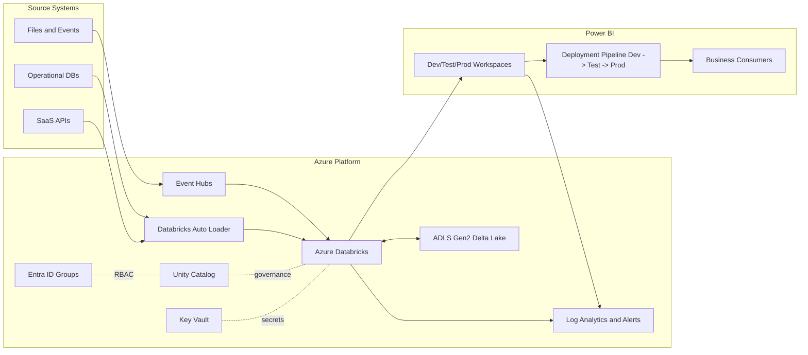
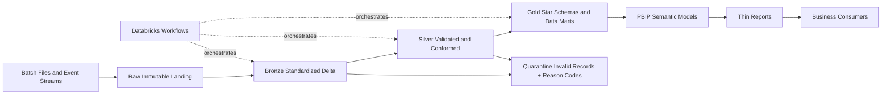
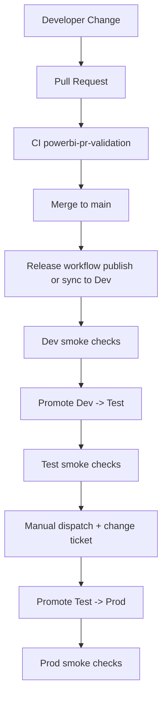

# dataplatform-beta

Azure Databricks data platform scaffold with PBIP-first Power BI delivery, CI/CD workflows, and Terraform foundations.

## What is implemented
- Planning baseline: architecture, security, operations, and 90-day roadmap.
- PBIP repository structure for semantic models and reports.
- Deployment config contracts for workspaces and pipeline rules.
- GitHub Actions workflows for PBIP validation and release orchestration.
- GitHub Actions workflows for Terraform fmt/init/validate and data-contract checks.
- Python utility scripts for PBIP validation, smoke checks, and deployment pipeline promotion.
- Python utility script for data-contract validation.
- Terraform module scaffold for Entra groups used by Power BI RBAC.
- Initial dataset contract scaffolding under databricks/contracts.

## Directory map
- PLAN.md: platform plan and decisions.
- docs/architecture.md: architecture overview and component responsibilities.
- docs/security-compliance.md: baseline security/compliance controls.
- docs/operations-slos.md: SLI/SLO and alerting baseline.
- docs/powerbi-serving.md: Power BI delivery operating model.
- powerbi/deployment/: workspace and pipeline config maps.
- powerbi/domains/: domain PBIP artifacts.
- ci/: GitHub Actions workflows for Power BI, Terraform, and data contracts.
- scripts/powerbi/: Power BI automation helpers used by workflows.
- scripts/contracts/: data-contract validation helpers.
- databricks/contracts/: versioned data contracts for CI enforcement.
- terraform/: IaC scaffold for Power BI RBAC groups.

## GitHub configuration required
Repository variables:
- PBI_PIPELINE_ID
- PBI_DEV_WORKSPACE_ID
- PBI_TEST_WORKSPACE_ID
- PBI_PROD_WORKSPACE_ID
- PBI_DEV_DATASET_ID
- PBI_TEST_DATASET_ID
- PBI_PROD_DATASET_ID
- PBI_DEV_REPORT_ID
- PBI_TEST_REPORT_ID
- PBI_PROD_REPORT_ID

Repository secrets:
- AZURE_CLIENT_ID
- AZURE_TENANT_ID
- AZURE_SUBSCRIPTION_ID

## Workflow behavior
- ci/powerbi-pr-validation.yml:
  - Runs PBIP structural and naming checks on pull requests.
- ci/powerbi-release.yml:
  - Push to main: validates PBIP conventions, updates Dev, runs Dev smoke checks, promotes Dev -> Test.
  - Manual workflow dispatch on main: promotes Test -> Prod with change ticket gate.
  - Runs post-promotion smoke checks.
- ci/terraform-validate-plan.yml:
  - Runs terraform fmt -check and terraform init/validate for all dev/test/prod stack roots on pull requests.
- ci/data-contract-checks.yml:
  - Runs data-contract JSON validation on pull requests touching contract files.

## Local validation
Run PBIP validation:

python dataplatform-beta/scripts/powerbi/validate_pbip.py

Run data-contract validation:

python dataplatform-beta/scripts/contracts/validate_contracts.py

## Architecture and flow diagrams
Mermaid source diagrams are in docs/architecture-flow-diagrams.md and embedded here for quick review.

### Platform architecture

### Data flow

### CI/CD flow

## Terraform bootstrap (Power BI RBAC)

cd dataplatform-beta/terraform/environments/dev/powerbi_rbac
terraform init
terraform plan -var-file=terraform.tfvars.example

## Next implementation steps
1. Add tenant-specific PBIP publish-to-Dev mechanism before smoke checks.
2. Replace static IDs with dynamic mapping lookup from deployment config.
3. Add richer semantic model static checks in PR validation.
4. Extend Terraform environments for test/prod and provider wiring.
