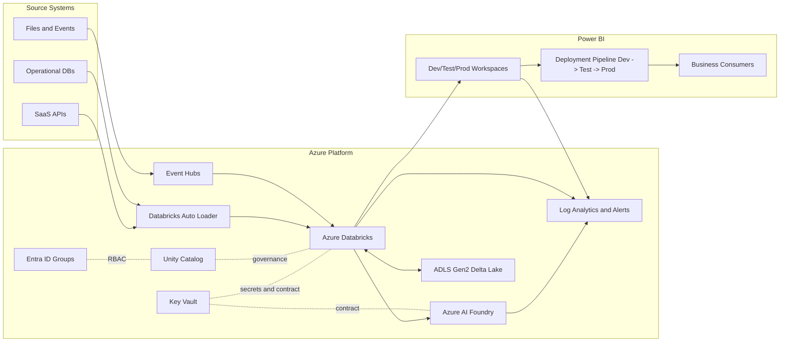
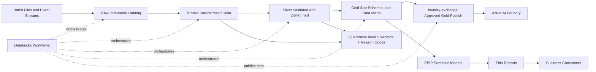
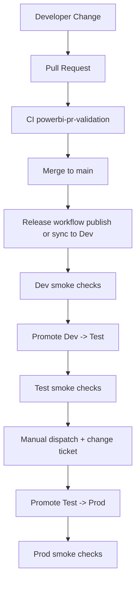
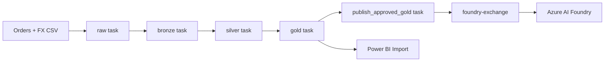

# dataplatform-beta

Azure Databricks data platform baseline with PBIP-first Power BI delivery, Azure AI Foundry exchange integration, CI/CD workflows, and Terraform-managed platform foundations.

## What is implemented
- Planning baseline: architecture, security, operations, and 90-day roadmap.
- PBIP repository structure for semantic models and reports.
- Deployment config contracts for workspaces and pipeline rules.
- GitHub Actions workflows for PBIP validation and release orchestration.
- GitHub Actions workflows for Terraform fmt/init/validate and data-contract checks.
- Python utility scripts for PBIP validation, smoke checks, and deployment pipeline promotion.
- Python utility script for data-contract validation.
- Terraform module for Entra groups used by Power BI RBAC.
- Terraform monitor_alerting module with action groups, Log Analytics, built-in baseline alerts, and saved searches.
- Terraform key_vault module with Foundry-to-Databricks connection contract secret support.
- Terraform network module with VNets, subnets, private endpoints, and private DNS zones.
- Terraform Databricks, Foundry, Unity Catalog, and storage baseline wiring.
- Databricks publish step that promotes approved Gold outputs into `foundry-exchange`.
- Split example ETL for `core_nordic_sales_nok` with explicit raw, bronze, silver, and gold Python stages.
- Databricks Asset Bundle scaffold in `databricks/databricks.yml` with a YAML workflow for `raw -> bronze -> silver -> gold -> publish_approved_gold`.
- Initial dataset contract scaffolding under databricks/contracts.

## Directory map
- PLAN.md: platform plan and decisions.
- docs/architecture.md: architecture overview and component responsibilities.
- docs/security-compliance.md: baseline security/compliance controls.
- docs/operations-slos.md: SLI/SLO and alerting baseline.
- docs/decision-log.md: ownership and closure tracking for open planning decisions.
- docs/progress.md: implementation status against the plan backlog.
- docs/powerbi-serving.md: Power BI delivery operating model.
- powerbi/deployment/: workspace and pipeline config maps.
- powerbi/domains/: domain PBIP artifacts.
- ci/: GitHub Actions workflows for Power BI, Terraform, and data contracts.
- scripts/powerbi/: Power BI automation helpers used by workflows.
- scripts/contracts/: data-contract validation helpers.
- databricks/contracts/: versioned data contracts for CI enforcement.
- databricks/databricks.yml: Databricks Asset Bundle entrypoint for the example workflow.
- databricks/jobs/: bundle-included job YAML resources.
- terraform/: IaC for networking, storage, Databricks, Foundry, Key Vault, observability, Unity Catalog, budgets, and Power BI groups.
- docs/runbooks/: incident and operations runbooks.

## GitHub configuration required
Repository variables:
- PBI_PIPELINE_ID
- PBI_DEV_WORKSPACE_ID
- PBI_TEST_WORKSPACE_ID
- PBI_PROD_WORKSPACE_ID
- PBI_DEV_DATASET_ID
- PBI_TEST_DATASET_ID
- PBI_PROD_DATASET_ID
- PBI_DEV_REPORT_ID
- PBI_TEST_REPORT_ID
- PBI_PROD_REPORT_ID

Repository secrets:
- AZURE_CLIENT_ID
- AZURE_TENANT_ID
- AZURE_SUBSCRIPTION_ID

## Workflow behavior
- ci/powerbi-pr-validation.yml:
  - Runs PBIP structural and naming checks on pull requests.
- ci/powerbi-release.yml:
  - Push to main: validates PBIP conventions, updates Dev, runs Dev smoke checks, promotes Dev -> Test.
  - Manual workflow dispatch on main: promotes Test -> Prod with change ticket gate.
  - Runs post-promotion smoke checks.
- ci/terraform-validate-plan.yml:
  - Runs terraform fmt -check and terraform init/validate for all dev/test/prod stack roots on pull requests.
- ci/terraform-plan-nonprod.yml:
  - Manual workflow to run Terraform plan for selected non-prod environment and stack.
- ci/terraform-apply-nonprod.yml:
  - Manual workflow to run Terraform apply for selected non-prod environment and stack.
- ci/terraform-plan-prod.yml:
  - Manual workflow to run Terraform plan for selected prod stack with change ticket input.
- ci/terraform-apply-prod.yml:
  - Manual workflow to run Terraform apply for selected prod stack with change ticket input and approvals.
- ci/data-contract-checks.yml:
  - Runs data-contract JSON validation on pull requests touching contract files.

## Local validation
Run PBIP validation:

python dataplatform-beta/scripts/powerbi/validate_pbip.py

Run data-contract validation:

python dataplatform-beta/scripts/contracts/validate_contracts.py

Run the staged example ETL tests:

poetry run pytest dataplatform-beta/tests/test_core_nordic_sales_nok.py -q

Validate the Databricks Asset Bundle structure locally:

cd dataplatform-beta/databricks
databricks bundle validate

## Example ETL layout
- `src/dataplatform_beta/example_products/core_nordic_sales_nok_raw.py`: raw extraction and JSON staging.
- `src/dataplatform_beta/example_products/core_nordic_sales_nok_bronze.py`: Bronze validation and quarantine logic.
- `src/dataplatform_beta/example_products/core_nordic_sales_nok_silver.py`: Silver deduplication and FX enrichment.
- `src/dataplatform_beta/example_products/core_nordic_sales_nok_gold.py`: Gold monthly aggregation.
- `src/dataplatform_beta/example_products/core_nordic_sales_nok.py`: compatibility facade and local end-to-end CLI.
- `src/dataplatform_beta/example_products/publish_gold_to_foundry_exchange.py`: approved Gold publish step.

## Architecture and flow diagrams
Mermaid source diagrams are in docs/architecture-flow-diagrams.md and embedded here for quick review.

### Platform architecture

### Data flow

### CI/CD flow

### Example DAB workflow

## Terraform bootstrap

cd dataplatform-beta/terraform/deployment
terraform init
terraform workspace select dev || terraform workspace new dev
terraform plan

## Databricks Asset Bundle bootstrap

cd dataplatform-beta/databricks
databricks bundle validate
databricks bundle deploy --target dev

## Next implementation steps
1. Add tenant-specific PBIP publish-to-Dev mechanism before smoke checks.
2. Replace static IDs with dynamic mapping lookup from deployment config.
3. Add richer semantic model static checks in PR validation.
4. Add diagnostics settings to route resource logs explicitly into Log Analytics.
