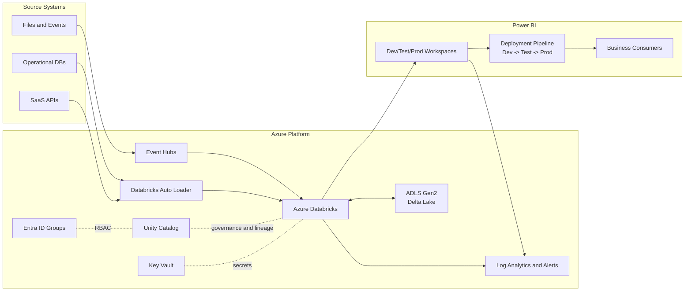
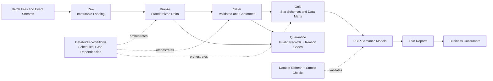
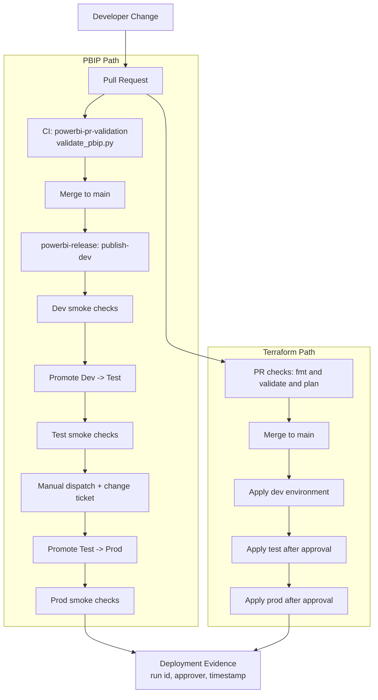

# Dataplatform Beta Architecture and Flow Diagrams

These diagrams are concise Mermaid sources intended for README and docs usage.

## 1) High-level Azure platform architecture

## 2) Data flow: medallion + orchestration + Power BI

## 3) CI/CD promotion flow: PBIP and Terraform

