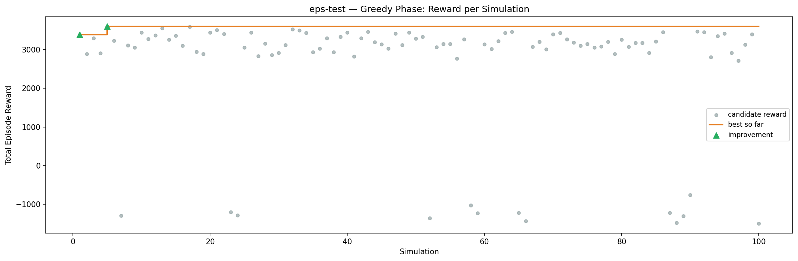
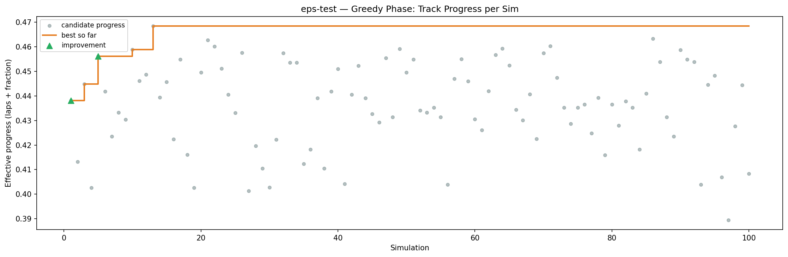
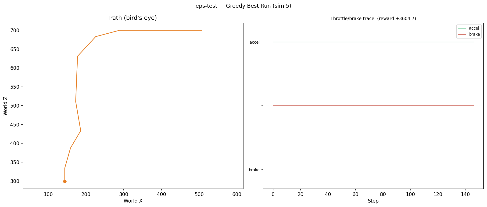
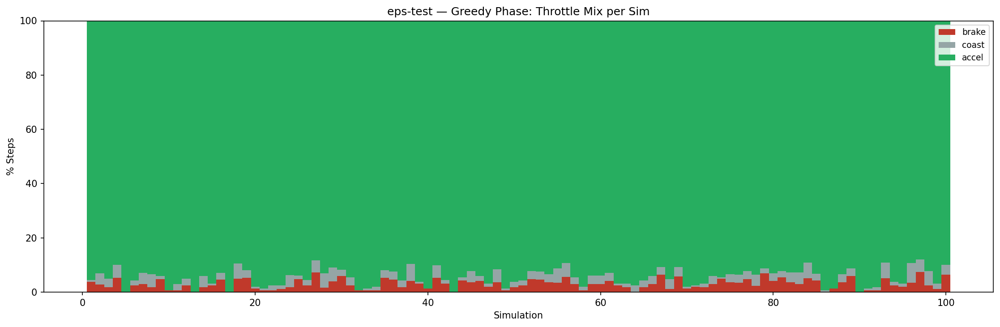
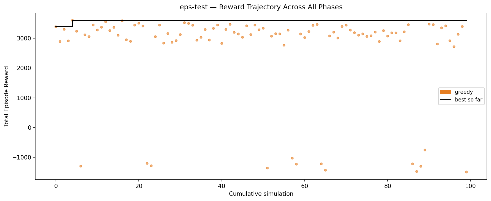

# Experiment: eps-test

## Timings

- **Start:** 2026-04-03 14:47:49
- **End:** 2026-04-03 14:53:02
- **Total runtime:** 5m 13.0s

| Phase | Duration |
|-------|----------|
| Greedy | 5m 07.3s |

## Run Parameters

### Training

| Parameter | Value |
|-----------|-------|
| speed | 10.0 |
| in_game_episode_s | 30.0 |
| n_sims | 100 |
| mutation_scale | 0.05 |
| probe_s | 8.0 |
| cold_restarts | 20 |
| cold_sims | 5 |
| n_lidar_rays | 8 |
| policy_type | epsilon_greedy |
| policy_params | {'n_bins': 3, 'epsilon': 1.0, 'epsilon_decay': 0.995, 'epsilon_min': 0.05, 'alpha': 0.1, 'gamma': 0.99} |

### Reward Config

| Parameter | Value |
|-----------|-------|
| progress_weight | 10000.0 |
| centerline_weight | -0.1 |
| centerline_exp | 2.0 |
| speed_weight | 0.05 |
| step_penalty | -0.05 |
| finish_bonus | 5000.0 |
| finish_time_weight | -5.0 |
| par_time_s | 60.0 |
| accel_bonus | 1.0 |
| airborne_penalty | -1.0 |
| crash_threshold_m | 25.0 |

## Greedy Phase

Best reward: **+3604.7**

| Sim  | Reward   | Result       |
|------|----------|--------------|
|    1 |  +3388.8 | **NEW BEST** |
|    2 |  +2892.5 |  |
|    3 |  +3302.8 |  |
|    4 |  +2914.0 |  |
|    5 |  +3604.7 | **NEW BEST** |
|    6 |  +3238.1 |  |
|    7 |  -1302.2 |  |
|    8 |  +3116.6 |  |
|    9 |  +3057.7 |  |
|   10 |  +3450.2 |  |
|   11 |  +3279.2 |  |
|   12 |  +3373.6 |  |
|   13 |  +3557.1 |  |
|   14 |  +3260.4 |  |
|   15 |  +3369.1 |  |
|   16 |  +3104.1 |  |
|   17 |  +3591.7 |  |
|   18 |  +2950.3 |  |
|   19 |  +2896.6 |  |
|   20 |  +3444.4 |  |
|   21 |  +3509.5 |  |
|   22 |  +3414.9 |  |
|   23 |  -1209.0 |  |
|   24 |  -1290.9 |  |
|   25 |  +3056.4 |  |
|   26 |  +3446.0 |  |
|   27 |  +2838.6 |  |
|   28 |  +3161.2 |  |
|   29 |  +2865.6 |  |
|   30 |  +2921.4 |  |
|   31 |  +3125.1 |  |
|   32 |  +3527.5 |  |
|   33 |  +3501.6 |  |
|   34 |  +3440.3 |  |
|   35 |  +2937.1 |  |
|   36 |  +3033.5 |  |
|   37 |  +3295.9 |  |
|   38 |  +2942.8 |  |
|   39 |  +3333.6 |  |
|   40 |  +3448.2 |  |
|   41 |  +2829.2 |  |
|   42 |  +3298.0 |  |
|   43 |  +3470.7 |  |
|   44 |  +3200.9 |  |
|   45 |  +3146.8 |  |
|   46 |  +3034.7 |  |
|   47 |  +3420.0 |  |
|   48 |  +3125.5 |  |
|   49 |  +3445.8 |  |
|   50 |  +3288.0 |  |
|   51 |  +3338.8 |  |
|   52 |  -1366.3 |  |
|   53 |  +3071.7 |  |
|   54 |  +3155.0 |  |
|   55 |  +3149.1 |  |
|   56 |  +2768.4 |  |
|   57 |  +3273.9 |  |
|   58 |  -1033.4 |  |
|   59 |  -1235.1 |  |
|   60 |  +3146.9 |  |
|   61 |  +3025.1 |  |
|   62 |  +3228.1 |  |
|   63 |  +3436.8 |  |
|   64 |  +3466.6 |  |
|   65 |  -1225.3 |  |
|   66 |  -1438.1 |  |
|   67 |  +3080.0 |  |
|   68 |  +3207.2 |  |
|   69 |  +3009.1 |  |
|   70 |  +3398.3 |  |
|   71 |  +3442.8 |  |
|   72 |  +3276.5 |  |
|   73 |  +3189.9 |  |
|   74 |  +3105.7 |  |
|   75 |  +3148.7 |  |
|   76 |  +3063.8 |  |
|   77 |  +3085.7 |  |
|   78 |  +3209.8 |  |
|   79 |  +2892.7 |  |
|   80 |  +3259.0 |  |
|   81 |  +3075.3 |  |
|   82 |  +3184.1 |  |
|   83 |  +3183.0 |  |
|   84 |  +2916.0 |  |
|   85 |  +3218.2 |  |
|   86 |  +3459.1 |  |
|   87 |  -1226.5 |  |
|   88 |  -1482.3 |  |
|   89 |  -1307.9 |  |
|   90 |   -758.7 |  |
|   91 |  +3478.0 |  |
|   92 |  +3460.3 |  |
|   93 |  +2808.4 |  |
|   94 |  +3352.2 |  |
|   95 |  +3418.7 |  |
|   96 |  +2917.8 |  |
|   97 |  +2717.5 |  |
|   98 |  +3135.6 |  |
|   99 |  +3397.7 |  |
|  100 |  -1498.9 |  |

## Additional Plots

