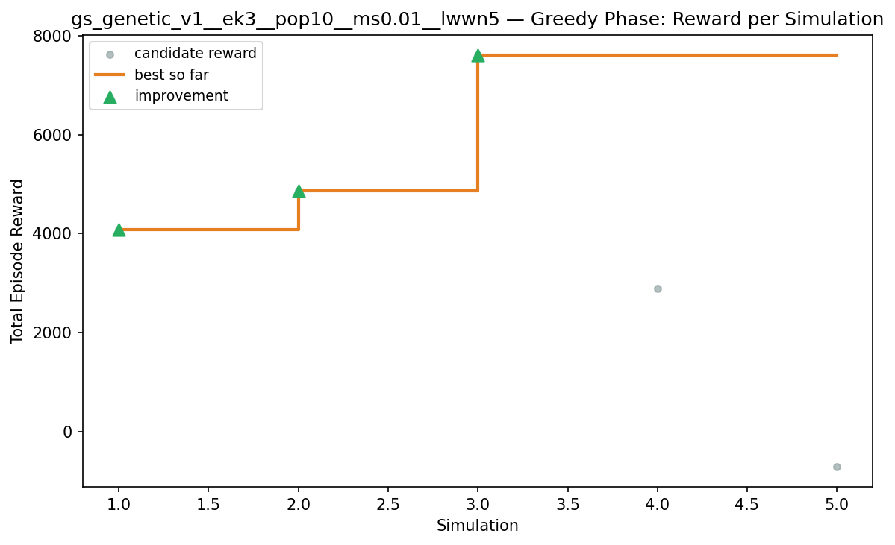
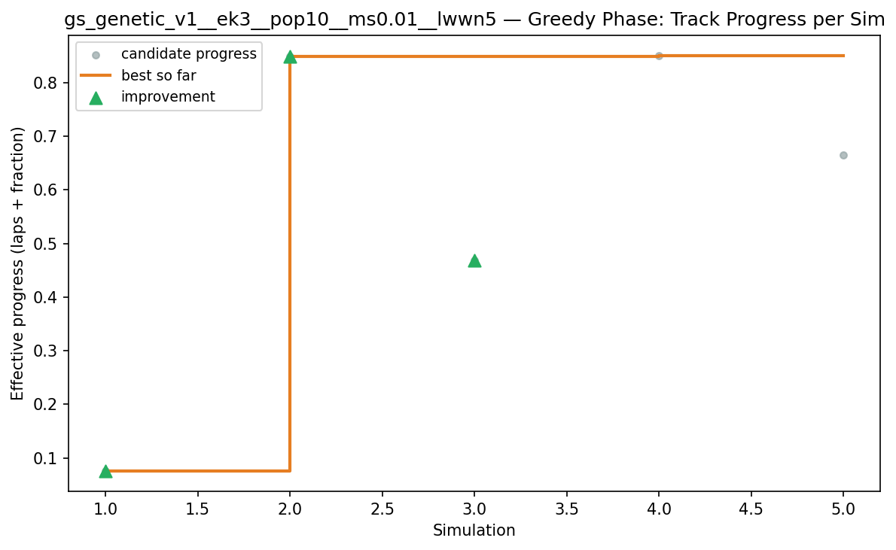
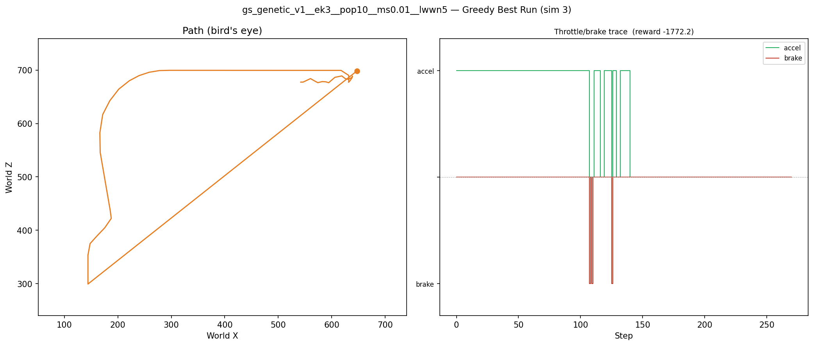
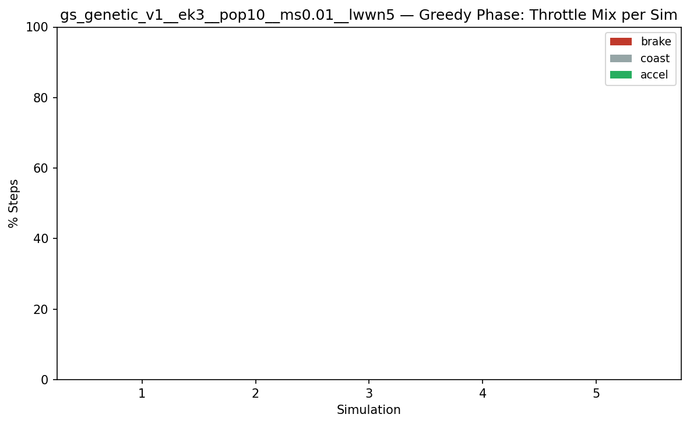
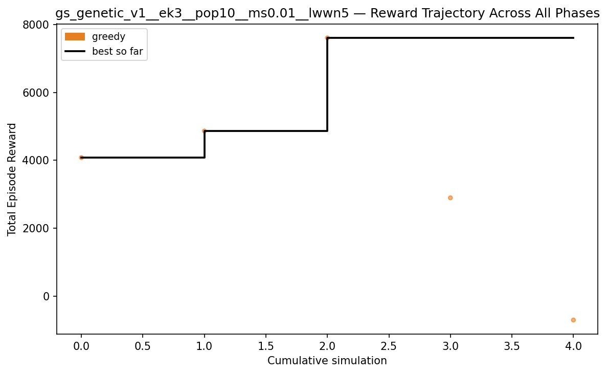
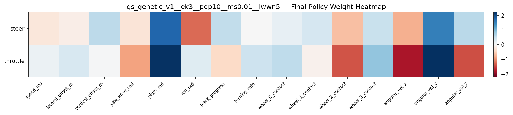

# Experiment: gs_genetic_v1__ek3__pop10__ms0.01__lwwn5

## Timings

- **Start:** 2026-04-03 19:59:49
- **End:** 2026-04-03 20:07:33
- **Total runtime:** 7m 43.5s

| Phase | Duration |
|-------|----------|
| Greedy | 7m 16.7s |

## Run Parameters

### Training

| Parameter | Value |
|-----------|-------|
| speed | 10.0 |
| n_sims | 5 |
| in_game_episode_s | 90.0 |
| n_lidar_rays | 8 |
| policy_type | genetic |
| elite_k | 3 |
| population_size | 10 |
| mutation_scale | 0.01 |

### Reward Config

| Parameter | Value |
|-----------|-------|
| progress_weight | 10000.0 |
| centerline_weight | 0.0 |
| centerline_exp | 0.0 |
| speed_weight | 0.05 |
| step_penalty | -0.01 |
| finish_bonus | 5000.0 |
| finish_time_weight | -5.0 |
| par_time_s | 60.0 |
| accel_bonus | 1.0 |
| airborne_penalty | -1.0 |
| lidar_wall_weight | -5.0 |
| crash_threshold_m | 25.0 |

## Greedy Phase

Best reward: **+7602.2**

| Sim  | Reward   | Result       |
|------|----------|--------------|
|    1 |  +4082.6 | **NEW BEST** |
|    2 |  +4863.4 | **NEW BEST** |
|    3 |  +7602.2 | **NEW BEST** |
|    4 |  +2898.8 |  |
|    5 |   -695.7 |  |

## Additional Plots

