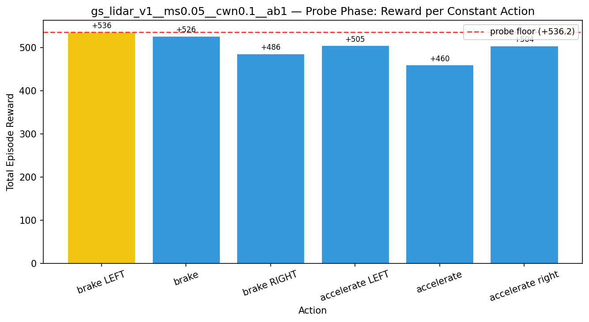
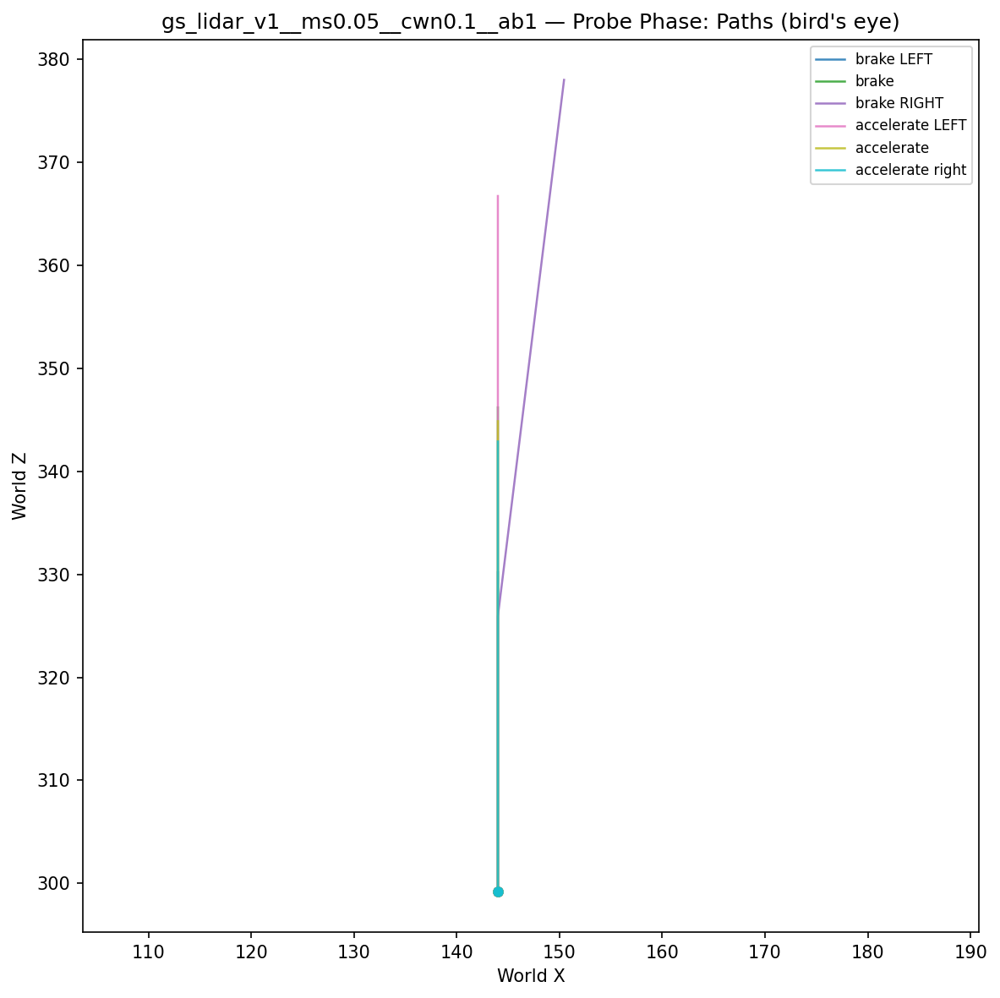
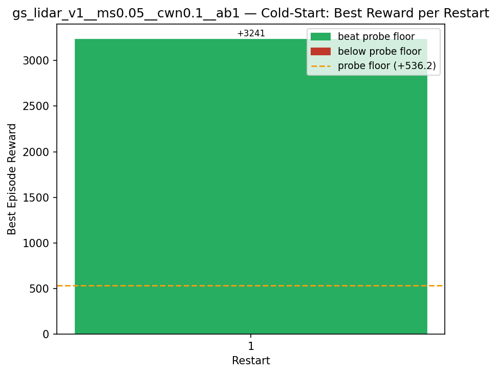
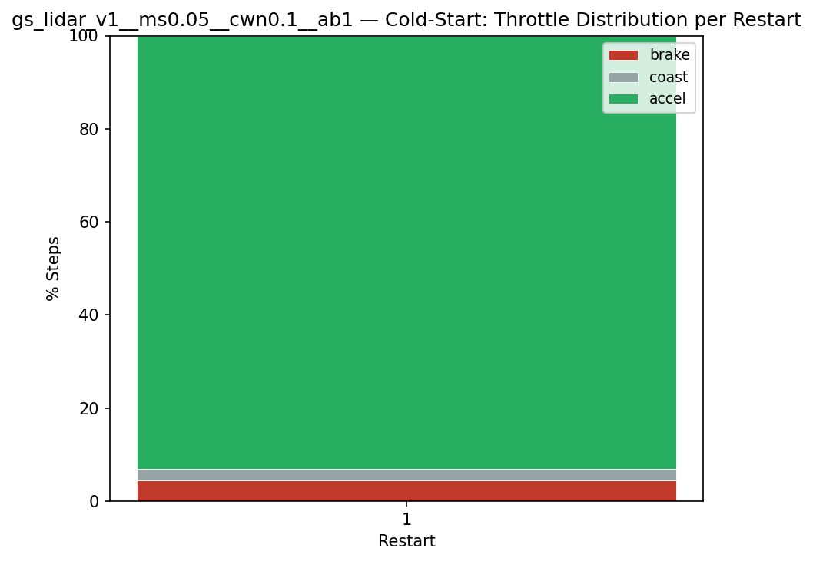
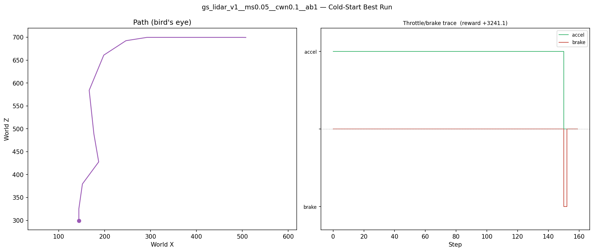
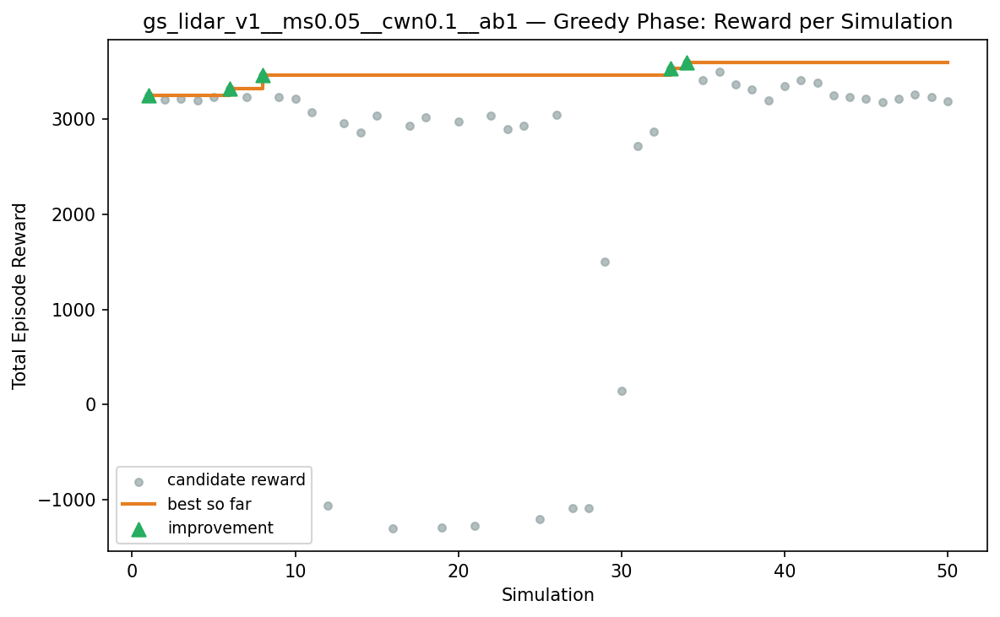
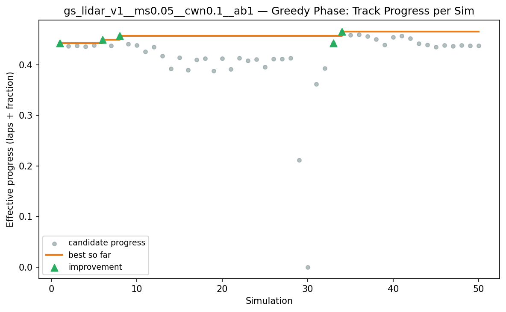
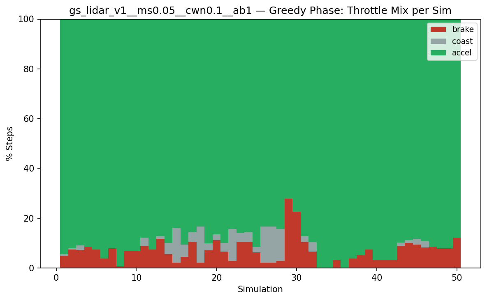
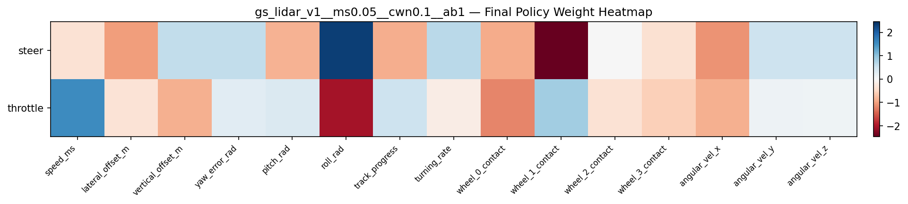

# Experiment: gs_lidar_v1__ms0.05__cwn0.1__ab1

## Timings

- **Start:** 2026-03-15 23:53:33
- **End:** 2026-03-15 23:56:30
- **Total runtime:** 2m 57.2s

| Phase | Duration |
|-------|----------|
| Probe | 6.5s |
| Cold-start | 16.4s |
| Greedy | 2m 33.3s |

## Run Parameters

### Training

| Parameter | Value |
|-----------|-------|
| speed | 10.0 |
| n_sims | 50 |
| in_game_episode_s | 30.0 |
| mutation_scale | 0.05 |
| probe_s | 8.0 |
| cold_restarts | 20 |
| cold_sims | 5 |
| n_lidar_rays | 8 |

### Reward Config

| Parameter | Value |
|-----------|-------|
| progress_weight | 10000.0 |
| centerline_weight | -0.1 |
| centerline_exp | 2.0 |
| speed_weight | 0.05 |
| step_penalty | -0.05 |
| finish_bonus | 5000.0 |
| finish_time_weight | -5.0 |
| par_time_s | 60.0 |
| accel_bonus | 1.0 |
| airborne_penalty | -1.0 |
| crash_threshold_m | 25.0 |

## Probe Phase

Best probe reward: **+536.2**

| Action | Name            | Reward   |          |
|--------|-----------------|----------|----------|
|      0 | brake LEFT      |   +536.2 | ← best |
|      1 | brake           |   +526.3 |  |
|      2 | brake RIGHT     |   +486.1 |  |
|      6 | accelerate LEFT |   +504.7 |  |
|      7 | accelerate      |   +460.1 |  |
|      8 | accelerate right |   +504.3 |  |

## Cold-Start Search

Best cold-start reward: **+3241.1**
Probe floor: **+536.2**

| Restart | Best Reward | Beat Probe Floor |          |
|---------|-------------|------------------|----------|
|       1 |     +3241.1 | yes              | ← best |

## Greedy Phase

Best reward: **+3597.4**

| Sim  | Reward   | Result       |
|------|----------|--------------|
|    1 |  +3253.5 | **NEW BEST** |
|    2 |  +3211.7 |  |
|    3 |  +3218.3 |  |
|    4 |  +3201.6 |  |
|    5 |  +3235.4 |  |
|    6 |  +3324.1 | **NEW BEST** |
|    7 |  +3232.3 |  |
|    8 |  +3469.1 | **NEW BEST** |
|    9 |  +3232.2 |  |
|   10 |  +3213.2 |  |
|   11 |  +3073.4 |  |
|   12 |  -1061.2 |  |
|   13 |  +2959.6 |  |
|   14 |  +2865.5 |  |
|   15 |  +3035.7 |  |
|   16 |  -1298.5 |  |
|   17 |  +2932.6 |  |
|   18 |  +3022.3 |  |
|   19 |  -1296.4 |  |
|   20 |  +2978.3 |  |
|   21 |  -1277.3 |  |
|   22 |  +3036.0 |  |
|   23 |  +2896.8 |  |
|   24 |  +2933.0 |  |
|   25 |  -1209.2 |  |
|   26 |  +3045.5 |  |
|   27 |  -1085.8 |  |
|   28 |  -1093.6 |  |
|   29 |  +1500.3 |  |
|   30 |   +146.9 |  |
|   31 |  +2719.8 |  |
|   32 |  +2866.8 |  |
|   33 |  +3533.8 | **NEW BEST** |
|   34 |  +3597.4 | **NEW BEST** |
|   35 |  +3414.7 |  |
|   36 |  +3501.3 |  |
|   37 |  +3365.5 |  |
|   38 |  +3316.3 |  |
|   39 |  +3197.6 |  |
|   40 |  +3352.9 |  |
|   41 |  +3410.7 |  |
|   42 |  +3386.9 |  |
|   43 |  +3255.7 |  |
|   44 |  +3234.3 |  |
|   45 |  +3212.3 |  |
|   46 |  +3183.7 |  |
|   47 |  +3220.5 |  |
|   48 |  +3264.2 |  |
|   49 |  +3231.6 |  |
|   50 |  +3189.3 |  |

## Additional Plots

