# Experiment: gs_lidar_v1__ms0.05__cwn0.1__ab2

## Timings

- **Start:** 2026-03-15 23:56:33
- **End:** 2026-03-15 23:59:31
- **Total runtime:** 2m 58.1s

| Phase | Duration |
|-------|----------|
| Probe | 6.4s |
| Cold-start | 16.5s |
| Greedy | 2m 34.2s |

## Run Parameters

### Training

| Parameter | Value |
|-----------|-------|
| speed | 10.0 |
| n_sims | 50 |
| in_game_episode_s | 30.0 |
| mutation_scale | 0.05 |
| probe_s | 8.0 |
| cold_restarts | 20 |
| cold_sims | 5 |
| n_lidar_rays | 8 |

### Reward Config

| Parameter | Value |
|-----------|-------|
| progress_weight | 10000.0 |
| centerline_weight | -0.1 |
| centerline_exp | 2.0 |
| speed_weight | 0.05 |
| step_penalty | -0.05 |
| finish_bonus | 5000.0 |
| finish_time_weight | -5.0 |
| par_time_s | 60.0 |
| accel_bonus | 2.0 |
| airborne_penalty | -1.0 |
| crash_threshold_m | 25.0 |

## Probe Phase

Best probe reward: **+564.1**

| Action | Name            | Reward   |          |
|--------|-----------------|----------|----------|
|      0 | brake LEFT      |   +495.0 |  |
|      1 | brake           |   +560.4 |  |
|      2 | brake RIGHT     |   +510.7 |  |
|      6 | accelerate LEFT |   +540.7 |  |
|      7 | accelerate      |   +523.1 |  |
|      8 | accelerate right |   +564.1 | ← best |

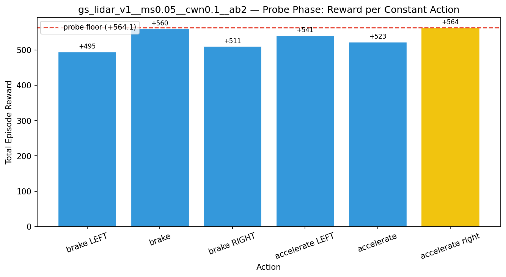

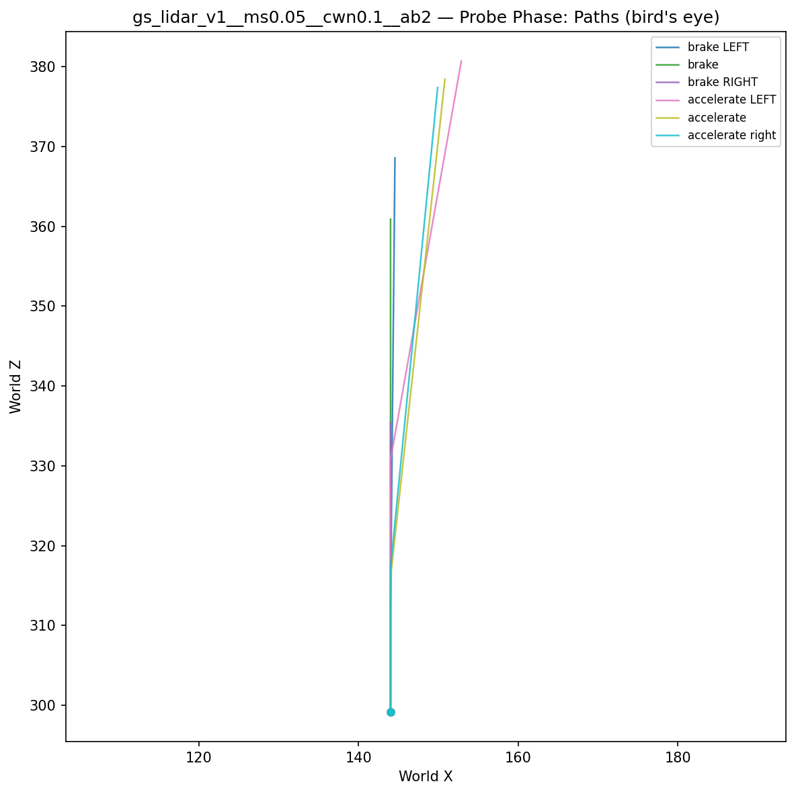

## Cold-Start Search

Best cold-start reward: **+3607.2**
Probe floor: **+564.1**

| Restart | Best Reward | Beat Probe Floor |          |
|---------|-------------|------------------|----------|
|       1 |     +3607.2 | yes              | ← best |

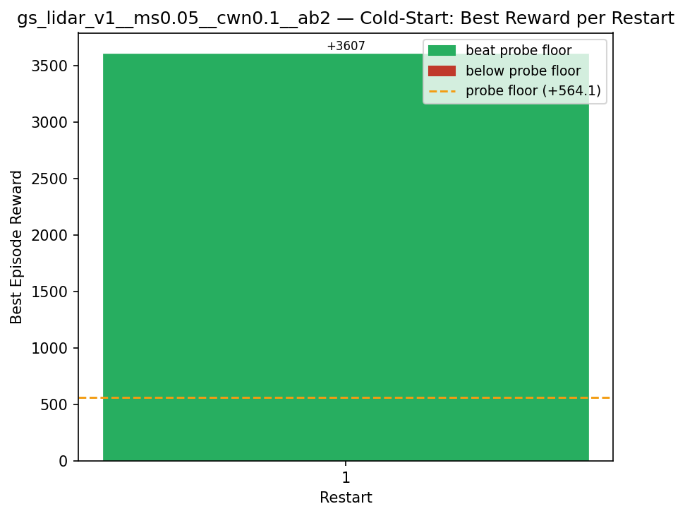

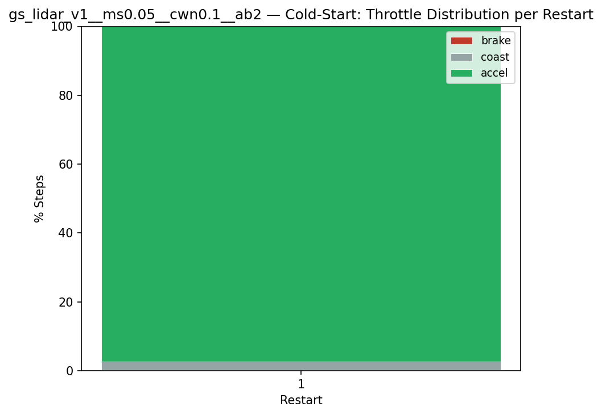

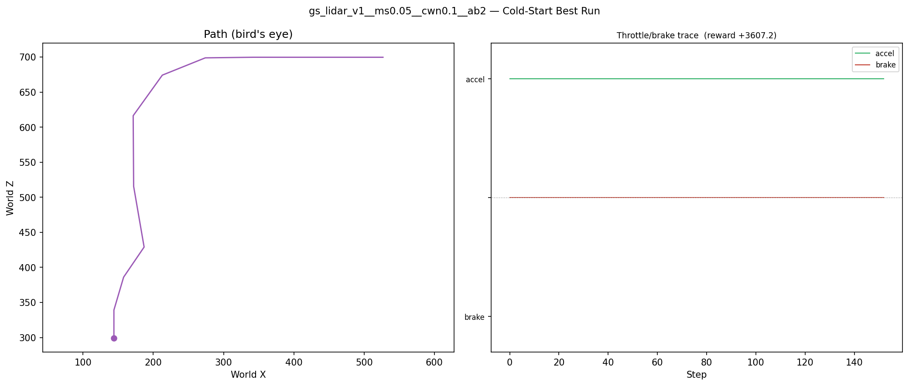

## Greedy Phase

Best reward: **+3784.4**

| Sim  | Reward   | Result       |
|------|----------|--------------|
|    1 |  -1155.0 |  |
|    2 |  +3509.0 |  |
|    3 |   -948.2 |  |
|    4 |  +3660.3 | **NEW BEST** |
|    5 |  +3599.9 |  |
|    6 |  -1191.1 |  |
|    7 |  +3660.8 | **NEW BEST** |
|    8 |  +3699.2 | **NEW BEST** |
|    9 |  +3784.4 | **NEW BEST** |
|   10 |  +3627.1 |  |
|   11 |  +3498.2 |  |
|   12 |  +3328.4 |  |
|   13 |  +3533.1 |  |
|   14 |  +3562.7 |  |
|   15 |  +3597.4 |  |
|   16 |  +3719.2 |  |
|   17 |  +3584.0 |  |
|   18 |   -960.0 |  |
|   19 |  +3612.5 |  |
|   20 |  +3532.2 |  |
|   21 |  +3698.3 |  |
|   22 |  +3700.5 |  |
|   23 |  +3681.7 |  |
|   24 |  +3528.3 |  |
|   25 |  +3603.9 |  |
|   26 |  -1144.3 |  |
|   27 |  +3476.4 |  |
|   28 |  +3729.6 |  |
|   29 |  +3500.7 |  |
|   30 |  +3417.9 |  |
|   31 |  +3610.0 |  |
|   32 |  -1323.1 |  |
|   33 |  +3396.0 |  |
|   34 |  +3332.2 |  |
|   35 |  +3381.4 |  |
|   36 |  +3405.1 |  |
|   37 |  +3264.1 |  |
|   38 |  +3334.2 |  |
|   39 |  +3723.3 |  |
|   40 |  +3476.2 |  |
|   41 |  +3600.8 |  |
|   42 |  +3702.8 |  |
|   43 |  +3579.5 |  |
|   44 |   -961.9 |  |
|   45 |  +3664.0 |  |
|   46 |  -1412.3 |  |
|   47 |  +3412.1 |  |
|   48 |  +3614.3 |  |
|   49 |  +3537.1 |  |
|   50 |  +3660.4 |  |

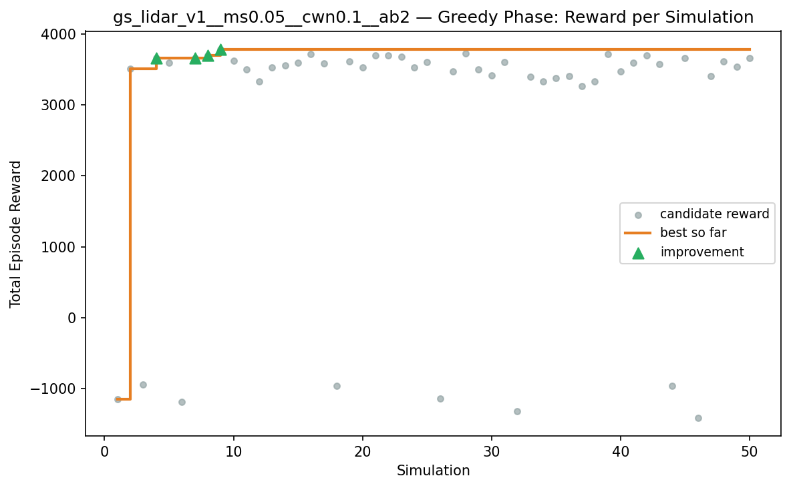

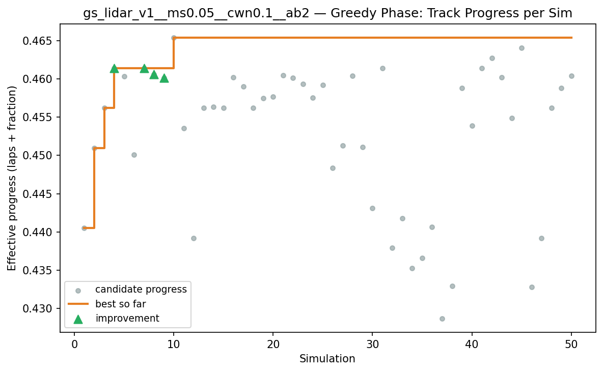

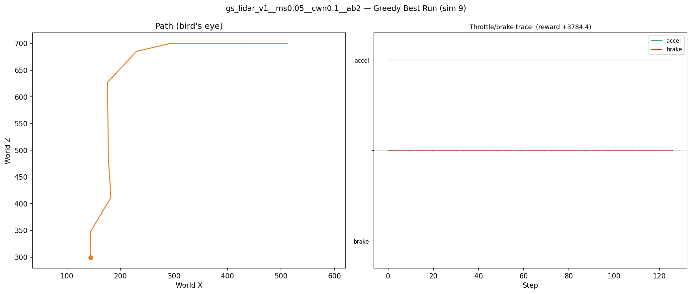

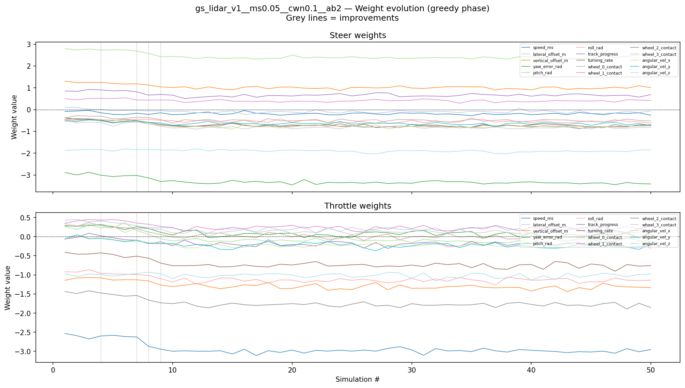

## Additional Plots

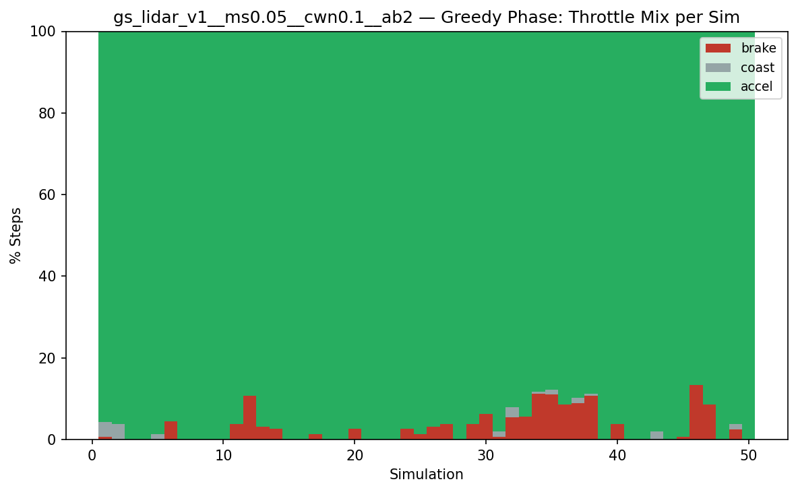

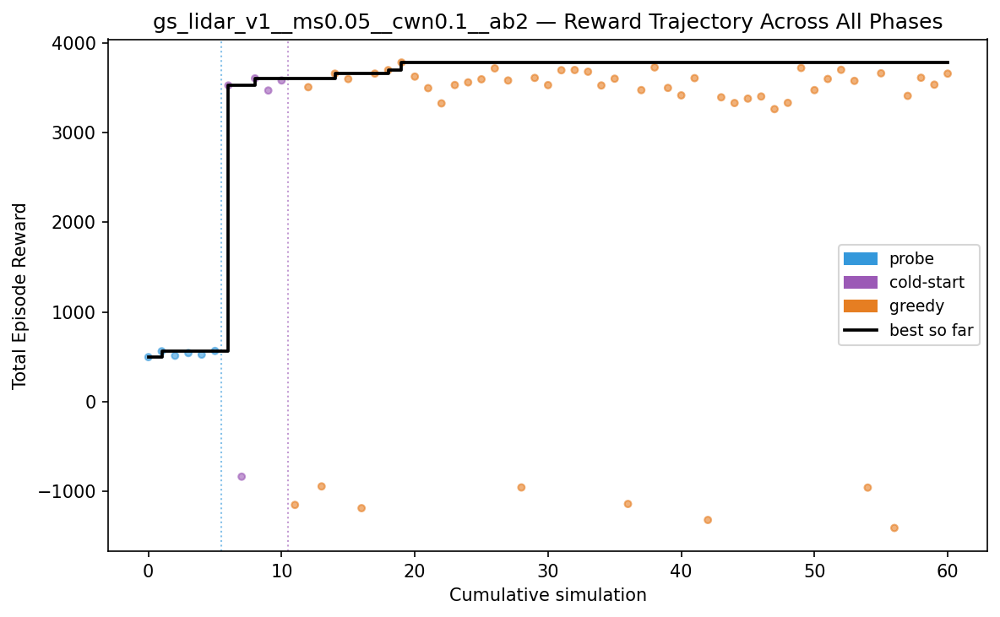

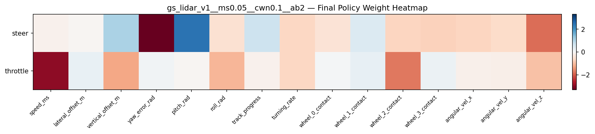

