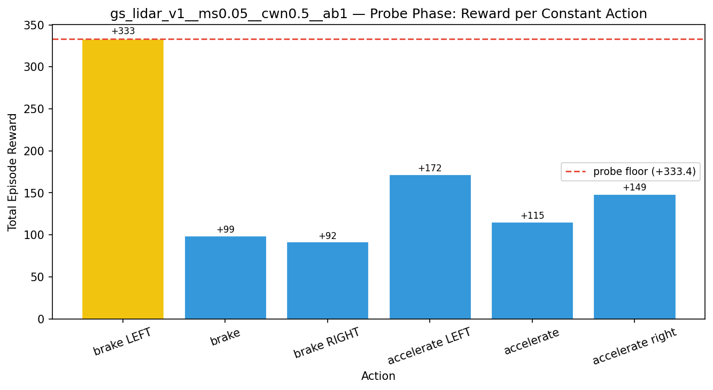
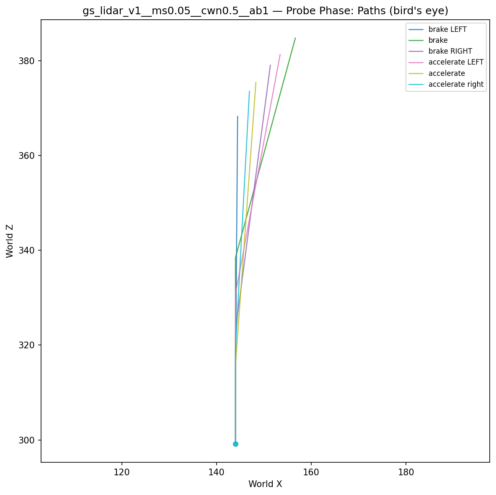
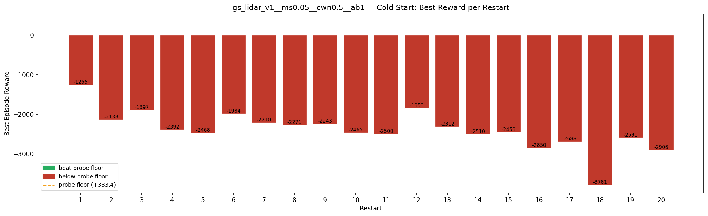
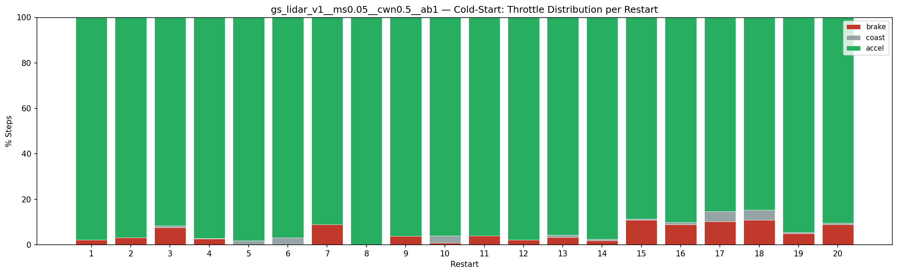
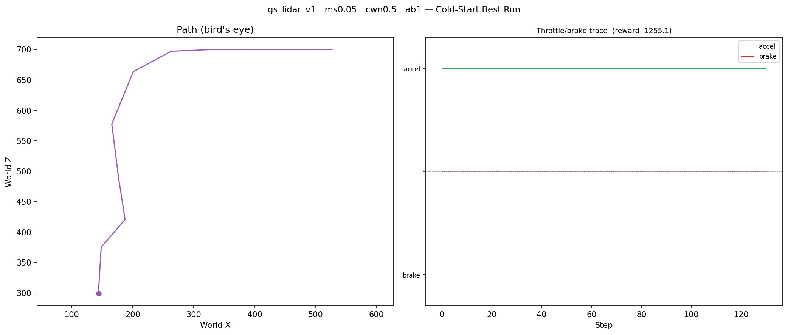
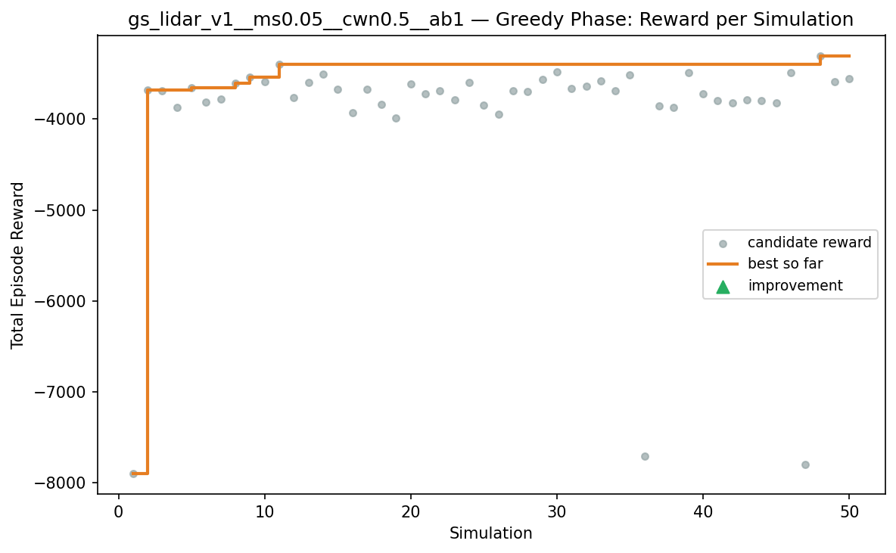
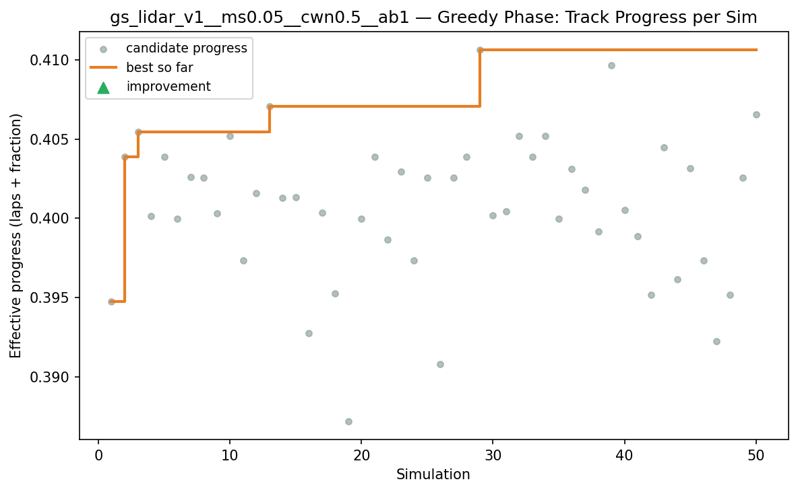
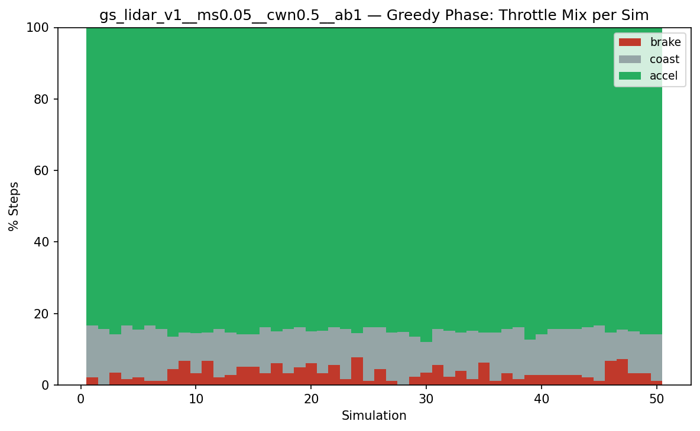
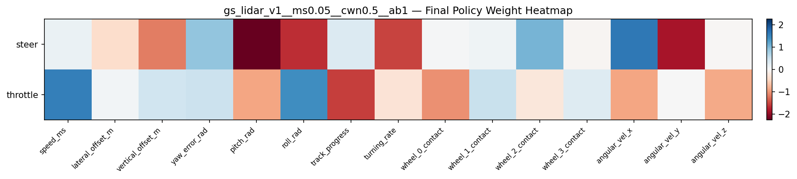

# Experiment: gs_lidar_v1__ms0.05__cwn0.5__ab1

## Timings

- **Start:** 2026-03-15 23:59:33
- **End:** 2026-03-16 00:07:21
- **Total runtime:** 7m 47.3s

| Phase | Duration |
|-------|----------|
| Probe | 6.4s |
| Cold-start | 5m 08.1s |
| Greedy | 2m 31.8s |

## Run Parameters

### Training

| Parameter | Value |
|-----------|-------|
| speed | 10.0 |
| n_sims | 50 |
| in_game_episode_s | 30.0 |
| mutation_scale | 0.05 |
| probe_s | 8.0 |
| cold_restarts | 20 |
| cold_sims | 5 |
| n_lidar_rays | 8 |

### Reward Config

| Parameter | Value |
|-----------|-------|
| progress_weight | 10000.0 |
| centerline_weight | -0.5 |
| centerline_exp | 2.0 |
| speed_weight | 0.05 |
| step_penalty | -0.05 |
| finish_bonus | 5000.0 |
| finish_time_weight | -5.0 |
| par_time_s | 60.0 |
| accel_bonus | 1.0 |
| airborne_penalty | -1.0 |
| crash_threshold_m | 25.0 |

## Probe Phase

Best probe reward: **+333.4**

| Action | Name            | Reward   |          |
|--------|-----------------|----------|----------|
|      0 | brake LEFT      |   +333.4 | ← best |
|      1 | brake           |    +99.1 |  |
|      2 | brake RIGHT     |    +91.9 |  |
|      6 | accelerate LEFT |   +171.8 |  |
|      7 | accelerate      |   +115.4 |  |
|      8 | accelerate right |   +148.6 |  |

## Cold-Start Search

Best cold-start reward: **-1255.1**
Probe floor: **+333.4**

| Restart | Best Reward | Beat Probe Floor |          |
|---------|-------------|------------------|----------|
|       1 |     -1255.1 | no               | ← best |
|       2 |     -2137.5 | no               |  |
|       3 |     -1896.6 | no               |  |
|       4 |     -2391.6 | no               |  |
|       5 |     -2468.1 | no               |  |
|       6 |     -1984.1 | no               |  |
|       7 |     -2210.0 | no               |  |
|       8 |     -2271.1 | no               |  |
|       9 |     -2243.0 | no               |  |
|      10 |     -2465.5 | no               |  |
|      11 |     -2499.7 | no               |  |
|      12 |     -1853.1 | no               |  |
|      13 |     -2312.2 | no               |  |
|      14 |     -2510.0 | no               |  |
|      15 |     -2458.1 | no               |  |
|      16 |     -2849.7 | no               |  |
|      17 |     -2688.2 | no               |  |
|      18 |     -3781.2 | no               |  |
|      19 |     -2591.3 | no               |  |
|      20 |     -2906.2 | no               |  |

## Greedy Phase

Best reward: **-3308.7**

| Sim  | Reward   | Result       |
|------|----------|--------------|
|    1 |  -7892.8 |  |
|    2 |  -3684.1 |  |
|    3 |  -3694.5 |  |
|    4 |  -3876.5 |  |
|    5 |  -3661.1 |  |
|    6 |  -3813.5 |  |
|    7 |  -3778.8 |  |
|    8 |  -3603.6 |  |
|    9 |  -3542.4 |  |
|   10 |  -3589.6 |  |
|   11 |  -3398.8 |  |
|   12 |  -3764.5 |  |
|   13 |  -3596.8 |  |
|   14 |  -3505.4 |  |
|   15 |  -3672.5 |  |
|   16 |  -3935.6 |  |
|   17 |  -3674.6 |  |
|   18 |  -3836.9 |  |
|   19 |  -3987.3 |  |
|   20 |  -3618.5 |  |
|   21 |  -3724.5 |  |
|   22 |  -3686.8 |  |
|   23 |  -3793.7 |  |
|   24 |  -3597.7 |  |
|   25 |  -3844.6 |  |
|   26 |  -3951.1 |  |
|   27 |  -3688.3 |  |
|   28 |  -3698.6 |  |
|   29 |  -3569.3 |  |
|   30 |  -3486.2 |  |
|   31 |  -3663.5 |  |
|   32 |  -3642.4 |  |
|   33 |  -3586.3 |  |
|   34 |  -3694.5 |  |
|   35 |  -3513.3 |  |
|   36 |  -7709.6 |  |
|   37 |  -3854.1 |  |
|   38 |  -3871.4 |  |
|   39 |  -3488.5 |  |
|   40 |  -3723.9 |  |
|   41 |  -3795.8 |  |
|   42 |  -3823.8 |  |
|   43 |  -3786.3 |  |
|   44 |  -3798.8 |  |
|   45 |  -3824.1 |  |
|   46 |  -3487.0 |  |
|   47 |  -7796.2 |  |
|   48 |  -3308.7 |  |
|   49 |  -3587.6 |  |
|   50 |  -3553.9 |  |

## Additional Plots

