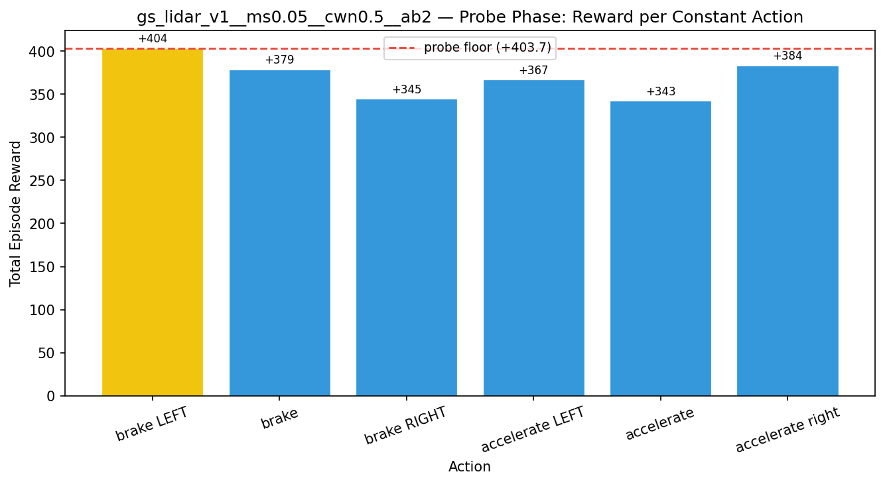
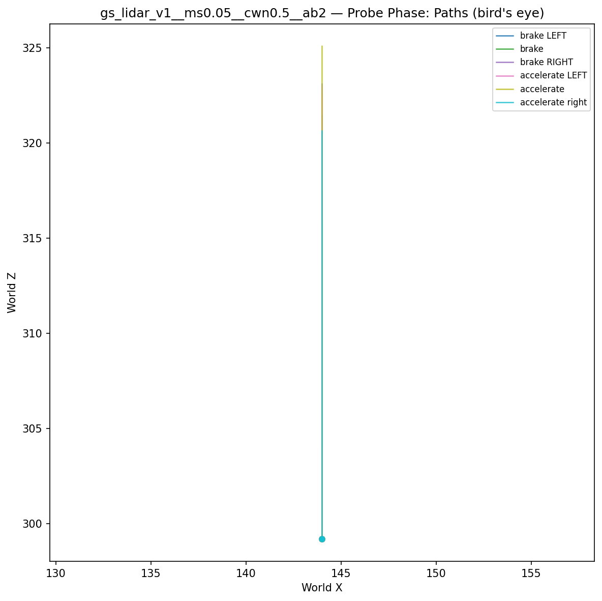
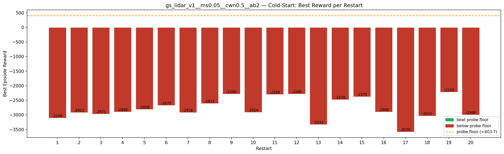
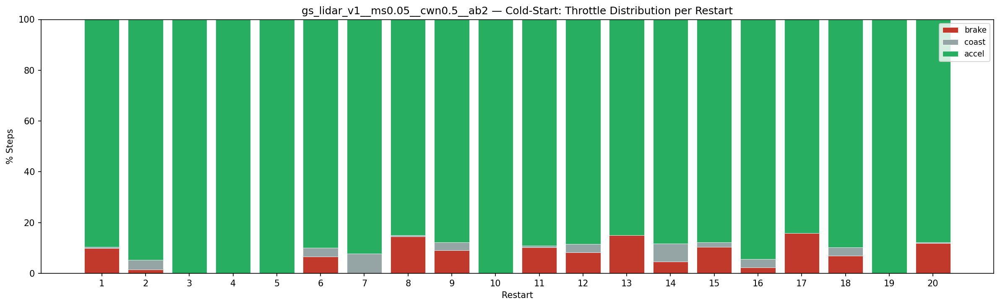
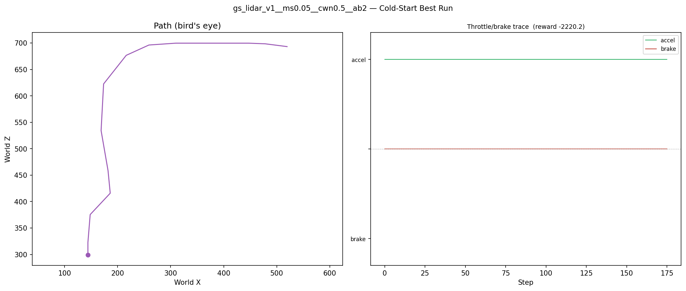
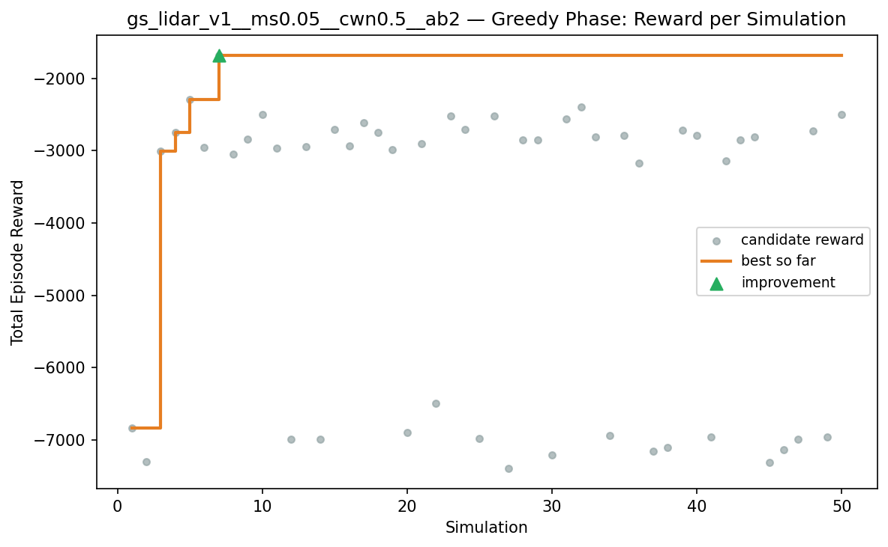
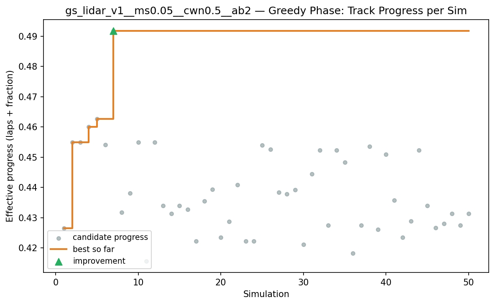
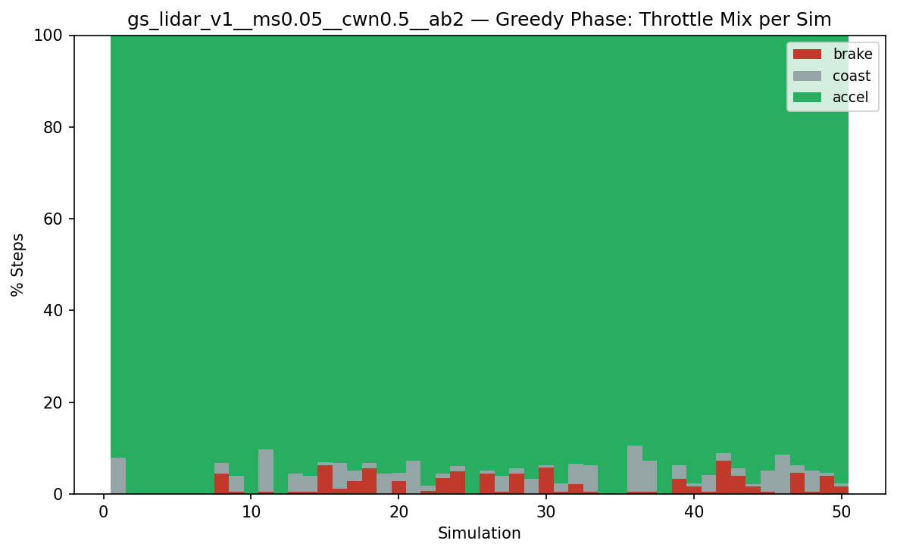
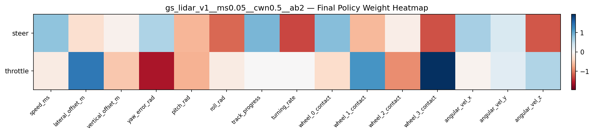

# Experiment: gs_lidar_v1__ms0.05__cwn0.5__ab2

## Timings

- **Start:** 2026-03-16 00:07:24
- **End:** 2026-03-16 00:15:07
- **Total runtime:** 7m 43.8s

| Phase | Duration |
|-------|----------|
| Probe | 6.0s |
| Cold-start | 5m 04.8s |
| Greedy | 2m 31.9s |

## Run Parameters

### Training

| Parameter | Value |
|-----------|-------|
| speed | 10.0 |
| n_sims | 50 |
| in_game_episode_s | 30.0 |
| mutation_scale | 0.05 |
| probe_s | 8.0 |
| cold_restarts | 20 |
| cold_sims | 5 |
| n_lidar_rays | 8 |

### Reward Config

| Parameter | Value |
|-----------|-------|
| progress_weight | 10000.0 |
| centerline_weight | -0.5 |
| centerline_exp | 2.0 |
| speed_weight | 0.05 |
| step_penalty | -0.05 |
| finish_bonus | 5000.0 |
| finish_time_weight | -5.0 |
| par_time_s | 60.0 |
| accel_bonus | 2.0 |
| airborne_penalty | -1.0 |
| crash_threshold_m | 25.0 |

## Probe Phase

Best probe reward: **+403.7**

| Action | Name            | Reward   |          |
|--------|-----------------|----------|----------|
|      0 | brake LEFT      |   +403.7 | ← best |
|      1 | brake           |   +378.6 |  |
|      2 | brake RIGHT     |   +345.0 |  |
|      6 | accelerate LEFT |   +367.0 |  |
|      7 | accelerate      |   +342.7 |  |
|      8 | accelerate right |   +383.6 |  |

## Cold-Start Search

Best cold-start reward: **-2220.2**
Probe floor: **+403.7**

| Restart | Best Reward | Beat Probe Floor |          |
|---------|-------------|------------------|----------|
|       1 |     -3108.1 | no               |  |
|       2 |     -2921.1 | no               |  |
|       3 |     -2971.0 | no               |  |
|       4 |     -2899.1 | no               |  |
|       5 |     -2807.6 | no               |  |
|       6 |     -2669.7 | no               |  |
|       7 |     -2915.6 | no               |  |
|       8 |     -2611.1 | no               |  |
|       9 |     -2280.4 | no               |  |
|      10 |     -2913.6 | no               |  |
|      11 |     -2299.2 | no               |  |
|      12 |     -2285.9 | no               |  |
|      13 |     -3332.8 | no               |  |
|      14 |     -2478.2 | no               |  |
|      15 |     -2375.4 | no               |  |
|      16 |     -2899.7 | no               |  |
|      17 |     -3579.4 | no               |  |
|      18 |     -3034.6 | no               |  |
|      19 |     -2220.2 | no               | ← best |
|      20 |     -2998.1 | no               |  |

## Greedy Phase

Best reward: **-1683.5**

| Sim  | Reward   | Result       |
|------|----------|--------------|
|    1 |  -6831.2 |  |
|    2 |  -7304.0 |  |
|    3 |  -3008.6 |  |
|    4 |  -2744.9 |  |
|    5 |  -2290.0 |  |
|    6 |  -2958.7 |  |
|    7 |  -1683.5 | **NEW BEST** |
|    8 |  -3045.9 |  |
|    9 |  -2838.5 |  |
|   10 |  -2495.3 |  |
|   11 |  -2966.2 |  |
|   12 |  -6991.9 |  |
|   13 |  -2940.2 |  |
|   14 |  -6989.7 |  |
|   15 |  -2709.4 |  |
|   16 |  -2934.7 |  |
|   17 |  -2614.4 |  |
|   18 |  -2749.0 |  |
|   19 |  -2990.4 |  |
|   20 |  -6892.6 |  |
|   21 |  -2900.4 |  |
|   22 |  -6490.9 |  |
|   23 |  -2517.1 |  |
|   24 |  -2706.1 |  |
|   25 |  -6981.9 |  |
|   26 |  -2517.9 |  |
|   27 |  -7388.2 |  |
|   28 |  -2851.9 |  |
|   29 |  -2850.3 |  |
|   30 |  -7207.2 |  |
|   31 |  -2558.2 |  |
|   32 |  -2393.9 |  |
|   33 |  -2812.6 |  |
|   34 |  -6938.8 |  |
|   35 |  -2792.2 |  |
|   36 |  -3169.5 |  |
|   37 |  -7153.1 |  |
|   38 |  -7102.3 |  |
|   39 |  -2720.3 |  |
|   40 |  -2785.7 |  |
|   41 |  -6960.7 |  |
|   42 |  -3142.1 |  |
|   43 |  -2846.6 |  |
|   44 |  -2807.7 |  |
|   45 |  -7306.1 |  |
|   46 |  -7132.5 |  |
|   47 |  -6988.3 |  |
|   48 |  -2726.8 |  |
|   49 |  -6955.0 |  |
|   50 |  -2503.9 |  |

## Additional Plots

