# Experiment: gs_lidar_v1__ms0.1__cwn0.1__ab1

## Timings

- **Start:** 2026-03-16 00:15:10
- **End:** 2026-03-16 00:18:05
- **Total runtime:** 2m 55.2s

| Phase | Duration |
|-------|----------|
| Probe | 6.0s |
| Cold-start | 16.2s |
| Greedy | 2m 32.0s |

## Run Parameters

### Training

| Parameter | Value |
|-----------|-------|
| speed | 10.0 |
| n_sims | 50 |
| in_game_episode_s | 30.0 |
| mutation_scale | 0.1 |
| probe_s | 8.0 |
| cold_restarts | 20 |
| cold_sims | 5 |
| n_lidar_rays | 8 |

### Reward Config

| Parameter | Value |
|-----------|-------|
| progress_weight | 10000.0 |
| centerline_weight | -0.1 |
| centerline_exp | 2.0 |
| speed_weight | 0.05 |
| step_penalty | -0.05 |
| finish_bonus | 5000.0 |
| finish_time_weight | -5.0 |
| par_time_s | 60.0 |
| accel_bonus | 1.0 |
| airborne_penalty | -1.0 |
| crash_threshold_m | 25.0 |

## Probe Phase

Best probe reward: **+444.4**

| Action | Name            | Reward   |          |
|--------|-----------------|----------|----------|
|      0 | brake LEFT      |   +444.4 | ← best |
|      1 | brake           |   +437.7 |  |
|      2 | brake RIGHT     |   +433.9 |  |
|      6 | accelerate LEFT |   +433.9 |  |
|      7 | accelerate      |   +434.4 |  |
|      8 | accelerate right |   +440.4 |  |

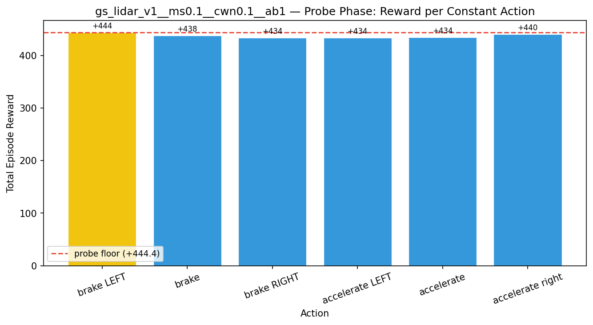

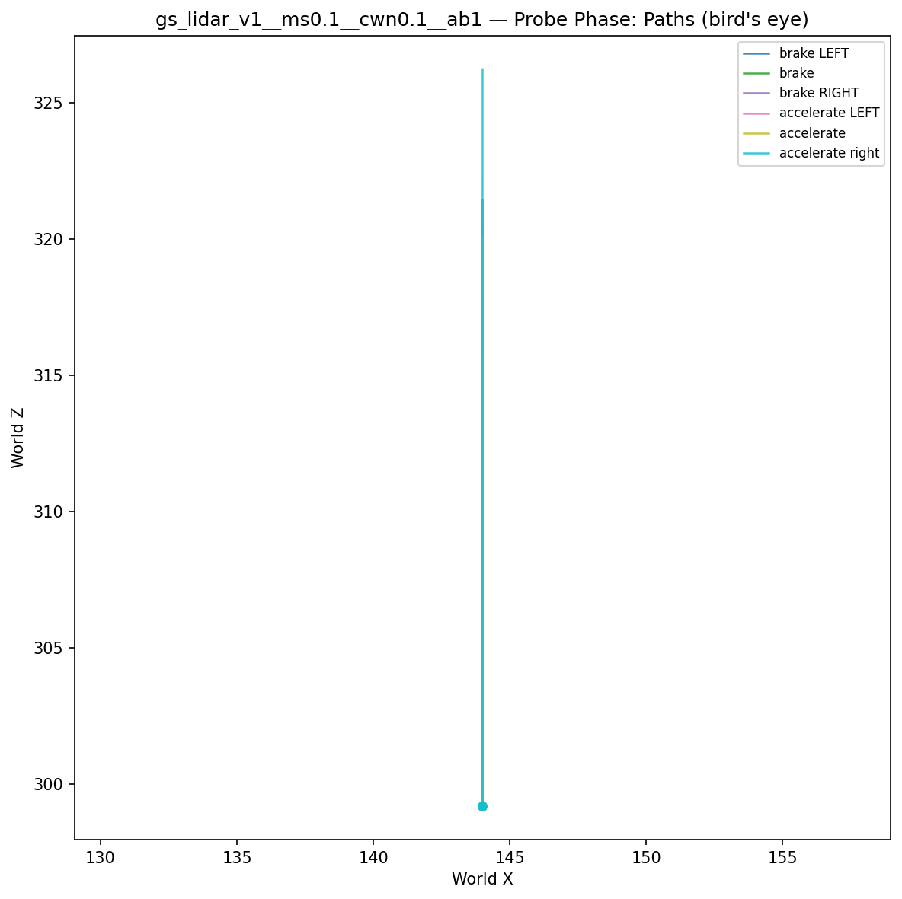

## Cold-Start Search

Best cold-start reward: **+3279.7**
Probe floor: **+444.4**

| Restart | Best Reward | Beat Probe Floor |          |
|---------|-------------|------------------|----------|
|       1 |     +3279.7 | yes              | ← best |

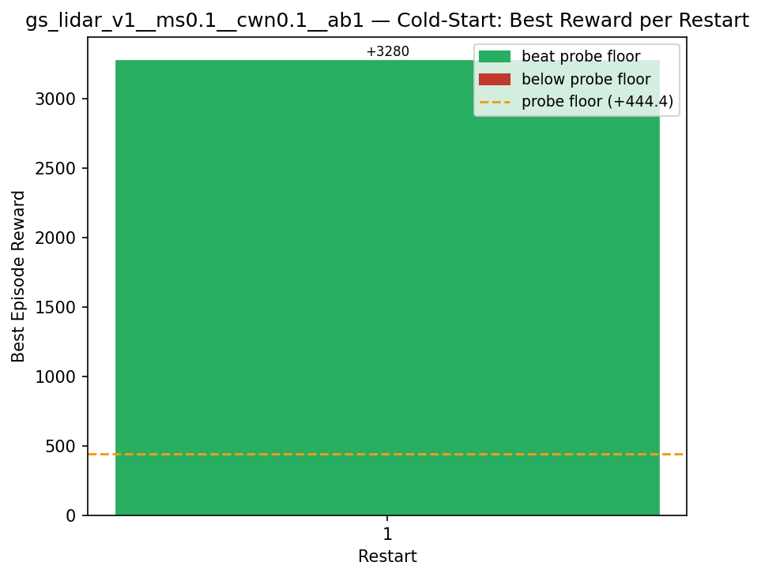

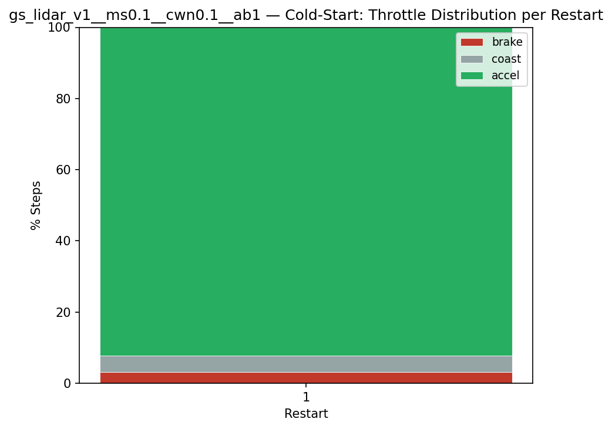

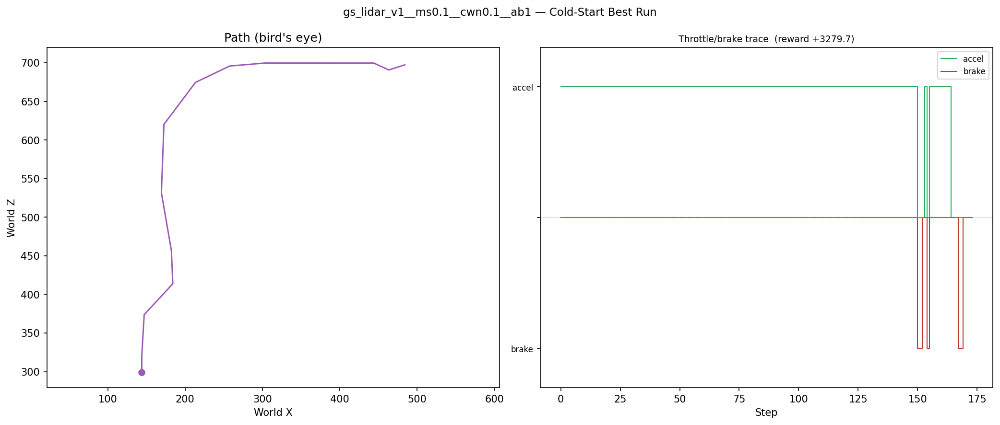

## Greedy Phase

Best reward: **+3308.0**

| Sim  | Reward   | Result       |
|------|----------|--------------|
|    1 |   -954.0 |  |
|    2 |  +3222.5 |  |
|    3 |  +3242.5 |  |
|    4 |  +3150.5 |  |
|    5 |  -1207.4 |  |
|    6 |   -966.7 |  |
|    7 |  +2996.2 |  |
|    8 |  -1057.1 |  |
|    9 |  +3292.8 | **NEW BEST** |
|   10 |  -1108.2 |  |
|   11 |  +3232.1 |  |
|   12 |  +3095.3 |  |
|   13 |  +3285.7 |  |
|   14 |  +3075.5 |  |
|   15 |  +3251.7 |  |
|   16 |  +3163.7 |  |
|   17 |  +3088.3 |  |
|   18 |  +2951.9 |  |
|   19 |  +3170.3 |  |
|   20 |  +3265.5 |  |
|   21 |  +2994.0 |  |
|   22 |  +3245.1 |  |
|   23 |  +3238.5 |  |
|   24 |  +3282.7 |  |
|   25 |  +3062.4 |  |
|   26 |  +3195.1 |  |
|   27 |  +3308.0 | **NEW BEST** |
|   28 |  +3256.2 |  |
|   29 |  +3170.2 |  |
|   30 |  +3082.8 |  |
|   31 |  +3174.3 |  |
|   32 |  +3147.6 |  |
|   33 |  +2946.1 |  |
|   34 |  +2964.3 |  |
|   35 |  +3078.5 |  |
|   36 |  +3073.4 |  |
|   37 |  +2915.0 |  |
|   38 |  +3080.0 |  |
|   39 |  +3088.3 |  |
|   40 |  +3031.4 |  |
|   41 |  +3104.3 |  |
|   42 |  +3160.0 |  |
|   43 |  +3187.9 |  |
|   44 |  +3178.0 |  |
|   45 |  -1169.5 |  |
|   46 |  +2990.0 |  |
|   47 |  +3147.8 |  |
|   48 |  -1268.2 |  |
|   49 |  +3033.3 |  |
|   50 |  +3005.2 |  |

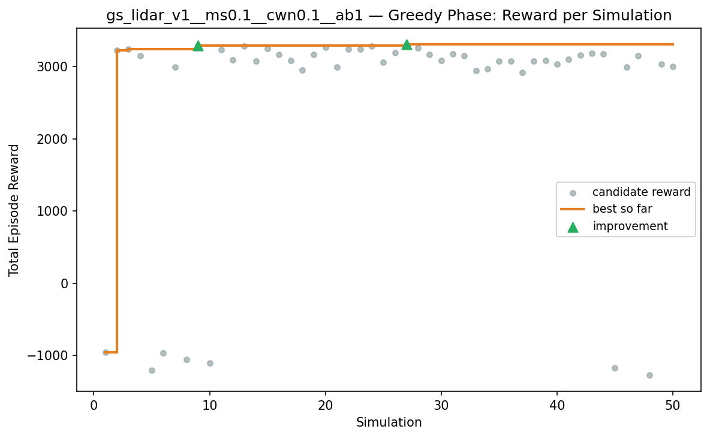

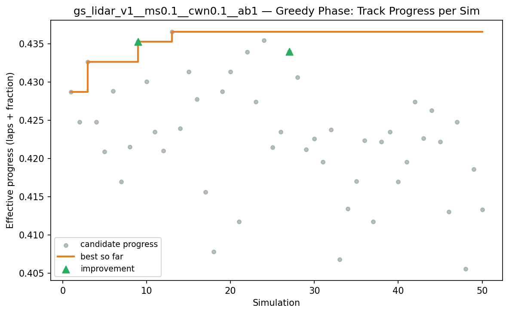

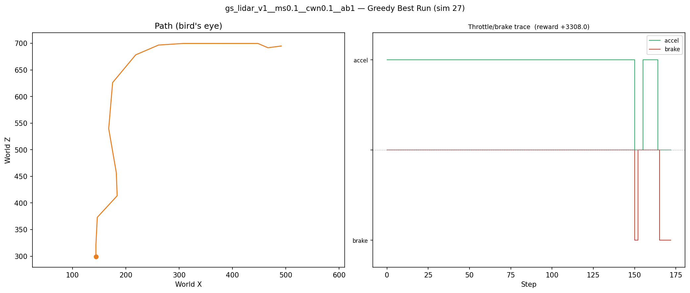

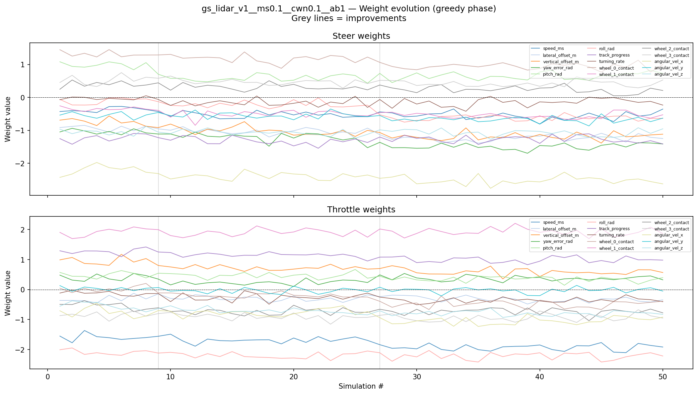

## Additional Plots

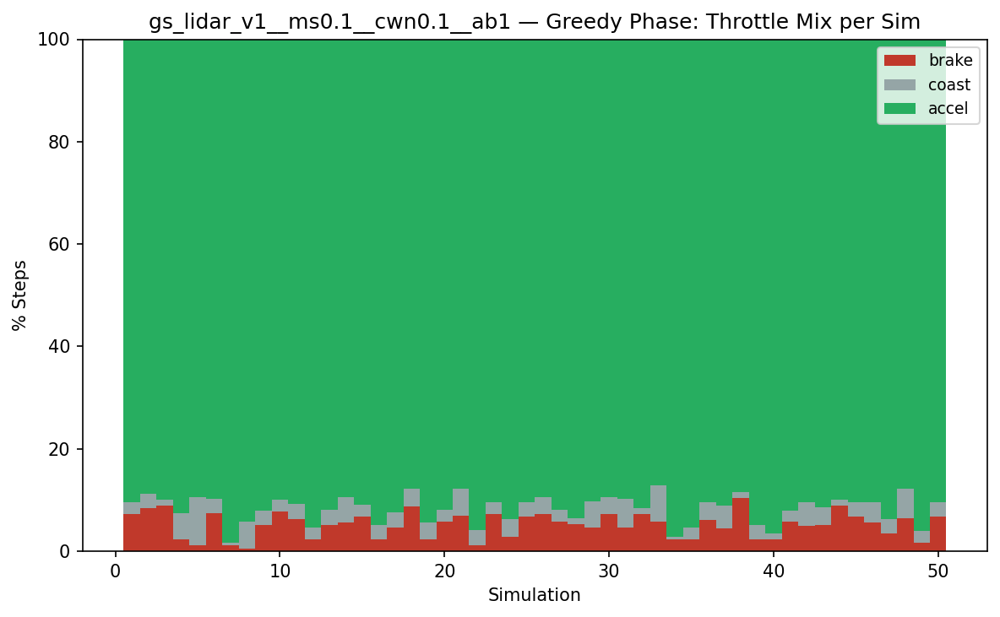

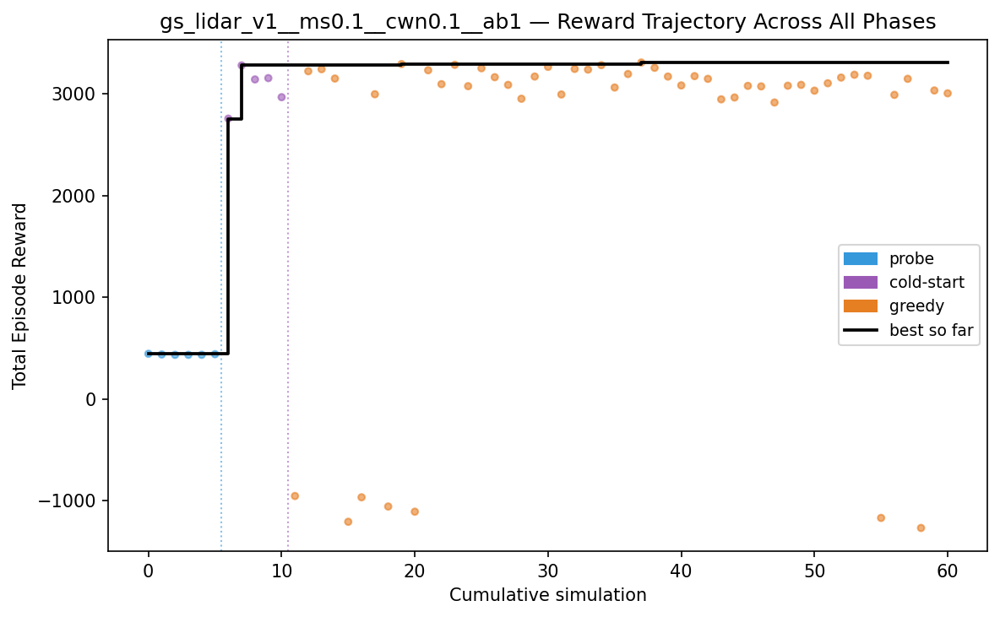

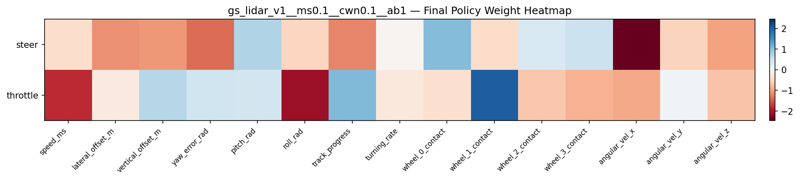

