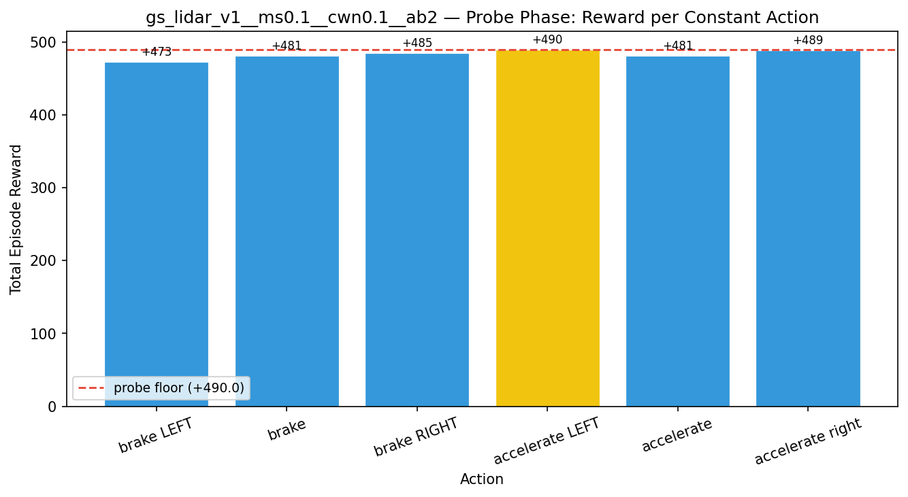
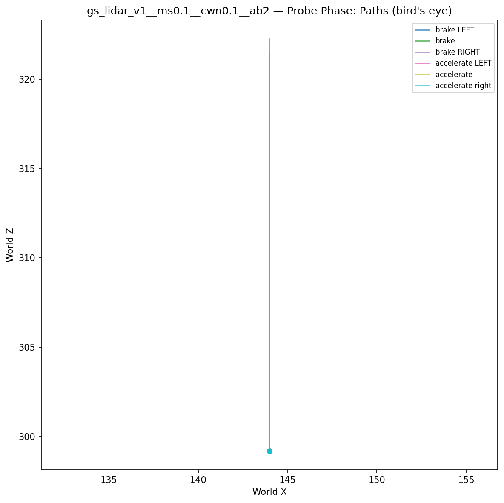
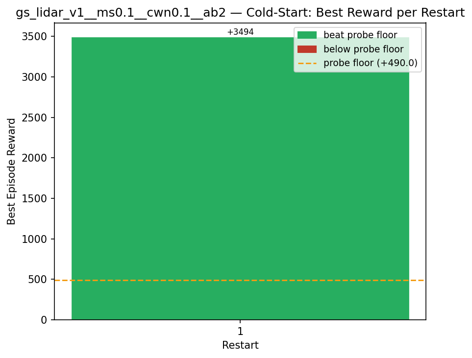
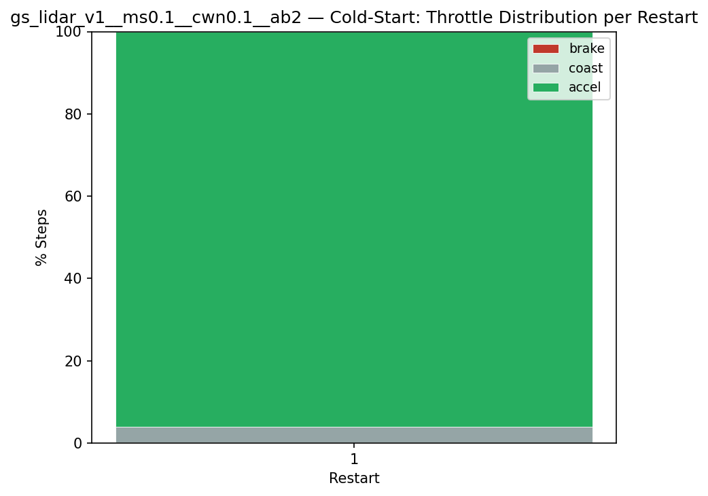
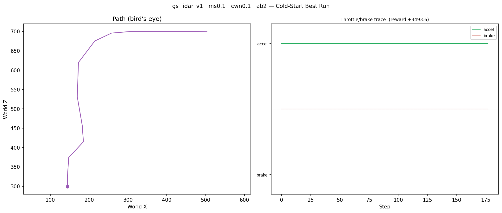
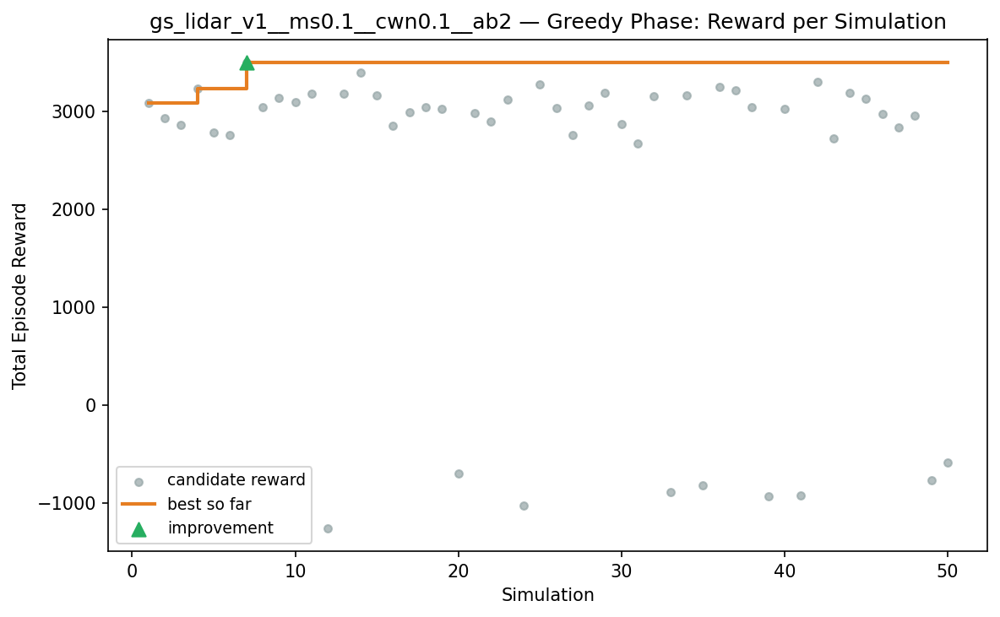
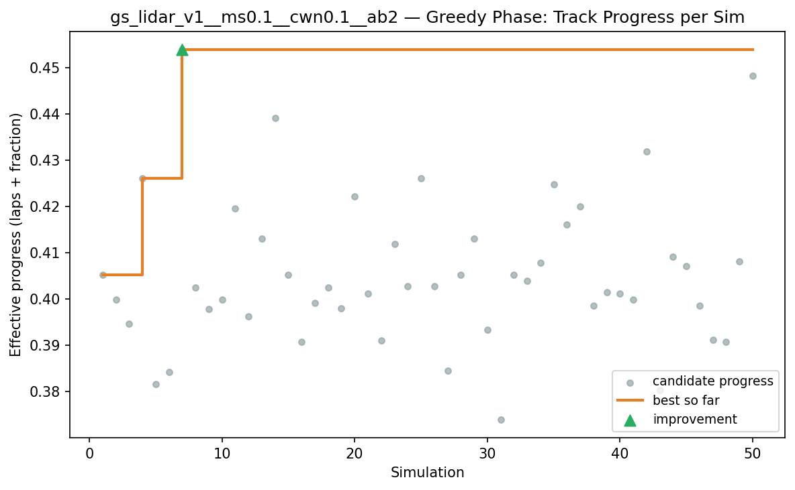
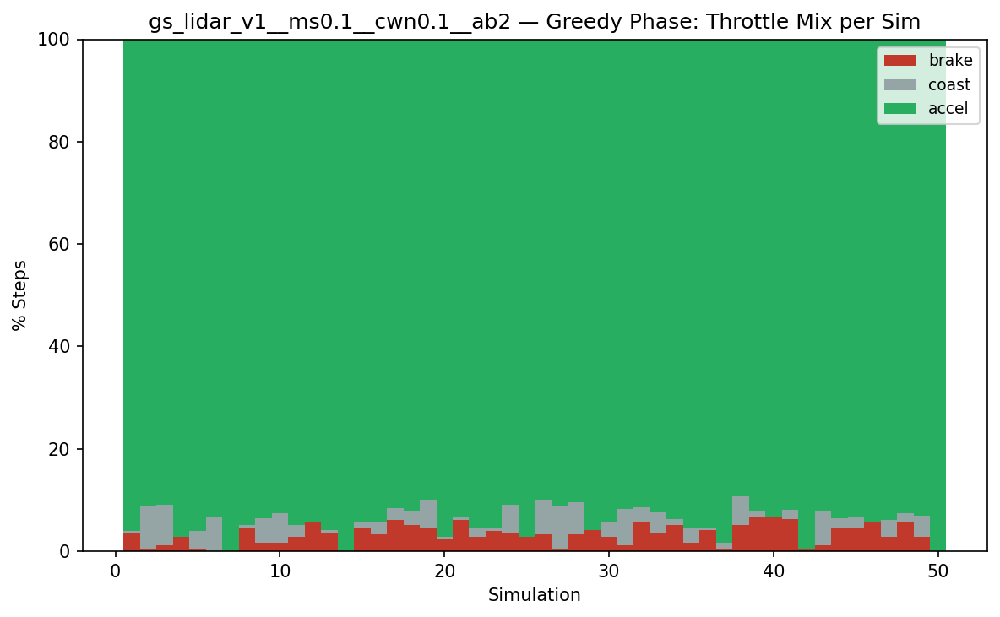
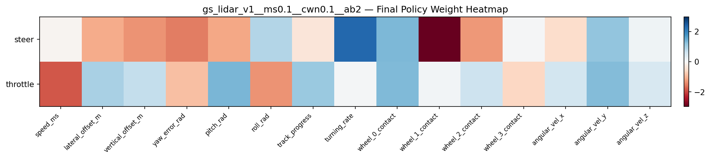

# Experiment: gs_lidar_v1__ms0.1__cwn0.1__ab2

## Timings

- **Start:** 2026-03-16 00:18:08
- **End:** 2026-03-16 00:21:03
- **Total runtime:** 2m 55.1s

| Phase | Duration |
|-------|----------|
| Probe | 6.0s |
| Cold-start | 16.2s |
| Greedy | 2m 31.9s |

## Run Parameters

### Training

| Parameter | Value |
|-----------|-------|
| speed | 10.0 |
| n_sims | 50 |
| in_game_episode_s | 30.0 |
| mutation_scale | 0.1 |
| probe_s | 8.0 |
| cold_restarts | 20 |
| cold_sims | 5 |
| n_lidar_rays | 8 |

### Reward Config

| Parameter | Value |
|-----------|-------|
| progress_weight | 10000.0 |
| centerline_weight | -0.1 |
| centerline_exp | 2.0 |
| speed_weight | 0.05 |
| step_penalty | -0.05 |
| finish_bonus | 5000.0 |
| finish_time_weight | -5.0 |
| par_time_s | 60.0 |
| accel_bonus | 2.0 |
| airborne_penalty | -1.0 |
| crash_threshold_m | 25.0 |

## Probe Phase

Best probe reward: **+490.0**

| Action | Name            | Reward   |          |
|--------|-----------------|----------|----------|
|      0 | brake LEFT      |   +473.1 |  |
|      1 | brake           |   +481.4 |  |
|      2 | brake RIGHT     |   +484.6 |  |
|      6 | accelerate LEFT |   +490.0 | ← best |
|      7 | accelerate      |   +481.0 |  |
|      8 | accelerate right |   +488.7 |  |

## Cold-Start Search

Best cold-start reward: **+3493.6**
Probe floor: **+490.0**

| Restart | Best Reward | Beat Probe Floor |          |
|---------|-------------|------------------|----------|
|       1 |     +3493.6 | yes              | ← best |

## Greedy Phase

Best reward: **+3496.8**

| Sim  | Reward   | Result       |
|------|----------|--------------|
|    1 |  +3085.7 |  |
|    2 |  +2924.0 |  |
|    3 |  +2858.8 |  |
|    4 |  +3233.2 |  |
|    5 |  +2781.0 |  |
|    6 |  +2756.0 |  |
|    7 |  +3496.8 | **NEW BEST** |
|    8 |  +3038.9 |  |
|    9 |  +3136.4 |  |
|   10 |  +3092.4 |  |
|   11 |  +3176.4 |  |
|   12 |  -1258.5 |  |
|   13 |  +3180.1 |  |
|   14 |  +3394.8 |  |
|   15 |  +3161.7 |  |
|   16 |  +2848.3 |  |
|   17 |  +2990.4 |  |
|   18 |  +3041.8 |  |
|   19 |  +3019.5 |  |
|   20 |   -704.4 |  |
|   21 |  +2982.9 |  |
|   22 |  +2893.8 |  |
|   23 |  +3116.4 |  |
|   24 |  -1031.5 |  |
|   25 |  +3270.2 |  |
|   26 |  +3029.1 |  |
|   27 |  +2753.9 |  |
|   28 |  +3056.5 |  |
|   29 |  +3190.7 |  |
|   30 |  +2870.0 |  |
|   31 |  +2670.4 |  |
|   32 |  +3156.0 |  |
|   33 |   -890.0 |  |
|   34 |  +3161.9 |  |
|   35 |   -826.5 |  |
|   36 |  +3244.4 |  |
|   37 |  +3212.8 |  |
|   38 |  +3044.4 |  |
|   39 |   -936.1 |  |
|   40 |  +3025.3 |  |
|   41 |   -924.2 |  |
|   42 |  +3299.9 |  |
|   43 |  +2719.0 |  |
|   44 |  +3189.5 |  |
|   45 |  +3130.1 |  |
|   46 |  +2971.4 |  |
|   47 |  +2832.8 |  |
|   48 |  +2952.0 |  |
|   49 |   -770.0 |  |
|   50 |   -589.7 |  |

## Additional Plots

