# Experiment: gs_lidar_v1__ms0.1__cwn0.5__ab1

## Timings

- **Start:** 2026-03-16 00:21:06
- **End:** 2026-03-16 00:28:50
- **Total runtime:** 7m 44.0s

| Phase | Duration |
|-------|----------|
| Probe | 6.0s |
| Cold-start | 5m 05.0s |
| Greedy | 2m 32.1s |

## Run Parameters

### Training

| Parameter | Value |
|-----------|-------|
| speed | 10.0 |
| n_sims | 50 |
| in_game_episode_s | 30.0 |
| mutation_scale | 0.1 |
| probe_s | 8.0 |
| cold_restarts | 20 |
| cold_sims | 5 |
| n_lidar_rays | 8 |

### Reward Config

| Parameter | Value |
|-----------|-------|
| progress_weight | 10000.0 |
| centerline_weight | -0.5 |
| centerline_exp | 2.0 |
| speed_weight | 0.05 |
| step_penalty | -0.05 |
| finish_bonus | 5000.0 |
| finish_time_weight | -5.0 |
| par_time_s | 60.0 |
| accel_bonus | 1.0 |
| airborne_penalty | -1.0 |
| crash_threshold_m | 25.0 |

## Probe Phase

Best probe reward: **+340.1**

| Action | Name            | Reward   |          |
|--------|-----------------|----------|----------|
|      0 | brake LEFT      |  -3943.6 |  |
|      1 | brake           |   +332.4 |  |
|      2 | brake RIGHT     |   +340.1 | ← best |
|      6 | accelerate LEFT |   +337.3 |  |
|      7 | accelerate      |   +335.0 |  |
|      8 | accelerate right |   +337.9 |  |

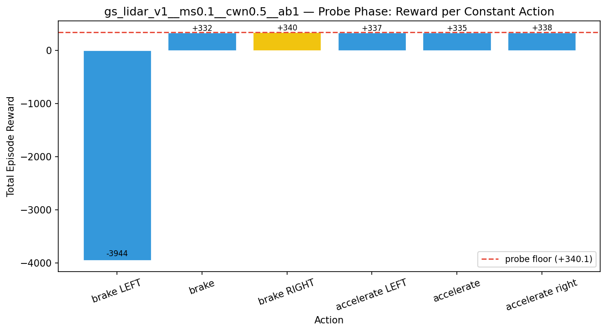

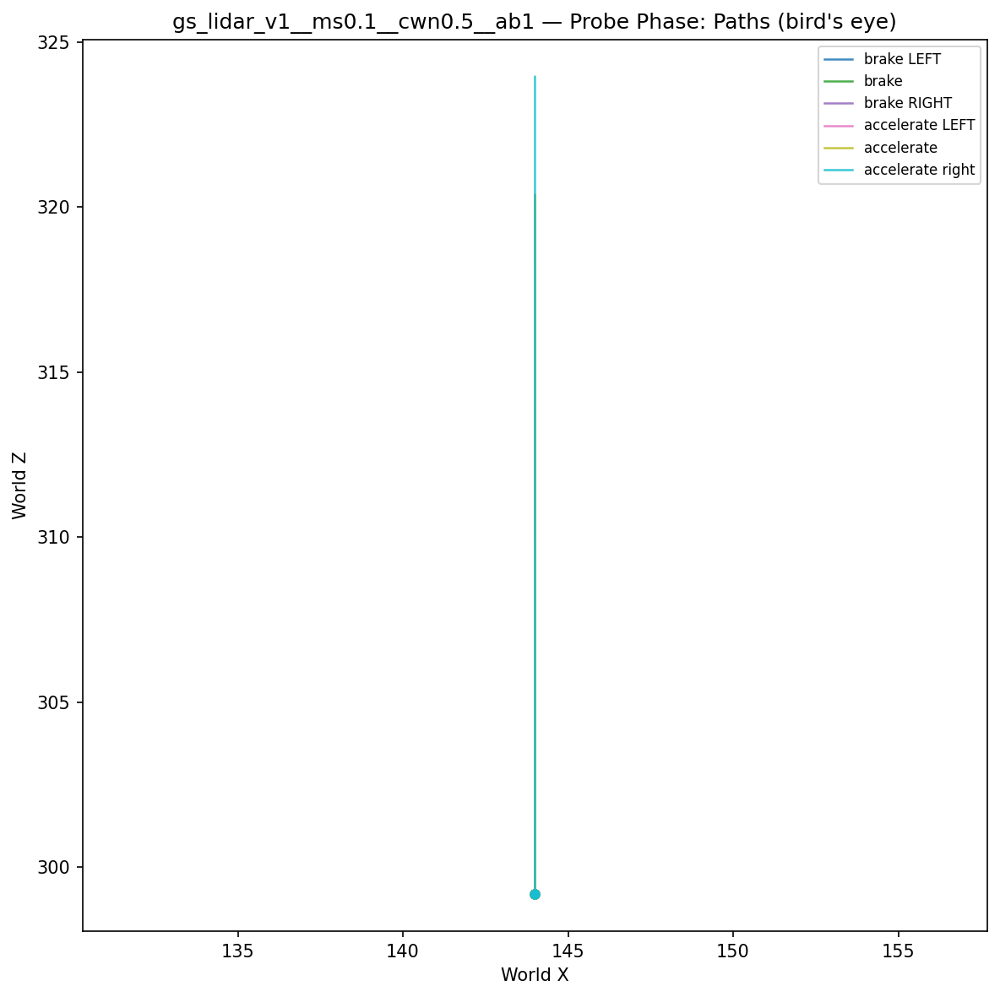

## Cold-Start Search

Best cold-start reward: **-1873.7**
Probe floor: **+340.1**

| Restart | Best Reward | Beat Probe Floor |          |
|---------|-------------|------------------|----------|
|       1 |     -2722.9 | no               |  |
|       2 |     -2849.8 | no               |  |
|       3 |     -3954.1 | no               |  |
|       4 |     -2950.0 | no               |  |
|       5 |     -2766.4 | no               |  |
|       6 |     -2679.9 | no               |  |
|       7 |     -2766.7 | no               |  |
|       8 |     -2904.3 | no               |  |
|       9 |     -2907.8 | no               |  |
|      10 |     -2829.8 | no               |  |
|      11 |     -3504.8 | no               |  |
|      12 |     -2970.4 | no               |  |
|      13 |     -3201.9 | no               |  |
|      14 |     -2266.7 | no               |  |
|      15 |     -2681.8 | no               |  |
|      16 |     -2741.2 | no               |  |
|      17 |     -3076.6 | no               |  |
|      18 |     -3075.8 | no               |  |
|      19 |     -1873.7 | no               | ← best |
|      20 |     -3655.8 | no               |  |

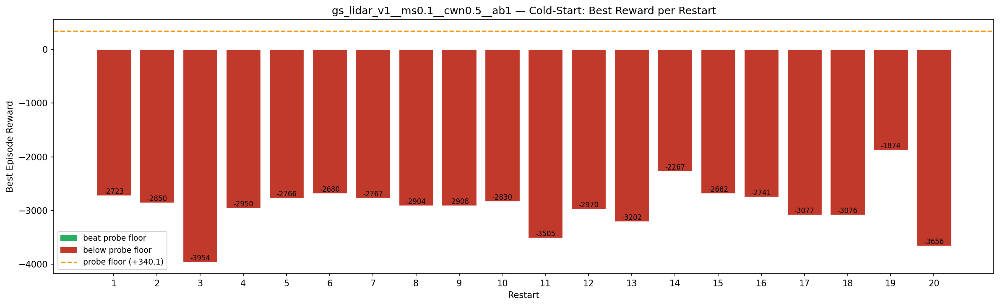

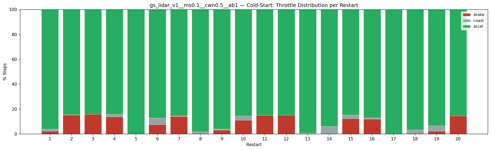

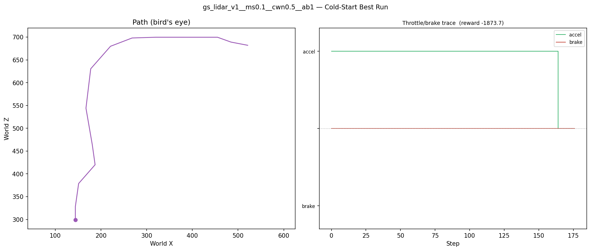

## Greedy Phase

Best reward: **-1786.3**

| Sim  | Reward   | Result       |
|------|----------|--------------|
|    1 |  -2326.4 |  |
|    2 |  -2036.4 |  |
|    3 |  -2795.6 |  |
|    4 |  -2419.9 |  |
|    5 |  -2228.9 |  |
|    6 |  -2135.9 |  |
|    7 |  -2052.4 |  |
|    8 |  -2182.1 |  |
|    9 |  -2341.0 |  |
|   10 |  -2098.9 |  |
|   11 |  -2631.5 |  |
|   12 |  -2134.9 |  |
|   13 |  -6330.1 |  |
|   14 |  -2548.9 |  |
|   15 |  -2158.1 |  |
|   16 |  -2336.1 |  |
|   17 |  -2799.4 |  |
|   18 |  -2038.0 |  |
|   19 |  -1786.3 | **NEW BEST** |
|   20 |  -2717.5 |  |
|   21 |  -2585.6 |  |
|   22 |  -2150.4 |  |
|   23 |  -2384.5 |  |
|   24 |  -3163.8 |  |
|   25 |  -6237.4 |  |
|   26 |  -3002.9 |  |
|   27 |  -2580.9 |  |
|   28 |  -6132.7 |  |
|   29 |  -1861.1 |  |
|   30 |  -3211.3 |  |
|   31 |  -2170.5 |  |
|   32 |  -2828.7 |  |
|   33 |  -2633.0 |  |
|   34 |  -2849.6 |  |
|   35 |  -2343.2 |  |
|   36 |  -1968.7 |  |
|   37 |  -3018.3 |  |
|   38 |  -2848.9 |  |
|   39 |  -2155.1 |  |
|   40 |  -2256.2 |  |
|   41 |  -2804.8 |  |
|   42 |  -2673.7 |  |
|   43 |  -2911.7 |  |
|   44 |  -3027.3 |  |
|   45 |  -2919.9 |  |
|   46 |  -2146.7 |  |
|   47 |  -2117.3 |  |
|   48 |  -2753.3 |  |
|   49 |  -2177.5 |  |
|   50 |  -2600.6 |  |

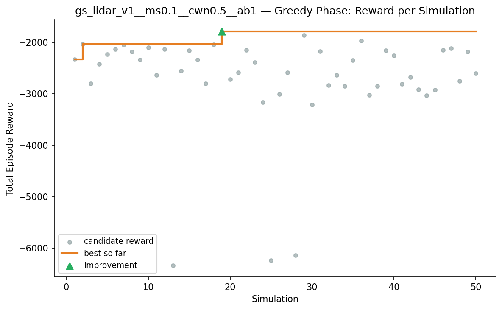

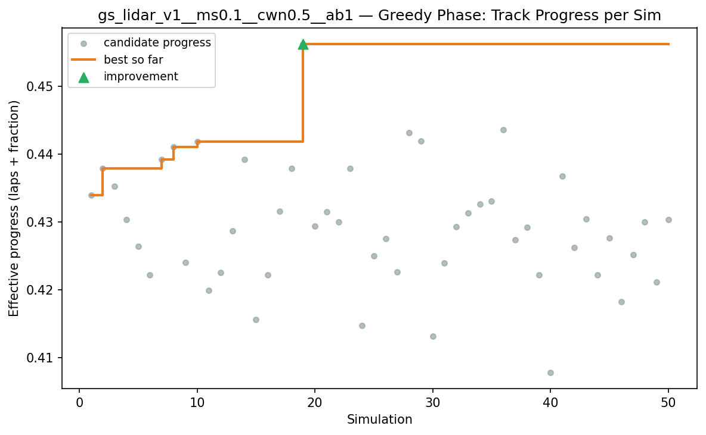

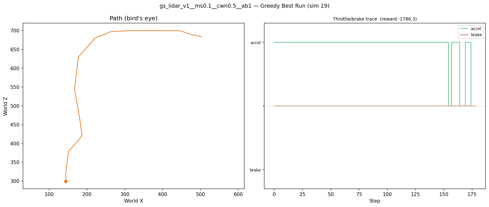

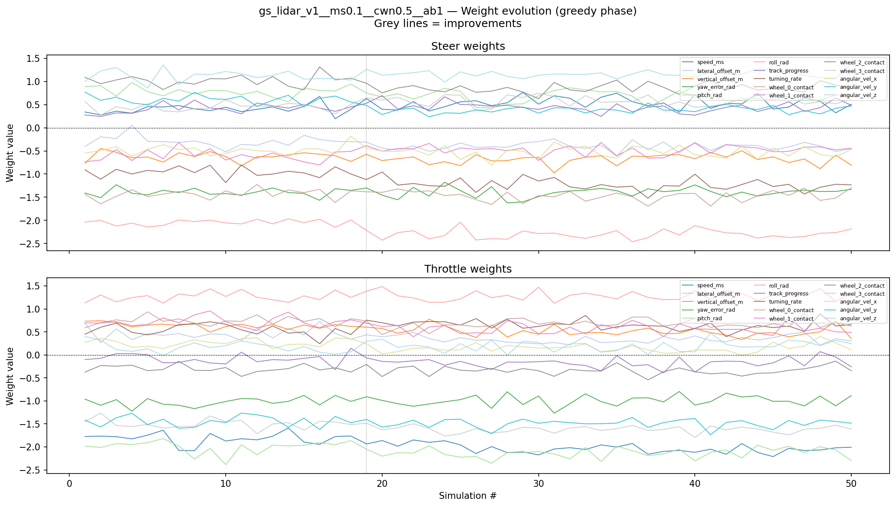

## Additional Plots

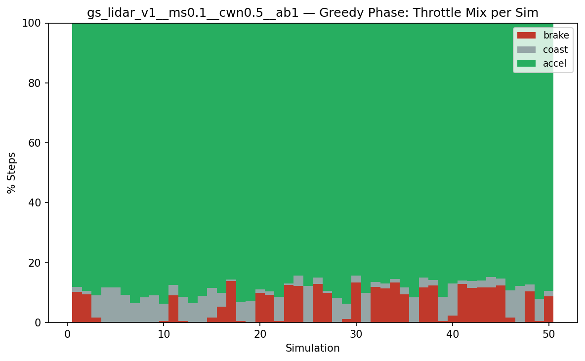

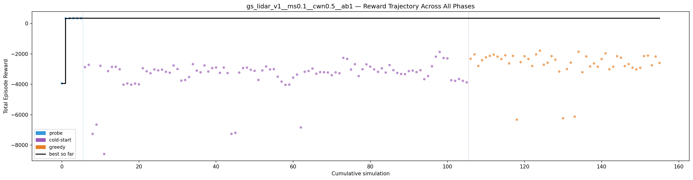

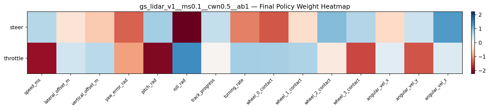

