# Experiment: gs_lidar_v1__ms0.1__cwn0.5__ab2

## Timings

- **Start:** 2026-03-16 00:28:53
- **End:** 2026-03-16 00:36:36
- **Total runtime:** 7m 43.8s

| Phase | Duration |
|-------|----------|
| Probe | 6.0s |
| Cold-start | 5m 04.9s |
| Greedy | 2m 31.9s |

## Run Parameters

### Training

| Parameter | Value |
|-----------|-------|
| speed | 10.0 |
| n_sims | 50 |
| in_game_episode_s | 30.0 |
| mutation_scale | 0.1 |
| probe_s | 8.0 |
| cold_restarts | 20 |
| cold_sims | 5 |
| n_lidar_rays | 8 |

### Reward Config

| Parameter | Value |
|-----------|-------|
| progress_weight | 10000.0 |
| centerline_weight | -0.5 |
| centerline_exp | 2.0 |
| speed_weight | 0.05 |
| step_penalty | -0.05 |
| finish_bonus | 5000.0 |
| finish_time_weight | -5.0 |
| par_time_s | 60.0 |
| accel_bonus | 2.0 |
| airborne_penalty | -1.0 |
| crash_threshold_m | 25.0 |

## Probe Phase

Best probe reward: **+389.8**

| Action | Name            | Reward   |          |
|--------|-----------------|----------|----------|
|      0 | brake LEFT      |  -3814.9 |  |
|      1 | brake           |   +389.8 | ← best |
|      2 | brake RIGHT     |   +349.6 |  |
|      6 | accelerate LEFT |   +360.8 |  |
|      7 | accelerate      |   +360.8 |  |
|      8 | accelerate right |   +343.5 |  |

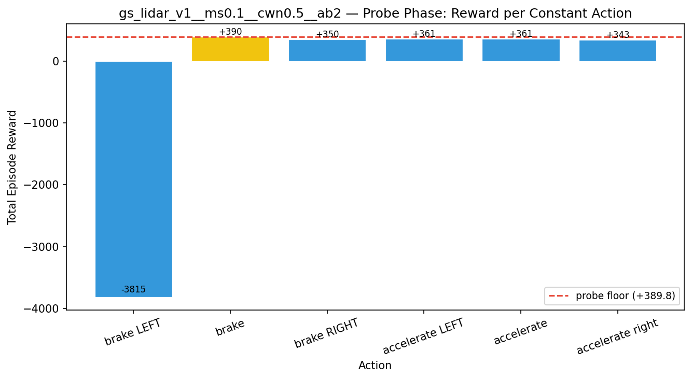

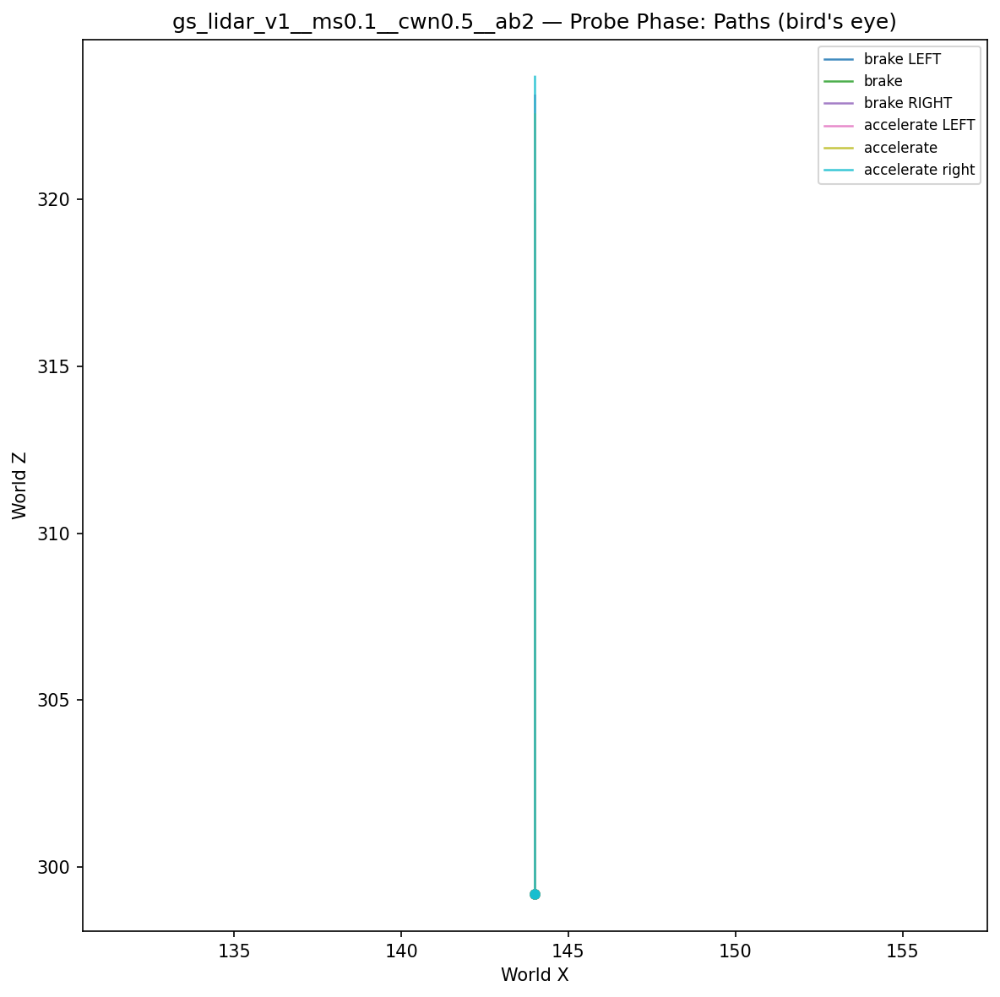

## Cold-Start Search

Best cold-start reward: **-2186.9**
Probe floor: **+389.8**

| Restart | Best Reward | Beat Probe Floor |          |
|---------|-------------|------------------|----------|
|       1 |     -2927.9 | no               |  |
|       2 |     -2737.6 | no               |  |
|       3 |     -3292.2 | no               |  |
|       4 |     -3111.3 | no               |  |
|       5 |     -2186.9 | no               | ← best |
|       6 |     -3464.1 | no               |  |
|       7 |     -3306.9 | no               |  |
|       8 |     -2248.5 | no               |  |
|       9 |     -2878.3 | no               |  |
|      10 |     -3460.1 | no               |  |
|      11 |     -2849.4 | no               |  |
|      12 |     -2670.1 | no               |  |
|      13 |     -2829.5 | no               |  |
|      14 |     -2679.4 | no               |  |
|      15 |     -3099.5 | no               |  |
|      16 |     -2798.0 | no               |  |
|      17 |     -3015.5 | no               |  |
|      18 |     -2475.4 | no               |  |
|      19 |     -2419.3 | no               |  |
|      20 |     -3282.5 | no               |  |

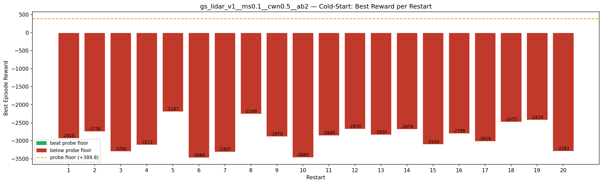

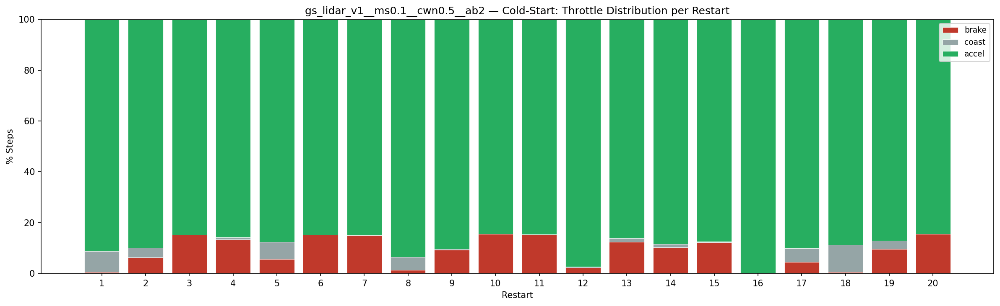

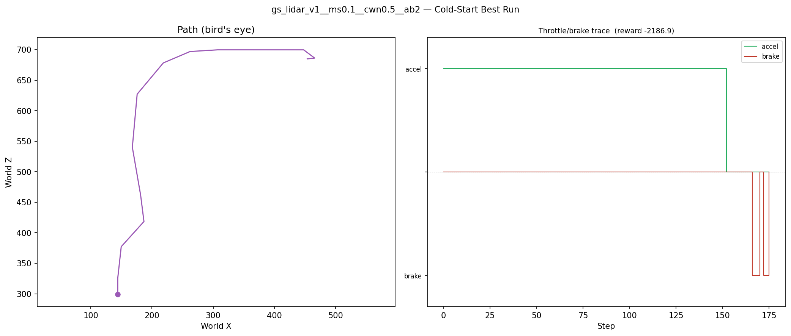

## Greedy Phase

Best reward: **-2156.0**

| Sim  | Reward   | Result       |
|------|----------|--------------|
|    1 |  -6264.6 |  |
|    2 |  -6232.7 |  |
|    3 |  -2156.0 | **NEW BEST** |
|    4 |  -6846.2 |  |
|    5 |  -2574.8 |  |
|    6 |  -2840.7 |  |
|    7 |  -2650.9 |  |
|    8 |  -2773.6 |  |
|    9 |  -2827.9 |  |
|   10 |  -2228.7 |  |
|   11 |  -2935.4 |  |
|   12 |  -2691.6 |  |
|   13 |  -2504.7 |  |
|   14 |  -2778.5 |  |
|   15 |  -2701.3 |  |
|   16 |  -2521.1 |  |
|   17 |  -2959.0 |  |
|   18 |  -2893.2 |  |
|   19 |  -6356.7 |  |
|   20 |  -6958.5 |  |
|   21 |  -2785.8 |  |
|   22 |  -6853.5 |  |
|   23 |  -2474.6 |  |
|   24 |  -6760.1 |  |
|   25 |  -2678.2 |  |
|   26 |  -2955.7 |  |
|   27 |  -2716.2 |  |
|   28 |  -2888.8 |  |
|   29 |  -2652.9 |  |
|   30 |  -2801.1 |  |
|   31 |  -3011.4 |  |
|   32 |  -2633.8 |  |
|   33 |  -2873.8 |  |
|   34 |  -2748.7 |  |
|   35 |  -2517.1 |  |
|   36 |  -2626.9 |  |
|   37 |  -6972.9 |  |
|   38 |  -2502.9 |  |
|   39 |  -2801.8 |  |
|   40 |  -2888.1 |  |
|   41 |  -2836.7 |  |
|   42 |  -2436.9 |  |
|   43 |  -2775.2 |  |
|   44 |  -2943.4 |  |
|   45 |  -2959.8 |  |
|   46 |  -2597.4 |  |
|   47 |  -2819.7 |  |
|   48 |  -2972.2 |  |
|   49 |  -2171.3 |  |
|   50 |  -2655.2 |  |

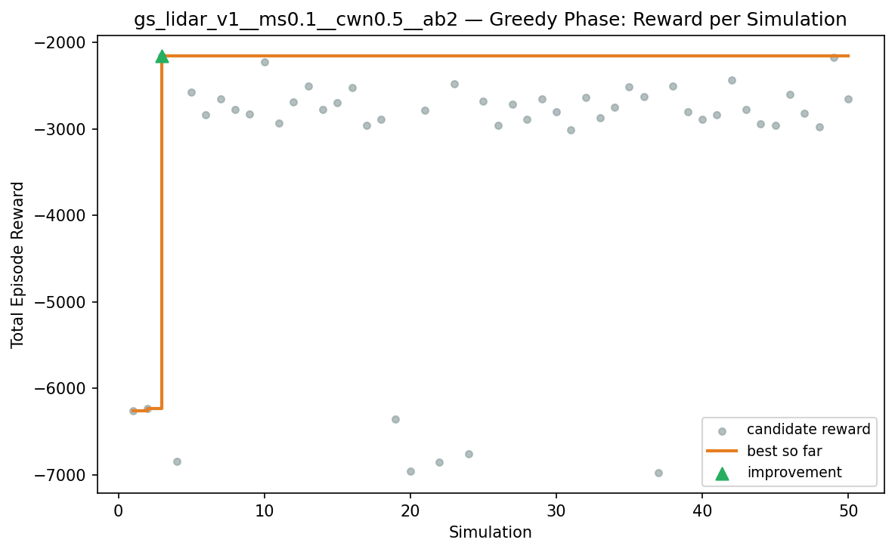

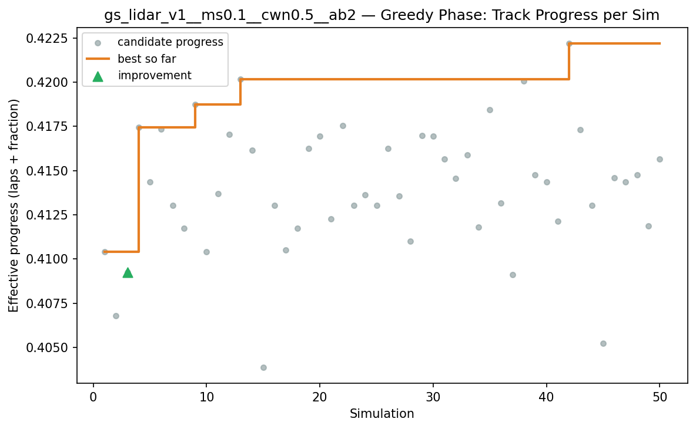

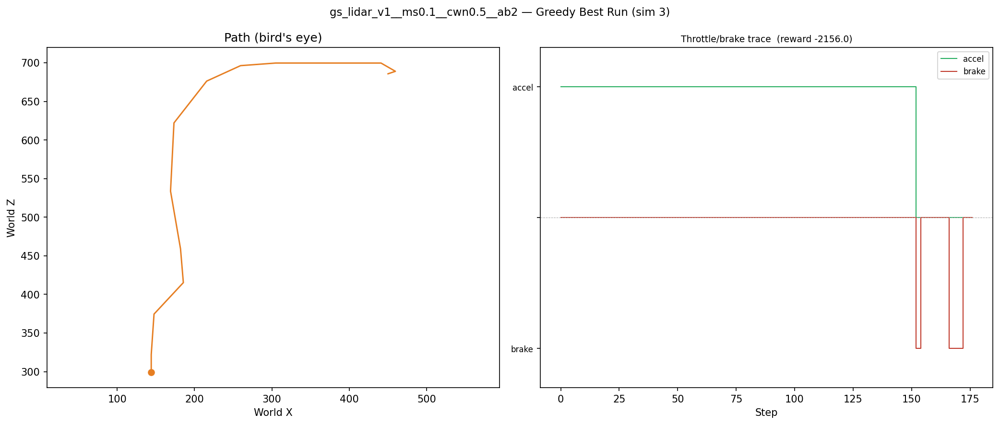

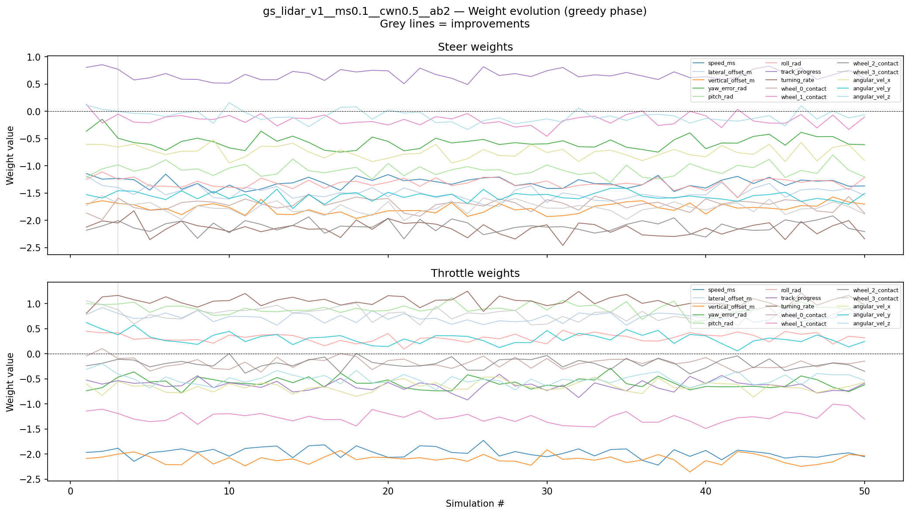

## Additional Plots

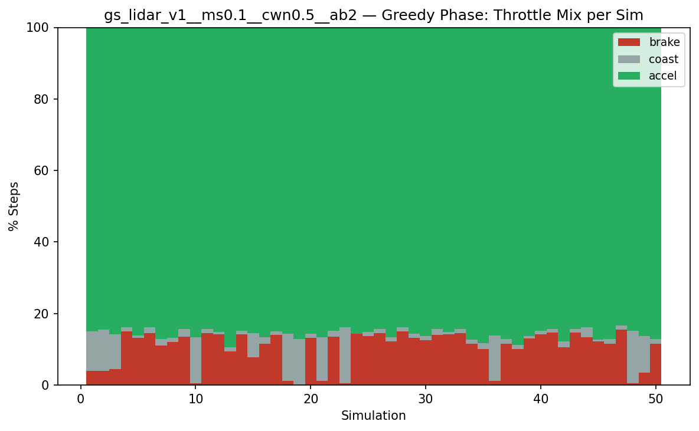

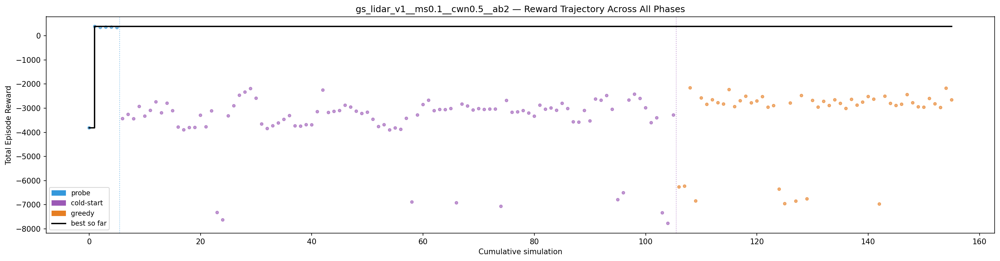

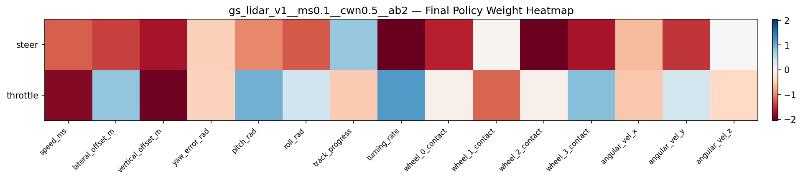

