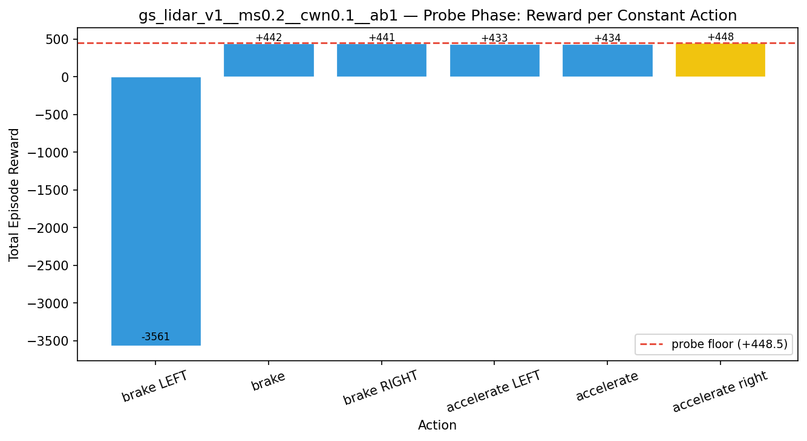
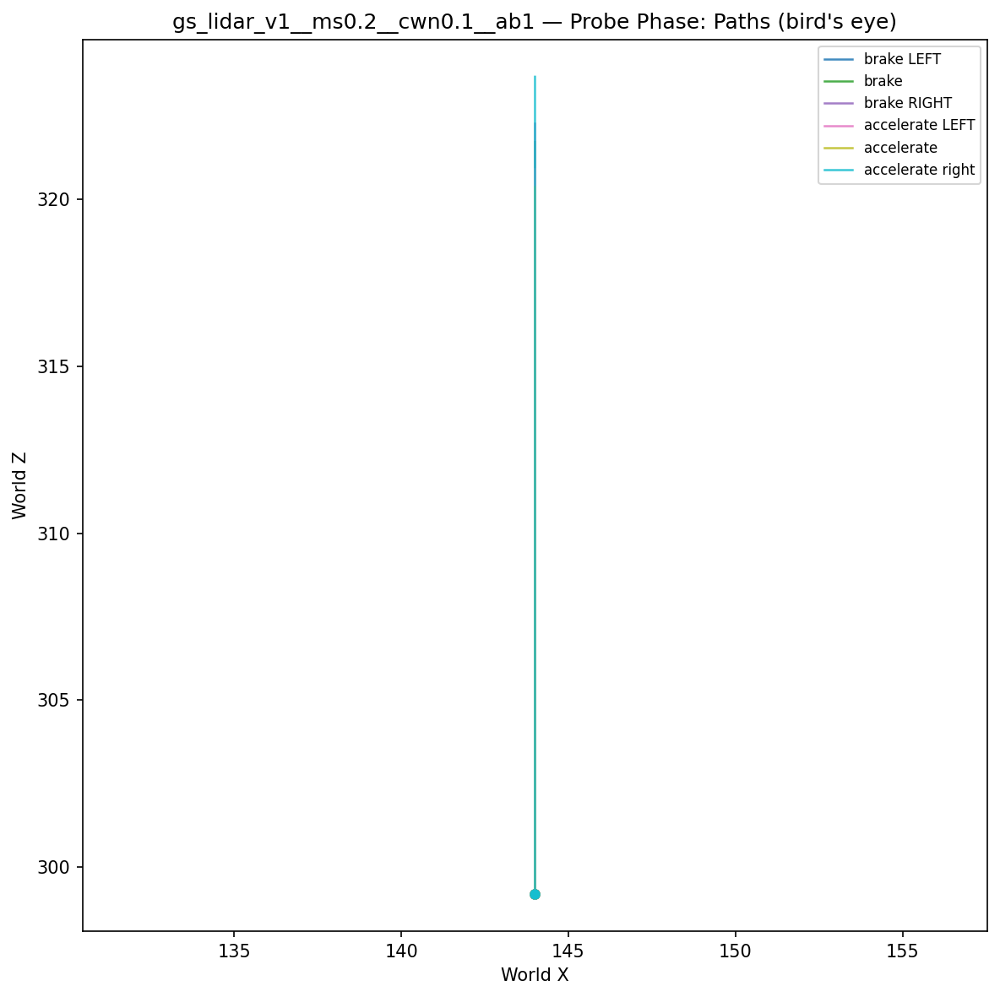
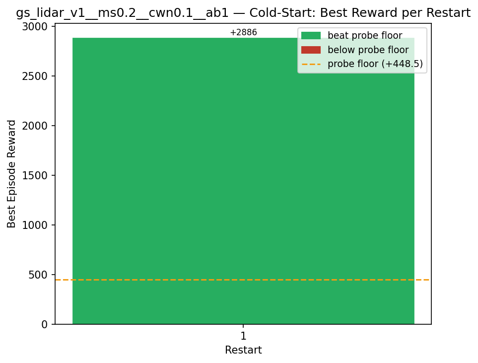
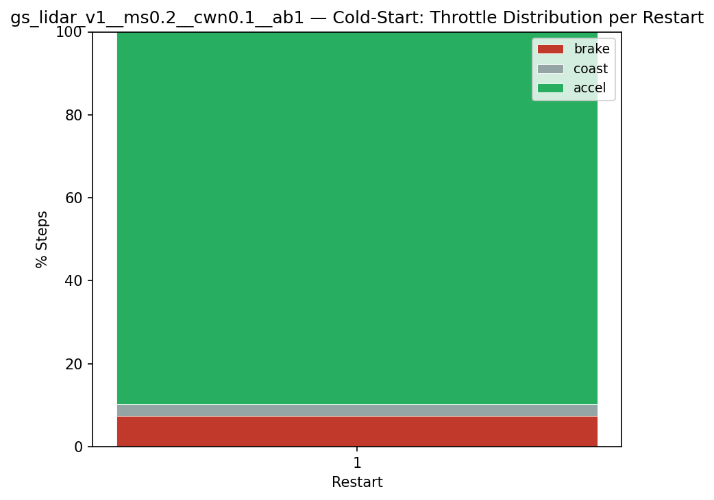
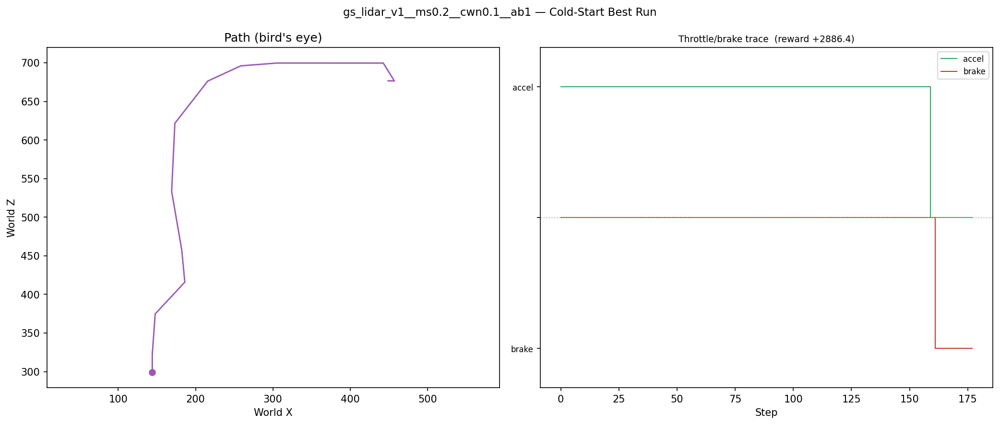
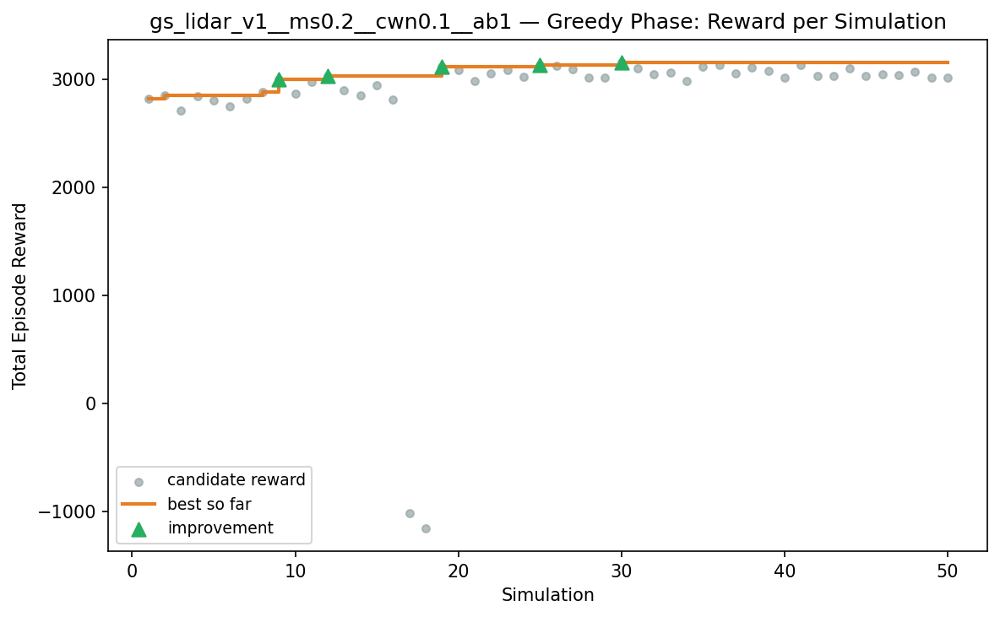
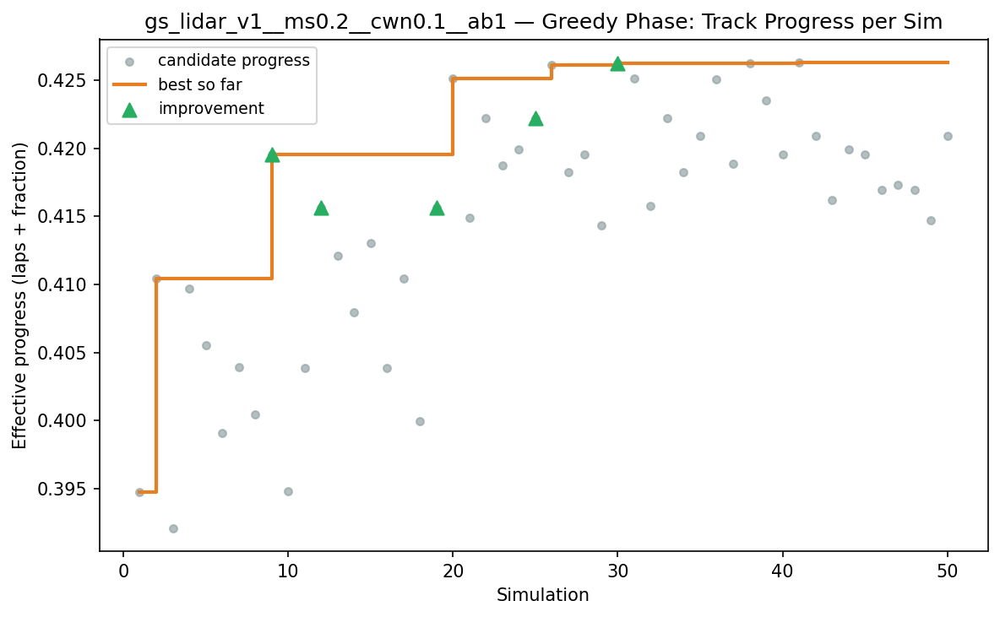
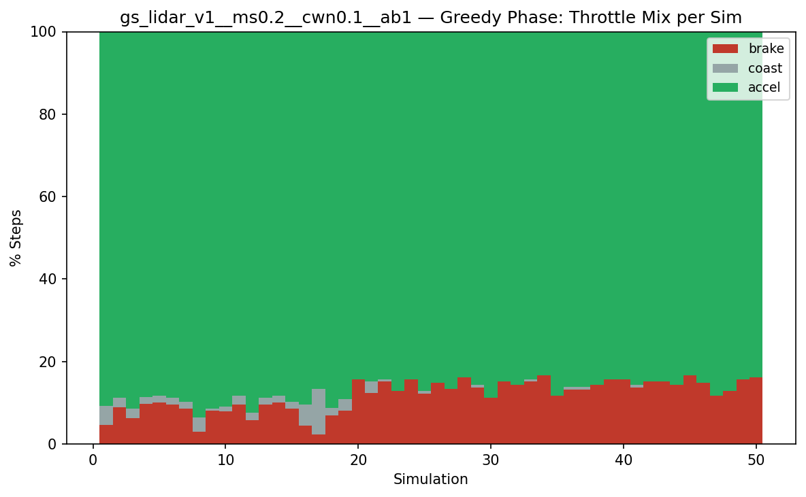
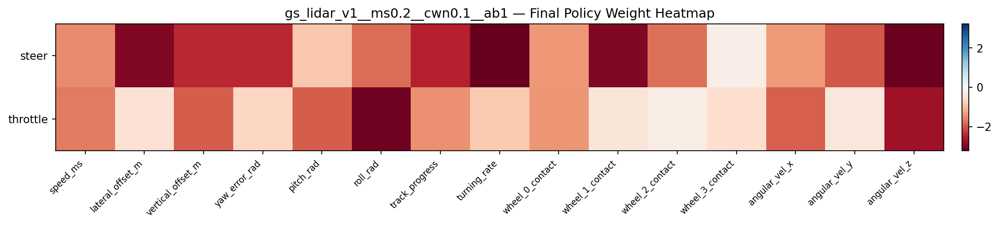

# Experiment: gs_lidar_v1__ms0.2__cwn0.1__ab1

## Timings

- **Start:** 2026-03-16 00:36:39
- **End:** 2026-03-16 00:39:35
- **Total runtime:** 2m 55.4s

| Phase | Duration |
|-------|----------|
| Probe | 6.0s |
| Cold-start | 16.2s |
| Greedy | 2m 32.2s |

## Run Parameters

### Training

| Parameter | Value |
|-----------|-------|
| speed | 10.0 |
| n_sims | 50 |
| in_game_episode_s | 30.0 |
| mutation_scale | 0.2 |
| probe_s | 8.0 |
| cold_restarts | 20 |
| cold_sims | 5 |
| n_lidar_rays | 8 |

### Reward Config

| Parameter | Value |
|-----------|-------|
| progress_weight | 10000.0 |
| centerline_weight | -0.1 |
| centerline_exp | 2.0 |
| speed_weight | 0.05 |
| step_penalty | -0.05 |
| finish_bonus | 5000.0 |
| finish_time_weight | -5.0 |
| par_time_s | 60.0 |
| accel_bonus | 1.0 |
| airborne_penalty | -1.0 |
| crash_threshold_m | 25.0 |

## Probe Phase

Best probe reward: **+448.5**

| Action | Name            | Reward   |          |
|--------|-----------------|----------|----------|
|      0 | brake LEFT      |  -3560.9 |  |
|      1 | brake           |   +442.0 |  |
|      2 | brake RIGHT     |   +441.0 |  |
|      6 | accelerate LEFT |   +433.1 |  |
|      7 | accelerate      |   +434.3 |  |
|      8 | accelerate right |   +448.5 | ← best |

## Cold-Start Search

Best cold-start reward: **+2886.4**
Probe floor: **+448.5**

| Restart | Best Reward | Beat Probe Floor |          |
|---------|-------------|------------------|----------|
|       1 |     +2886.4 | yes              | ← best |

## Greedy Phase

Best reward: **+3157.5**

| Sim  | Reward   | Result       |
|------|----------|--------------|
|    1 |  +2819.6 |  |
|    2 |  +2852.4 |  |
|    3 |  +2715.8 |  |
|    4 |  +2847.1 |  |
|    5 |  +2804.4 |  |
|    6 |  +2750.3 |  |
|    7 |  +2824.1 |  |
|    8 |  +2885.1 |  |
|    9 |  +3000.4 | **NEW BEST** |
|   10 |  +2871.9 |  |
|   11 |  +2976.6 |  |
|   12 |  +3033.2 | **NEW BEST** |
|   13 |  +2899.4 |  |
|   14 |  +2853.5 |  |
|   15 |  +2945.2 |  |
|   16 |  +2813.7 |  |
|   17 |  -1021.9 |  |
|   18 |  -1155.2 |  |
|   19 |  +3119.3 | **NEW BEST** |
|   20 |  +3089.4 |  |
|   21 |  +2987.1 |  |
|   22 |  +3057.4 |  |
|   23 |  +3086.6 |  |
|   24 |  +3022.0 |  |
|   25 |  +3131.6 | **NEW BEST** |
|   26 |  +3126.4 |  |
|   27 |  +3095.4 |  |
|   28 |  +3020.3 |  |
|   29 |  +3013.5 |  |
|   30 |  +3157.5 | **NEW BEST** |
|   31 |  +3102.5 |  |
|   32 |  +3045.4 |  |
|   33 |  +3063.5 |  |
|   34 |  +2988.7 |  |
|   35 |  +3120.3 |  |
|   36 |  +3131.3 |  |
|   37 |  +3056.8 |  |
|   38 |  +3113.7 |  |
|   39 |  +3079.6 |  |
|   40 |  +3019.1 |  |
|   41 |  +3134.3 |  |
|   42 |  +3029.1 |  |
|   43 |  +3033.9 |  |
|   44 |  +3100.5 |  |
|   45 |  +3032.9 |  |
|   46 |  +3050.9 |  |
|   47 |  +3038.1 |  |
|   48 |  +3070.9 |  |
|   49 |  +3019.3 |  |
|   50 |  +3015.6 |  |

## Additional Plots

