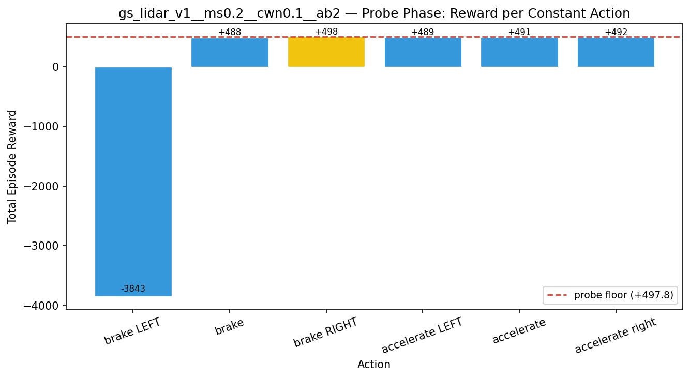
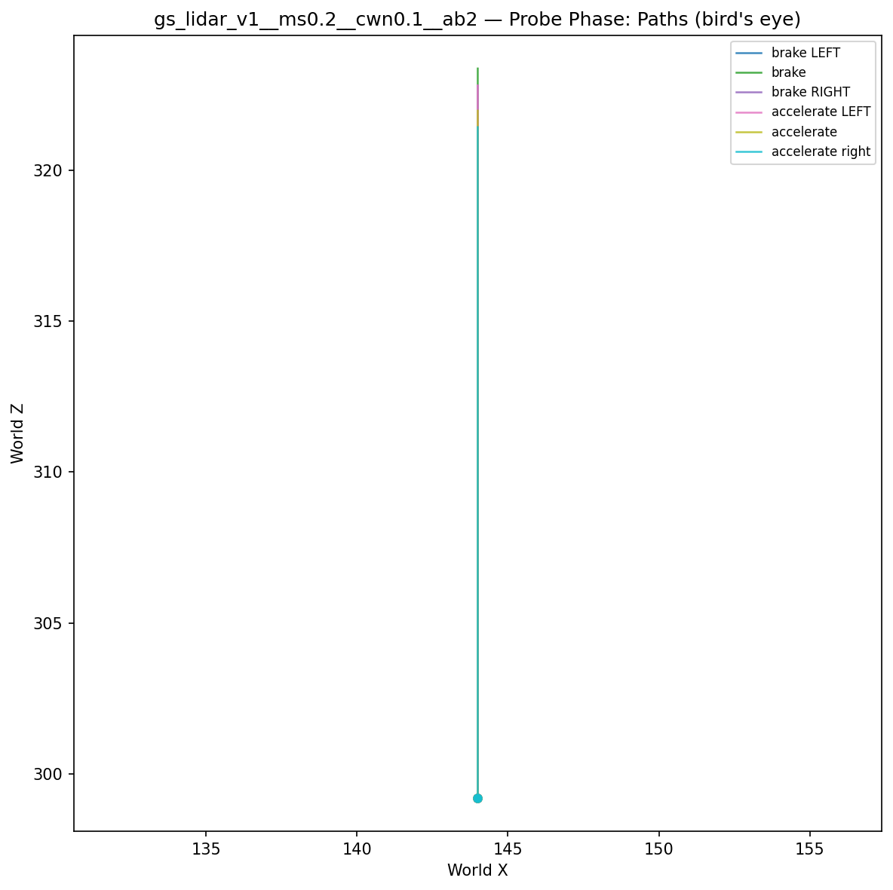
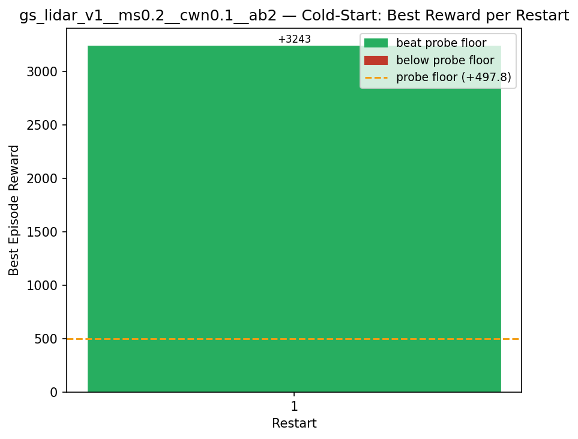
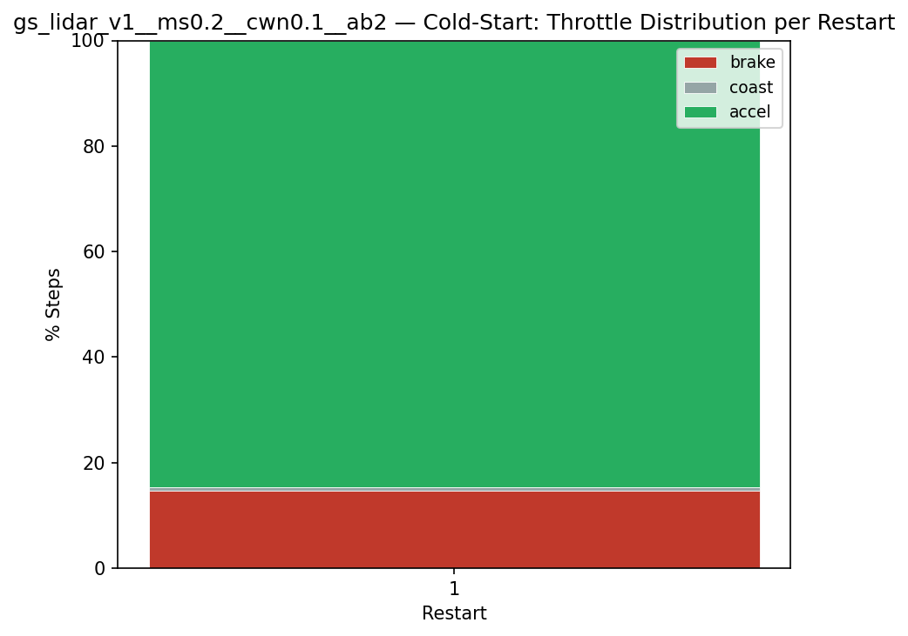
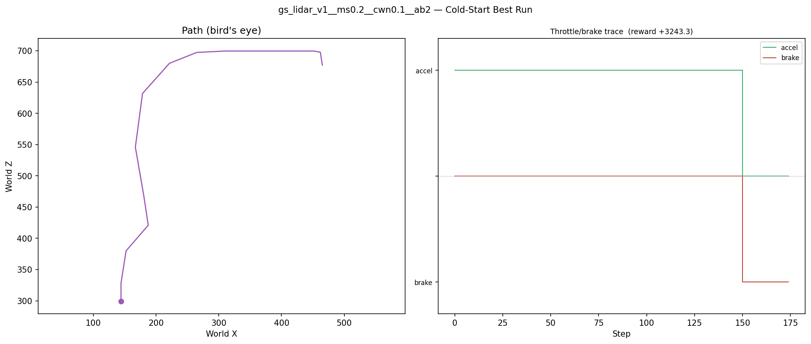
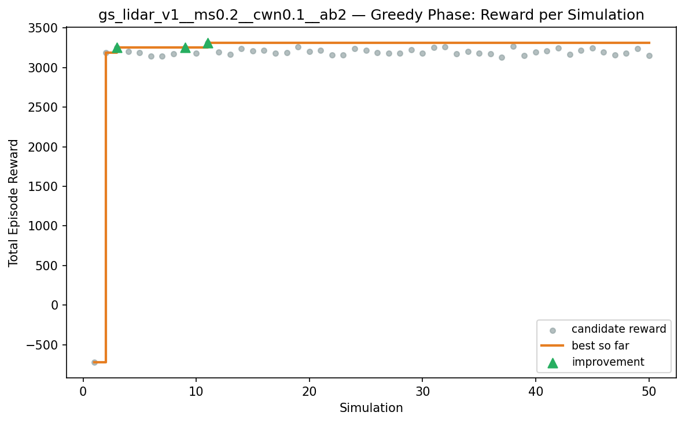
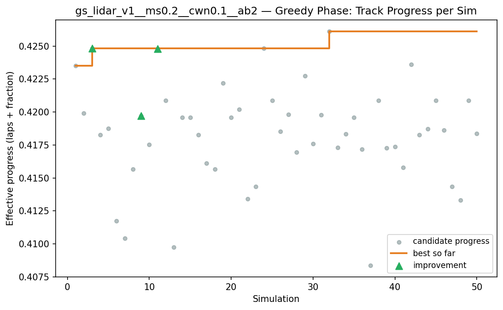
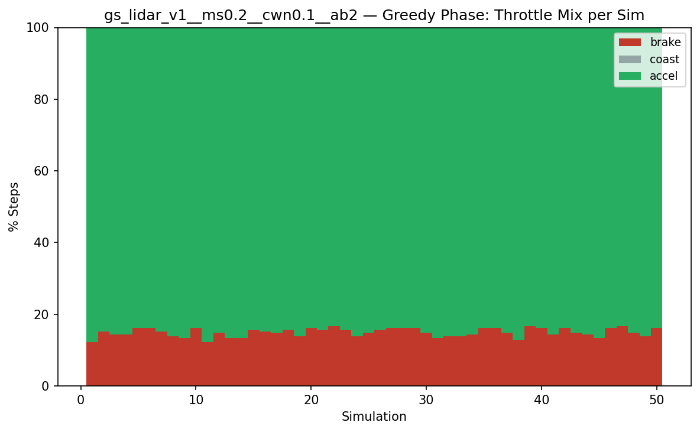
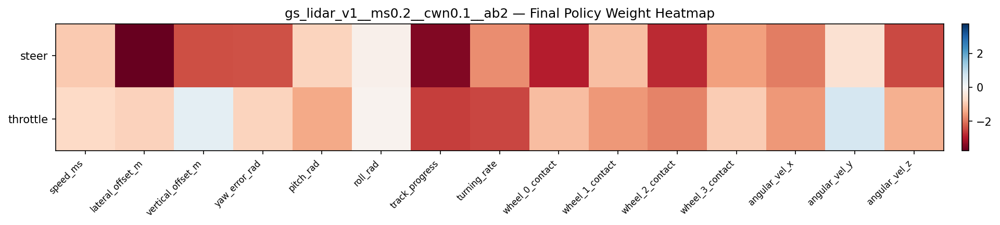

# Experiment: gs_lidar_v1__ms0.2__cwn0.1__ab2

## Timings

- **Start:** 2026-03-16 00:39:37
- **End:** 2026-03-16 00:42:32
- **Total runtime:** 2m 55.2s

| Phase | Duration |
|-------|----------|
| Probe | 6.0s |
| Cold-start | 16.2s |
| Greedy | 2m 31.9s |

## Run Parameters

### Training

| Parameter | Value |
|-----------|-------|
| speed | 10.0 |
| n_sims | 50 |
| in_game_episode_s | 30.0 |
| mutation_scale | 0.2 |
| probe_s | 8.0 |
| cold_restarts | 20 |
| cold_sims | 5 |
| n_lidar_rays | 8 |

### Reward Config

| Parameter | Value |
|-----------|-------|
| progress_weight | 10000.0 |
| centerline_weight | -0.1 |
| centerline_exp | 2.0 |
| speed_weight | 0.05 |
| step_penalty | -0.05 |
| finish_bonus | 5000.0 |
| finish_time_weight | -5.0 |
| par_time_s | 60.0 |
| accel_bonus | 2.0 |
| airborne_penalty | -1.0 |
| crash_threshold_m | 25.0 |

## Probe Phase

Best probe reward: **+497.8**

| Action | Name            | Reward   |          |
|--------|-----------------|----------|----------|
|      0 | brake LEFT      |  -3843.1 |  |
|      1 | brake           |   +487.5 |  |
|      2 | brake RIGHT     |   +497.8 | ← best |
|      6 | accelerate LEFT |   +489.2 |  |
|      7 | accelerate      |   +490.8 |  |
|      8 | accelerate right |   +491.8 |  |

## Cold-Start Search

Best cold-start reward: **+3243.3**
Probe floor: **+497.8**

| Restart | Best Reward | Beat Probe Floor |          |
|---------|-------------|------------------|----------|
|       1 |     +3243.3 | yes              | ← best |

## Greedy Phase

Best reward: **+3311.5**

| Sim  | Reward   | Result       |
|------|----------|--------------|
|    1 |   -716.9 |  |
|    2 |  +3190.5 |  |
|    3 |  +3254.6 | **NEW BEST** |
|    4 |  +3202.7 |  |
|    5 |  +3187.0 |  |
|    6 |  +3142.9 |  |
|    7 |  +3144.3 |  |
|    8 |  +3172.4 |  |
|    9 |  +3254.8 | **NEW BEST** |
|   10 |  +3181.7 |  |
|   11 |  +3311.5 | **NEW BEST** |
|   12 |  +3195.2 |  |
|   13 |  +3162.3 |  |
|   14 |  +3242.5 |  |
|   15 |  +3210.1 |  |
|   16 |  +3216.0 |  |
|   17 |  +3182.5 |  |
|   18 |  +3187.9 |  |
|   19 |  +3258.0 |  |
|   20 |  +3202.6 |  |
|   21 |  +3218.3 |  |
|   22 |  +3155.4 |  |
|   23 |  +3161.7 |  |
|   24 |  +3239.0 |  |
|   25 |  +3215.8 |  |
|   26 |  +3188.4 |  |
|   27 |  +3180.9 |  |
|   28 |  +3177.1 |  |
|   29 |  +3222.8 |  |
|   30 |  +3184.1 |  |
|   31 |  +3253.2 |  |
|   32 |  +3260.6 |  |
|   33 |  +3172.9 |  |
|   34 |  +3203.0 |  |
|   35 |  +3183.5 |  |
|   36 |  +3170.6 |  |
|   37 |  +3132.4 |  |
|   38 |  +3268.7 |  |
|   39 |  +3153.6 |  |
|   40 |  +3192.9 |  |
|   41 |  +3210.5 |  |
|   42 |  +3245.2 |  |
|   43 |  +3164.8 |  |
|   44 |  +3214.9 |  |
|   45 |  +3244.6 |  |
|   46 |  +3192.1 |  |
|   47 |  +3157.1 |  |
|   48 |  +3178.4 |  |
|   49 |  +3238.4 |  |
|   50 |  +3149.3 |  |

## Additional Plots

