# Experiment: gs_lidar_v1__ms0.2__cwn0.5__ab1

## Timings

- **Start:** 2026-03-16 00:42:35
- **End:** 2026-03-16 00:50:19
- **Total runtime:** 7m 43.8s

| Phase | Duration |
|-------|----------|
| Probe | 6.0s |
| Cold-start | 5m 04.9s |
| Greedy | 2m 31.9s |

## Run Parameters

### Training

| Parameter | Value |
|-----------|-------|
| speed | 10.0 |
| n_sims | 50 |
| in_game_episode_s | 30.0 |
| mutation_scale | 0.2 |
| probe_s | 8.0 |
| cold_restarts | 20 |
| cold_sims | 5 |
| n_lidar_rays | 8 |

### Reward Config

| Parameter | Value |
|-----------|-------|
| progress_weight | 10000.0 |
| centerline_weight | -0.5 |
| centerline_exp | 2.0 |
| speed_weight | 0.05 |
| step_penalty | -0.05 |
| finish_bonus | 5000.0 |
| finish_time_weight | -5.0 |
| par_time_s | 60.0 |
| accel_bonus | 1.0 |
| airborne_penalty | -1.0 |
| crash_threshold_m | 25.0 |

## Probe Phase

Best probe reward: **+346.2**

| Action | Name            | Reward   |          |
|--------|-----------------|----------|----------|
|      0 | brake LEFT      |   +346.2 | ← best |
|      1 | brake           |   +334.5 |  |
|      2 | brake RIGHT     |   +329.5 |  |
|      6 | accelerate LEFT |   +316.1 |  |
|      7 | accelerate      |   +302.3 |  |
|      8 | accelerate right |   +328.7 |  |

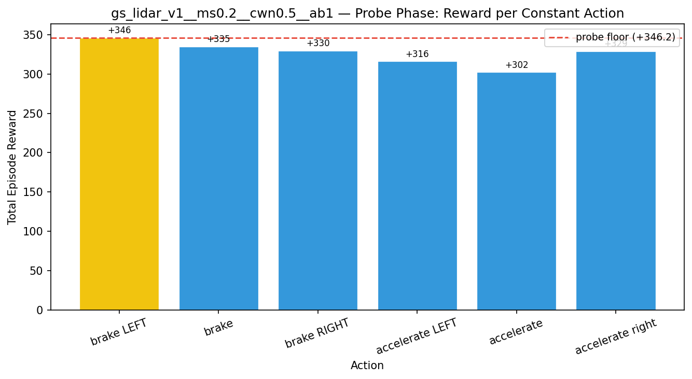

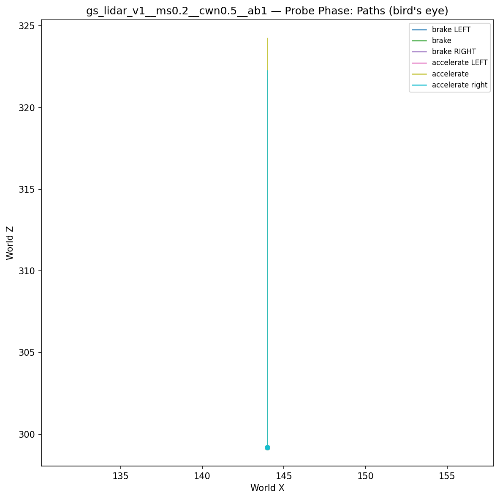

## Cold-Start Search

Best cold-start reward: **-2308.0**
Probe floor: **+346.2**

| Restart | Best Reward | Beat Probe Floor |          |
|---------|-------------|------------------|----------|
|       1 |     -2448.2 | no               |  |
|       2 |     -3772.9 | no               |  |
|       3 |     -2932.3 | no               |  |
|       4 |     -2922.0 | no               |  |
|       5 |     -3203.4 | no               |  |
|       6 |     -2882.0 | no               |  |
|       7 |     -2904.2 | no               |  |
|       8 |     -2754.0 | no               |  |
|       9 |     -2915.5 | no               |  |
|      10 |     -2734.6 | no               |  |
|      11 |     -3378.1 | no               |  |
|      12 |     -3066.3 | no               |  |
|      13 |     -2308.0 | no               | ← best |
|      14 |     -2786.5 | no               |  |
|      15 |     -2682.4 | no               |  |
|      16 |     -2776.0 | no               |  |
|      17 |     -3897.2 | no               |  |
|      18 |     -3034.6 | no               |  |
|      19 |     -2570.0 | no               |  |
|      20 |     -2611.4 | no               |  |

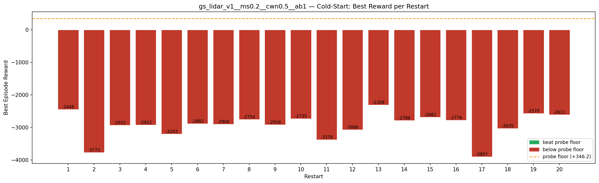

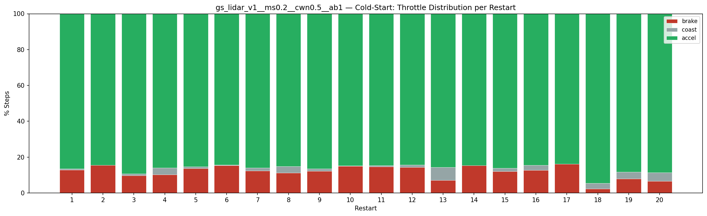

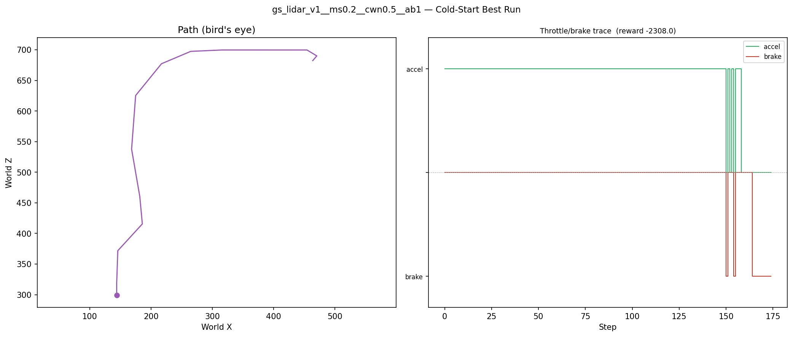

## Greedy Phase

Best reward: **-2262.6**

| Sim  | Reward   | Result       |
|------|----------|--------------|
|    1 |  -2626.1 |  |
|    2 |  -2995.1 |  |
|    3 |  -2736.9 |  |
|    4 |  -6925.1 |  |
|    5 |  -2676.1 |  |
|    6 |  -3013.4 |  |
|    7 |  -2985.8 |  |
|    8 |  -3387.1 |  |
|    9 |  -2583.7 |  |
|   10 |  -2556.5 |  |
|   11 |  -6644.3 |  |
|   12 |  -7190.6 |  |
|   13 |  -2969.5 |  |
|   14 |  -6939.6 |  |
|   15 |  -3220.0 |  |
|   16 |  -3210.8 |  |
|   17 |  -7427.1 |  |
|   18 |  -2713.3 |  |
|   19 |  -6854.4 |  |
|   20 |  -2527.6 |  |
|   21 |  -6989.7 |  |
|   22 |  -2352.5 |  |
|   23 |  -3334.6 |  |
|   24 |  -6624.2 |  |
|   25 |  -7079.7 |  |
|   26 |  -3235.9 |  |
|   27 |  -6334.8 |  |
|   28 |  -3038.6 |  |
|   29 |  -2643.9 |  |
|   30 |  -6450.9 |  |
|   31 |  -2262.6 | **NEW BEST** |
|   32 |  -2947.0 |  |
|   33 |  -2869.2 |  |
|   34 |  -2767.7 |  |
|   35 |  -3209.7 |  |
|   36 |  -3030.0 |  |
|   37 |  -2315.6 |  |
|   38 |  -2874.6 |  |
|   39 |  -2727.1 |  |
|   40 |  -2805.0 |  |
|   41 |  -3227.4 |  |
|   42 |  -2758.3 |  |
|   43 |  -2944.0 |  |
|   44 |  -2691.3 |  |
|   45 |  -2797.1 |  |
|   46 |  -6777.9 |  |
|   47 |  -3038.0 |  |
|   48 |  -3021.3 |  |
|   49 |  -2959.0 |  |
|   50 |  -3077.7 |  |

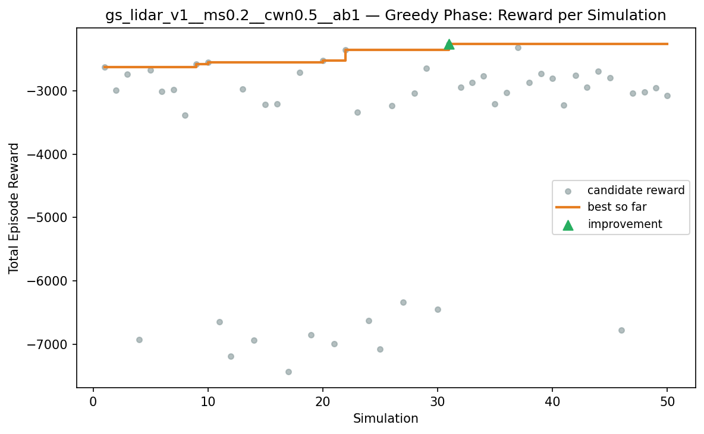

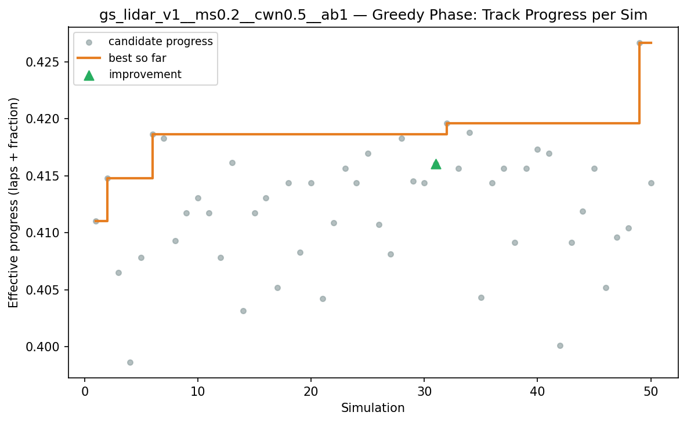

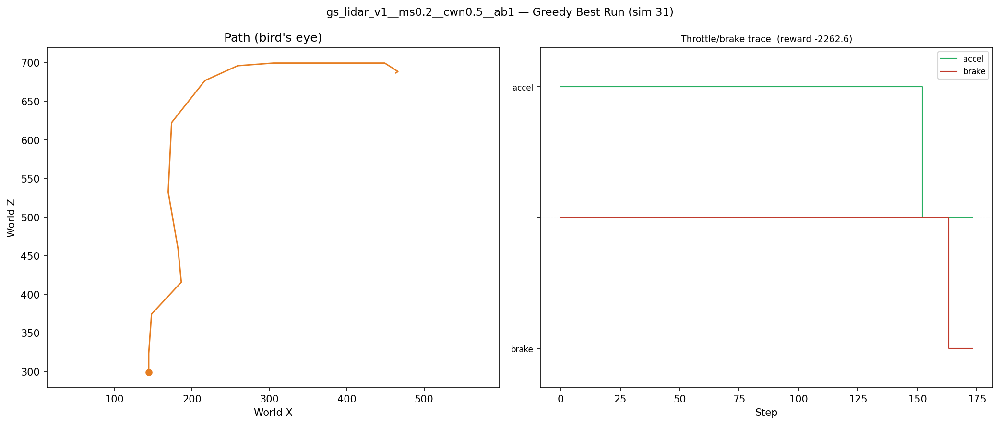

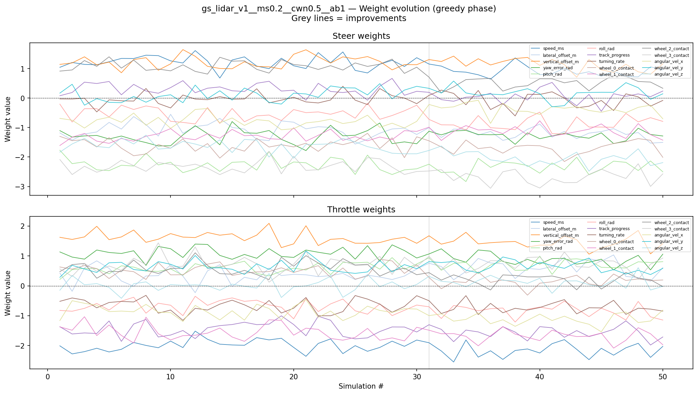

## Additional Plots

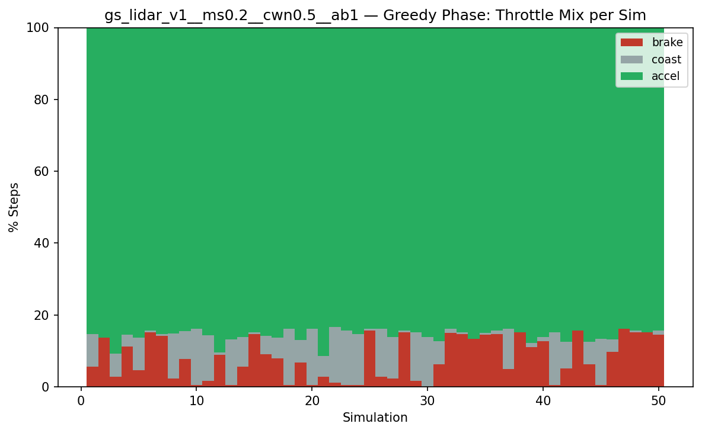

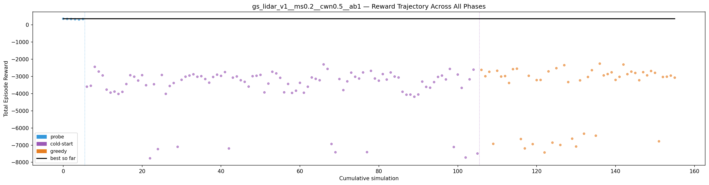

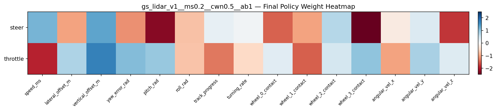

