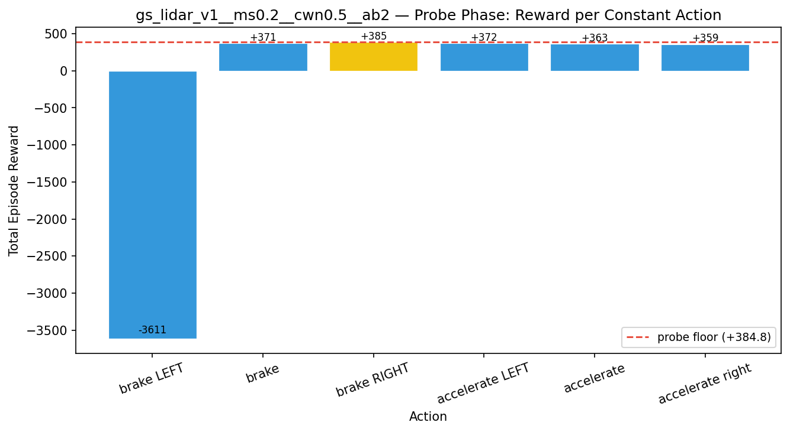
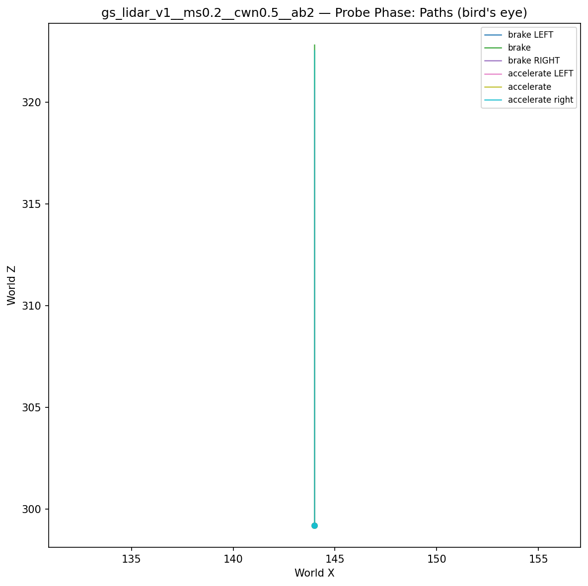
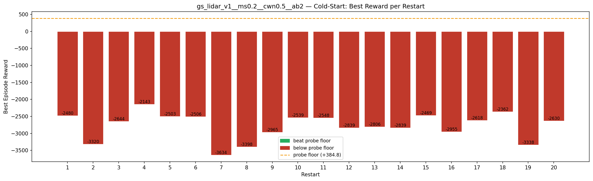
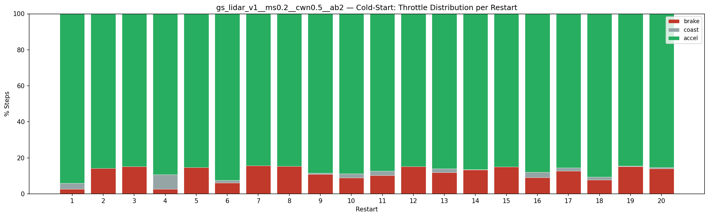
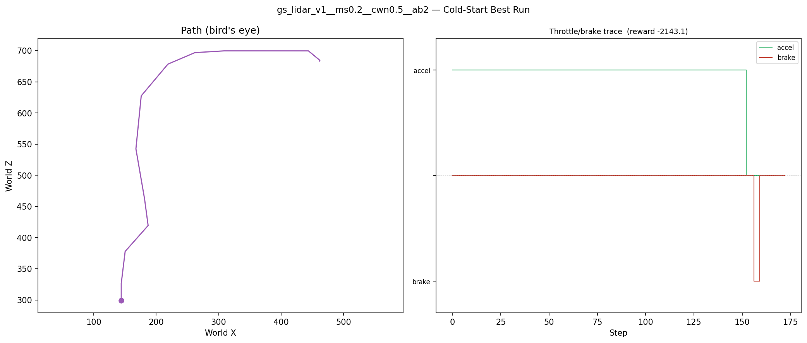
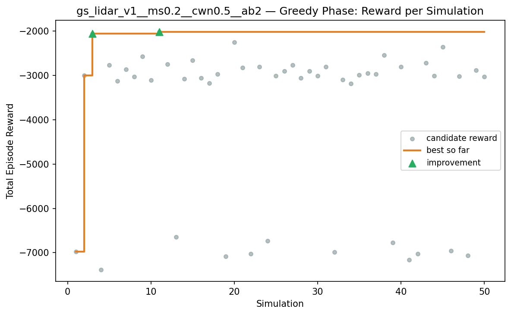
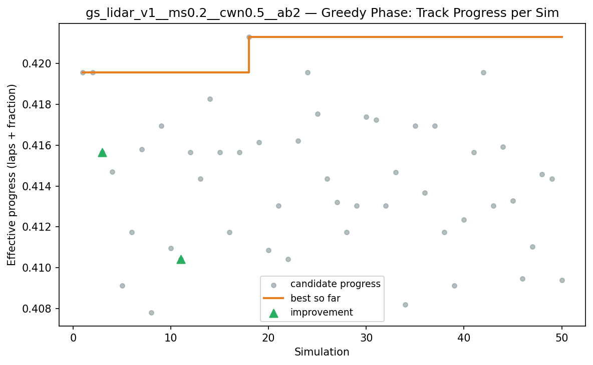
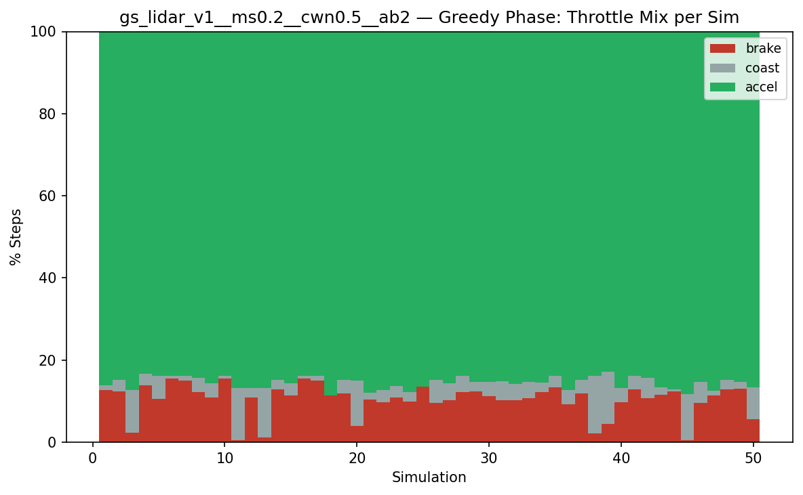
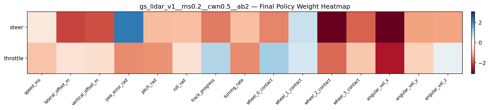

# Experiment: gs_lidar_v1__ms0.2__cwn0.5__ab2

## Timings

- **Start:** 2026-03-16 00:50:22
- **End:** 2026-03-16 00:58:06
- **Total runtime:** 7m 44.0s

| Phase | Duration |
|-------|----------|
| Probe | 6.0s |
| Cold-start | 5m 05.1s |
| Greedy | 2m 31.9s |

## Run Parameters

### Training

| Parameter | Value |
|-----------|-------|
| speed | 10.0 |
| n_sims | 50 |
| in_game_episode_s | 30.0 |
| mutation_scale | 0.2 |
| probe_s | 8.0 |
| cold_restarts | 20 |
| cold_sims | 5 |
| n_lidar_rays | 8 |

### Reward Config

| Parameter | Value |
|-----------|-------|
| progress_weight | 10000.0 |
| centerline_weight | -0.5 |
| centerline_exp | 2.0 |
| speed_weight | 0.05 |
| step_penalty | -0.05 |
| finish_bonus | 5000.0 |
| finish_time_weight | -5.0 |
| par_time_s | 60.0 |
| accel_bonus | 2.0 |
| airborne_penalty | -1.0 |
| crash_threshold_m | 25.0 |

## Probe Phase

Best probe reward: **+384.8**

| Action | Name            | Reward   |          |
|--------|-----------------|----------|----------|
|      0 | brake LEFT      |  -3610.7 |  |
|      1 | brake           |   +371.4 |  |
|      2 | brake RIGHT     |   +384.8 | ← best |
|      6 | accelerate LEFT |   +371.9 |  |
|      7 | accelerate      |   +362.8 |  |
|      8 | accelerate right |   +359.4 |  |

## Cold-Start Search

Best cold-start reward: **-2143.1**
Probe floor: **+384.8**

| Restart | Best Reward | Beat Probe Floor |          |
|---------|-------------|------------------|----------|
|       1 |     -2479.9 | no               |  |
|       2 |     -3320.0 | no               |  |
|       3 |     -2643.5 | no               |  |
|       4 |     -2143.1 | no               | ← best |
|       5 |     -2502.6 | no               |  |
|       6 |     -2506.4 | no               |  |
|       7 |     -3633.8 | no               |  |
|       8 |     -3398.4 | no               |  |
|       9 |     -2965.0 | no               |  |
|      10 |     -2538.7 | no               |  |
|      11 |     -2547.6 | no               |  |
|      12 |     -2839.1 | no               |  |
|      13 |     -2806.0 | no               |  |
|      14 |     -2839.1 | no               |  |
|      15 |     -2469.4 | no               |  |
|      16 |     -2955.5 | no               |  |
|      17 |     -2618.0 | no               |  |
|      18 |     -2361.9 | no               |  |
|      19 |     -3338.3 | no               |  |
|      20 |     -2629.9 | no               |  |

## Greedy Phase

Best reward: **-2021.6**

| Sim  | Reward   | Result       |
|------|----------|--------------|
|    1 |  -6977.9 |  |
|    2 |  -3006.4 |  |
|    3 |  -2060.6 | **NEW BEST** |
|    4 |  -7379.7 |  |
|    5 |  -2769.1 |  |
|    6 |  -3126.8 |  |
|    7 |  -2866.0 |  |
|    8 |  -3032.9 |  |
|    9 |  -2577.9 |  |
|   10 |  -3104.9 |  |
|   11 |  -2021.6 | **NEW BEST** |
|   12 |  -2753.6 |  |
|   13 |  -6648.7 |  |
|   14 |  -3083.1 |  |
|   15 |  -2663.0 |  |
|   16 |  -3059.9 |  |
|   17 |  -3180.6 |  |
|   18 |  -2976.2 |  |
|   19 |  -7079.4 |  |
|   20 |  -2255.6 |  |
|   21 |  -2830.1 |  |
|   22 |  -7020.6 |  |
|   23 |  -2803.6 |  |
|   24 |  -6732.2 |  |
|   25 |  -3008.8 |  |
|   26 |  -2904.5 |  |
|   27 |  -2764.4 |  |
|   28 |  -3059.5 |  |
|   29 |  -2904.9 |  |
|   30 |  -3016.7 |  |
|   31 |  -2812.8 |  |
|   32 |  -6983.4 |  |
|   33 |  -3098.1 |  |
|   34 |  -3187.7 |  |
|   35 |  -2996.3 |  |
|   36 |  -2956.8 |  |
|   37 |  -2974.6 |  |
|   38 |  -2542.9 |  |
|   39 |  -6767.9 |  |
|   40 |  -2803.6 |  |
|   41 |  -7164.8 |  |
|   42 |  -7024.1 |  |
|   43 |  -2722.5 |  |
|   44 |  -3015.7 |  |
|   45 |  -2365.4 |  |
|   46 |  -6959.7 |  |
|   47 |  -3022.3 |  |
|   48 |  -7064.4 |  |
|   49 |  -2883.8 |  |
|   50 |  -3034.7 |  |

## Additional Plots

