# Grid Search Summary: gs_lidar_v1

12 experiments, ranked by best greedy reward.

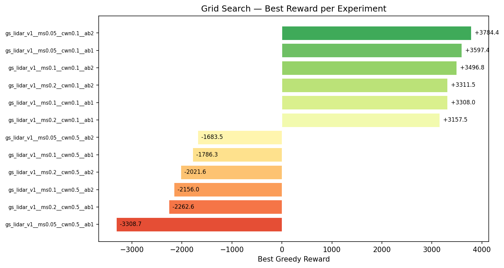

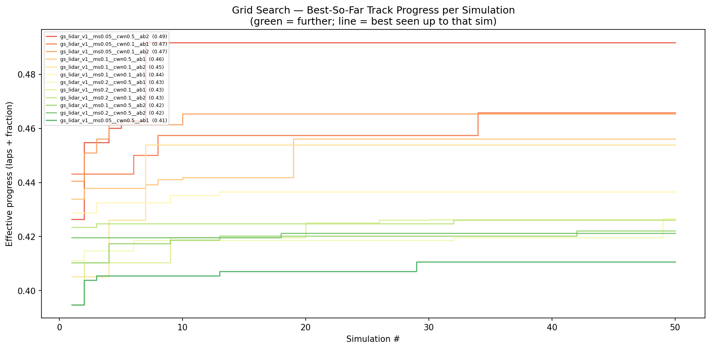

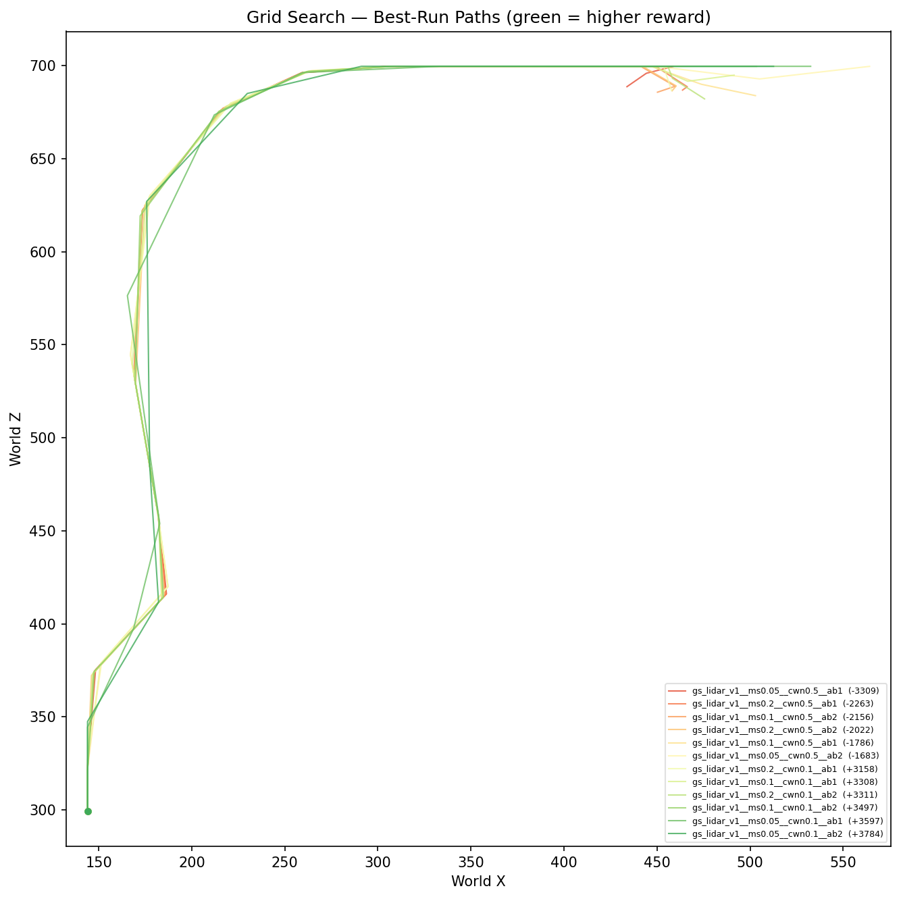

## Rankings

| Rank | Experiment | Best Reward | Improvements | First Improv. Sim | Accel % | Greedy Time |
|------|-----------|-------------|--------------|-------------------|---------|-------------|
| 1 | gs_lidar_v1__ms0.05__cwn0.1__ab2 | +3784.4 | 4 | 4 | 100% | 2m 34.2s |
| 2 | gs_lidar_v1__ms0.05__cwn0.1__ab1 | +3597.4 | 5 | 1 | 100% | 2m 33.3s |
| 3 | gs_lidar_v1__ms0.1__cwn0.1__ab2 | +3496.8 | 1 | 7 | 100% | 2m 31.9s |
| 4 | gs_lidar_v1__ms0.2__cwn0.1__ab2 | +3311.5 | 3 | 3 | 88% | 2m 31.9s |
| 5 | gs_lidar_v1__ms0.1__cwn0.1__ab1 | +3308.0 | 2 | 9 | 92% | 2m 32.0s |
| 6 | gs_lidar_v1__ms0.2__cwn0.1__ab1 | +3157.5 | 5 | 9 | 89% | 2m 32.2s |
| 7 | gs_lidar_v1__ms0.05__cwn0.5__ab2 | -1683.5 | 1 | 7 | 100% | 2m 31.9s |
| 8 | gs_lidar_v1__ms0.1__cwn0.5__ab1 | -1786.3 | 1 | 19 | 93% | 2m 32.1s |
| 9 | gs_lidar_v1__ms0.2__cwn0.5__ab2 | -2021.6 | 2 | 3 | 87% | 2m 31.9s |
| 10 | gs_lidar_v1__ms0.1__cwn0.5__ab2 | -2156.0 | 1 | 3 | 86% | 2m 31.9s |
| 11 | gs_lidar_v1__ms0.2__cwn0.5__ab1 | -2262.6 | 1 | 31 | 87% | 2m 31.9s |
| 12 | gs_lidar_v1__ms0.05__cwn0.5__ab1 | -3308.7 | 0 | — | 85% | 2m 31.8s |

---

## 1. gs_lidar_v1__ms0.05__cwn0.1__ab2

**Best reward: +3784.4**

| Param | Value |
|---|---|
| `mutation_scale` | 0.05 |
| `centerline_weight` | -0.1 |
| `accel_bonus` | 2.0 |

| Stat | Value |
|---|---|
| Greedy improvements | 4 |
| First improvement (sim) | 4 |
| Accel % of best run | 100.0% |
| Greedy runtime | 2m 34.2s |

---

## 2. gs_lidar_v1__ms0.05__cwn0.1__ab1

**Best reward: +3597.4**

| Param | Value |
|---|---|
| `mutation_scale` | 0.05 |
| `centerline_weight` | -0.1 |
| `accel_bonus` | 1.0 |

| Stat | Value |
|---|---|
| Greedy improvements | 5 |
| First improvement (sim) | 1 |
| Accel % of best run | 100.0% |
| Greedy runtime | 2m 33.3s |

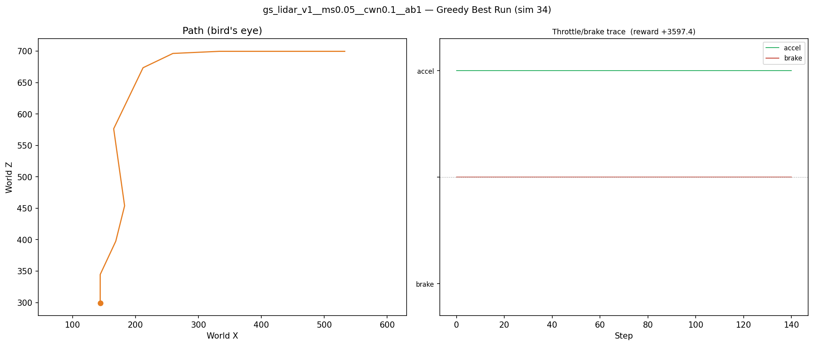

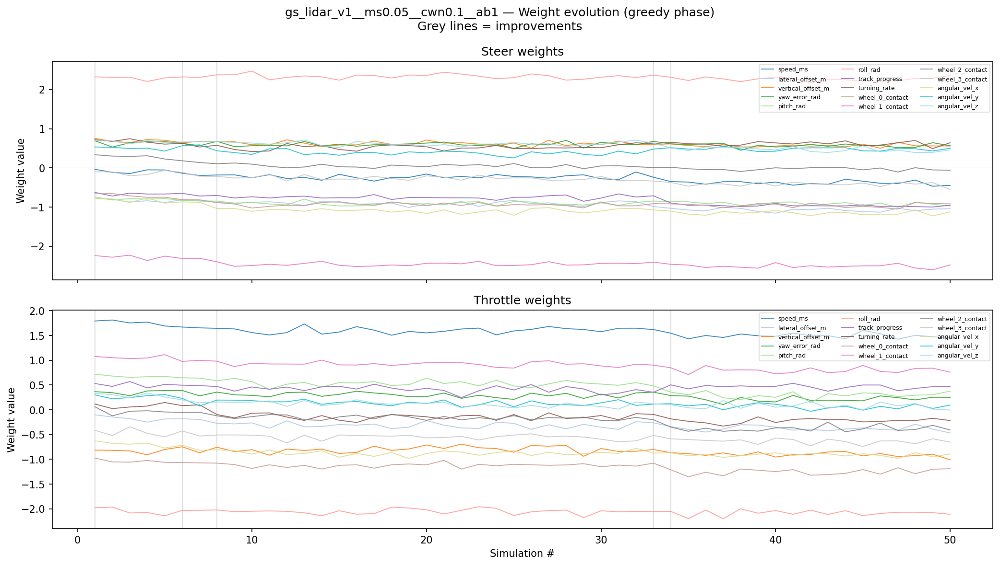

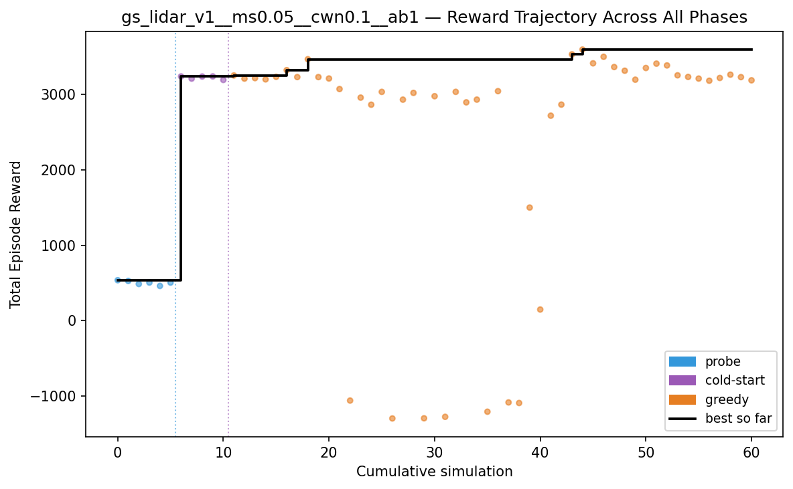

---

## 3. gs_lidar_v1__ms0.1__cwn0.1__ab2

**Best reward: +3496.8**

| Param | Value |
|---|---|
| `mutation_scale` | 0.1 |
| `centerline_weight` | -0.1 |
| `accel_bonus` | 2.0 |

| Stat | Value |
|---|---|
| Greedy improvements | 1 |
| First improvement (sim) | 7 |
| Accel % of best run | 100.0% |
| Greedy runtime | 2m 31.9s |

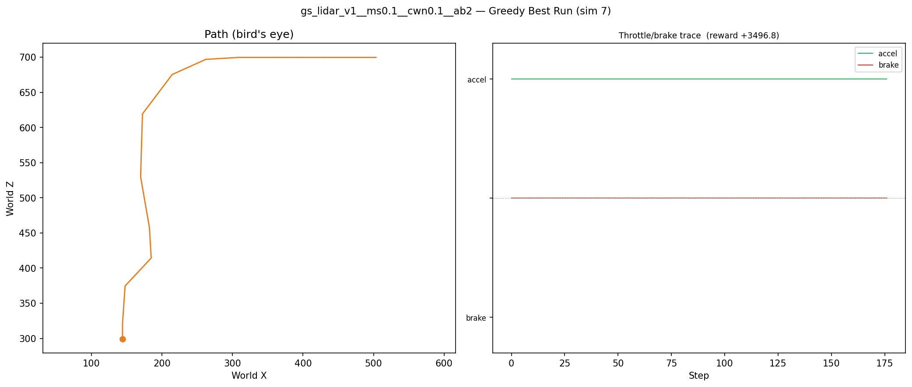

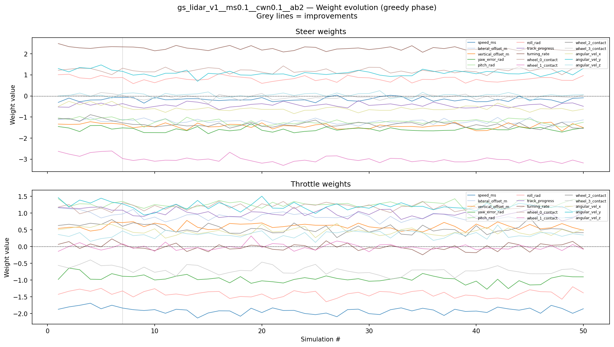

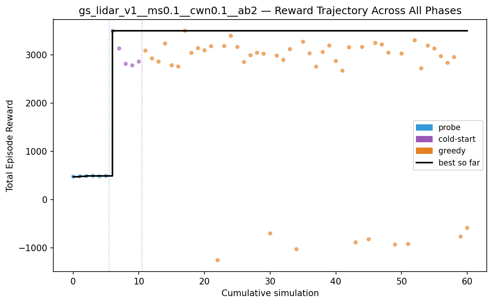

---

## 4. gs_lidar_v1__ms0.2__cwn0.1__ab2

**Best reward: +3311.5**

| Param | Value |
|---|---|
| `mutation_scale` | 0.2 |
| `centerline_weight` | -0.1 |
| `accel_bonus` | 2.0 |

| Stat | Value |
|---|---|
| Greedy improvements | 3 |
| First improvement (sim) | 3 |
| Accel % of best run | 87.7% |
| Greedy runtime | 2m 31.9s |

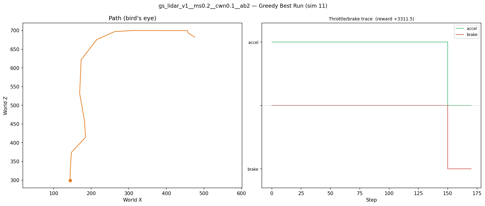

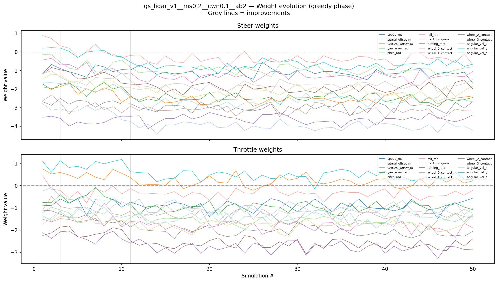

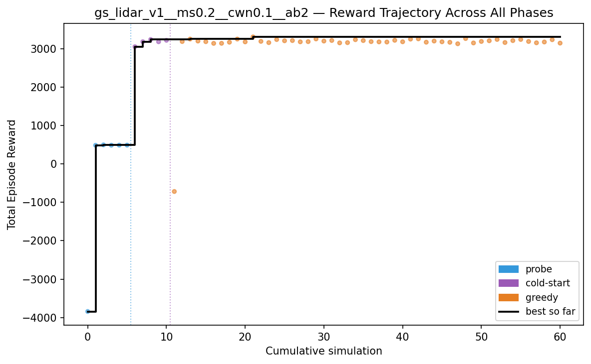

---

## 5. gs_lidar_v1__ms0.1__cwn0.1__ab1

**Best reward: +3308.0**

| Param | Value |
|---|---|
| `mutation_scale` | 0.1 |
| `centerline_weight` | -0.1 |
| `accel_bonus` | 1.0 |

| Stat | Value |
|---|---|
| Greedy improvements | 2 |
| First improvement (sim) | 9 |
| Accel % of best run | 91.9% |
| Greedy runtime | 2m 32.0s |

---

## 6. gs_lidar_v1__ms0.2__cwn0.1__ab1

**Best reward: +3157.5**

| Param | Value |
|---|---|
| `mutation_scale` | 0.2 |
| `centerline_weight` | -0.1 |
| `accel_bonus` | 1.0 |

| Stat | Value |
|---|---|
| Greedy improvements | 5 |
| First improvement (sim) | 9 |
| Accel % of best run | 88.8% |
| Greedy runtime | 2m 32.2s |

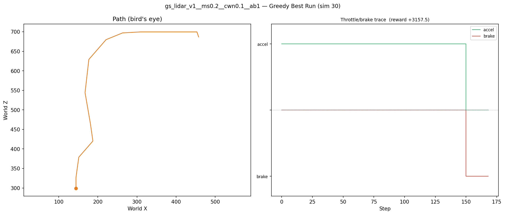

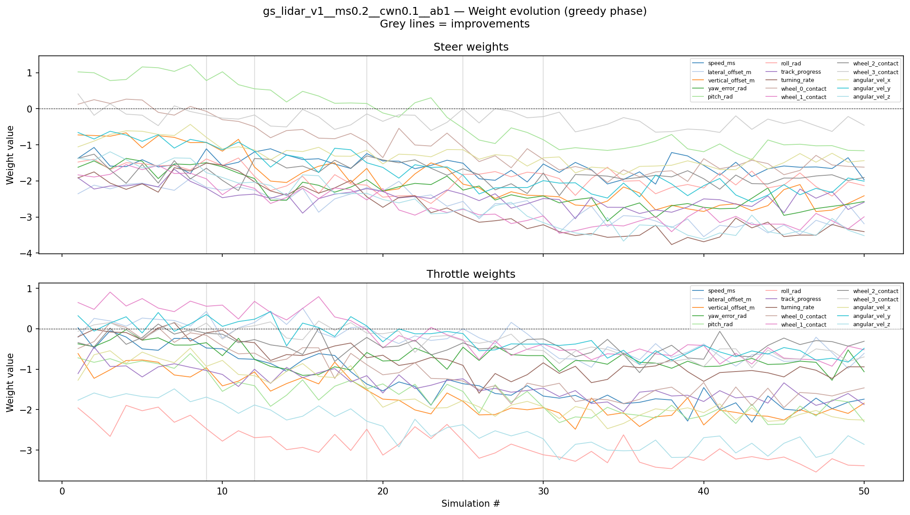

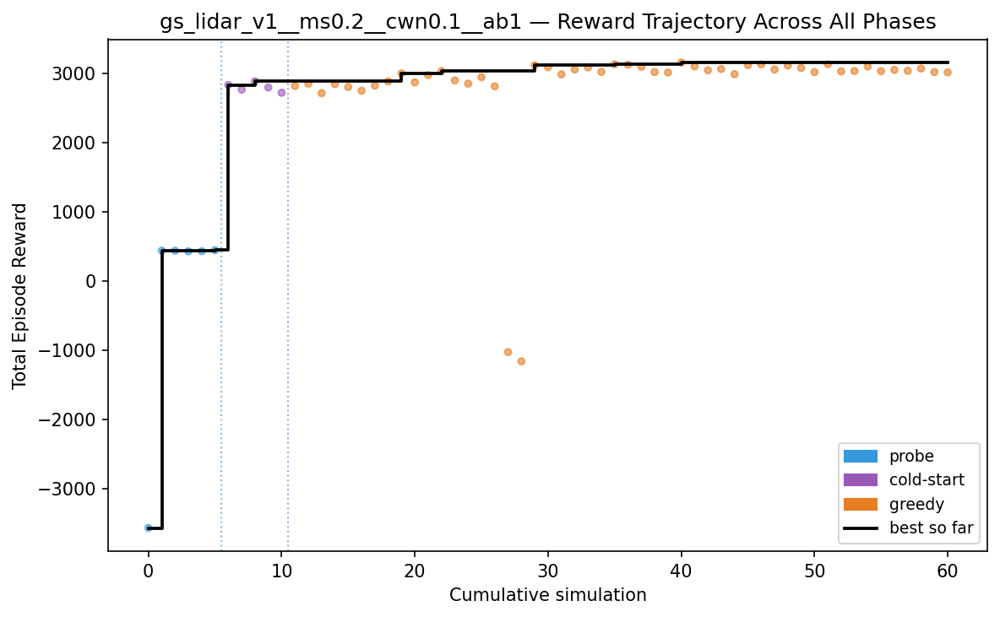

---

## 7. gs_lidar_v1__ms0.05__cwn0.5__ab2

**Best reward: -1683.5**

| Param | Value |
|---|---|
| `mutation_scale` | 0.05 |
| `centerline_weight` | -0.5 |
| `accel_bonus` | 2.0 |

| Stat | Value |
|---|---|
| Greedy improvements | 1 |
| First improvement (sim) | 7 |
| Accel % of best run | 100.0% |
| Greedy runtime | 2m 31.9s |

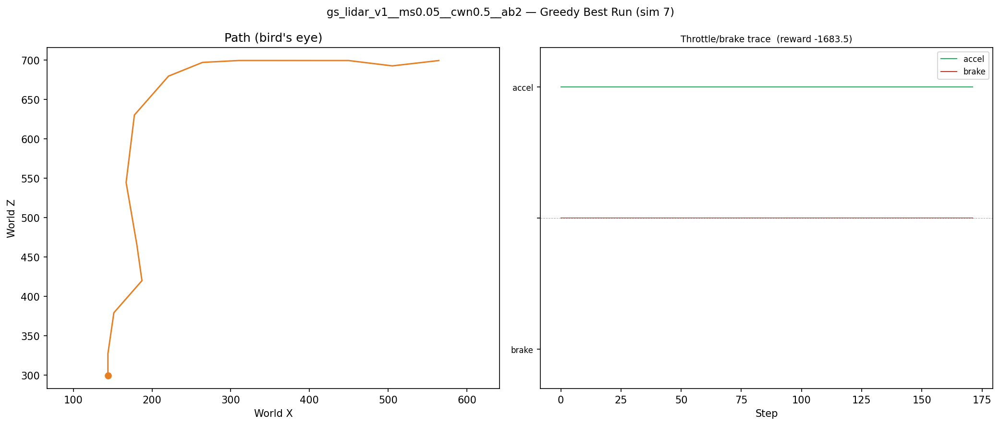

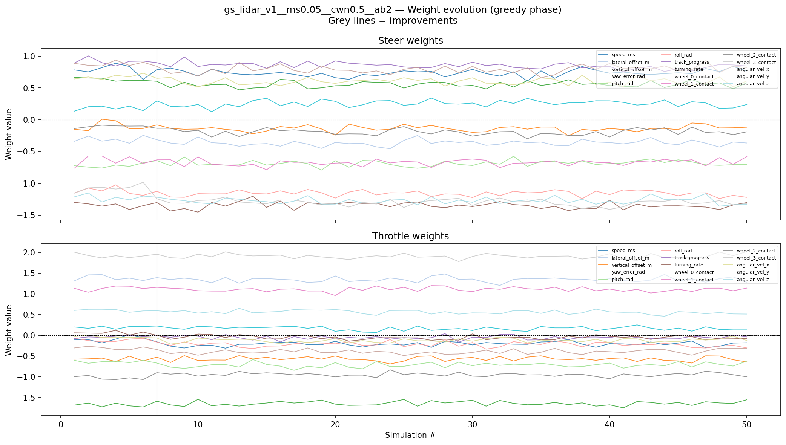

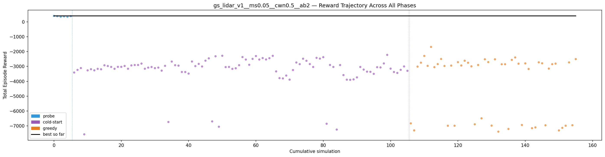

---

## 8. gs_lidar_v1__ms0.1__cwn0.5__ab1

**Best reward: -1786.3**

| Param | Value |
|---|---|
| `mutation_scale` | 0.1 |
| `centerline_weight` | -0.5 |
| `accel_bonus` | 1.0 |

| Stat | Value |
|---|---|
| Greedy improvements | 1 |
| First improvement (sim) | 19 |
| Accel % of best run | 92.7% |
| Greedy runtime | 2m 32.1s |

---

## 9. gs_lidar_v1__ms0.2__cwn0.5__ab2

**Best reward: -2021.6**

| Param | Value |
|---|---|
| `mutation_scale` | 0.2 |
| `centerline_weight` | -0.5 |
| `accel_bonus` | 2.0 |

| Stat | Value |
|---|---|
| Greedy improvements | 2 |
| First improvement (sim) | 3 |
| Accel % of best run | 86.8% |
| Greedy runtime | 2m 31.9s |

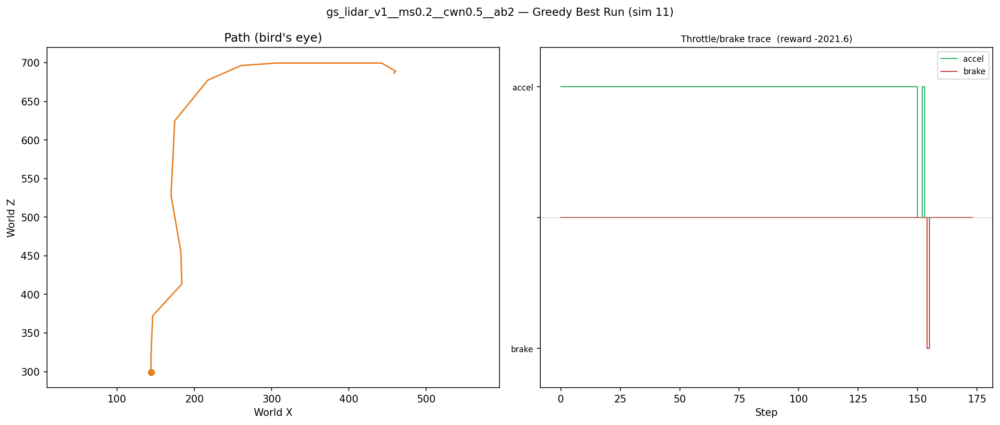

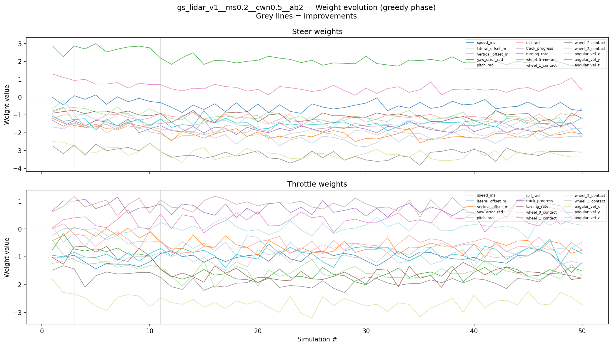

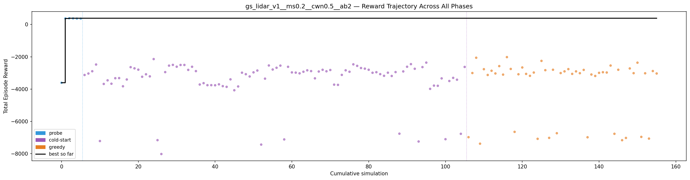

---

## 10. gs_lidar_v1__ms0.1__cwn0.5__ab2

**Best reward: -2156.0**

| Param | Value |
|---|---|
| `mutation_scale` | 0.1 |
| `centerline_weight` | -0.5 |
| `accel_bonus` | 2.0 |

| Stat | Value |
|---|---|
| Greedy improvements | 1 |
| First improvement (sim) | 3 |
| Accel % of best run | 85.9% |
| Greedy runtime | 2m 31.9s |

---

## 11. gs_lidar_v1__ms0.2__cwn0.5__ab1

**Best reward: -2262.6**

| Param | Value |
|---|---|
| `mutation_scale` | 0.2 |
| `centerline_weight` | -0.5 |
| `accel_bonus` | 1.0 |

| Stat | Value |
|---|---|
| Greedy improvements | 1 |
| First improvement (sim) | 31 |
| Accel % of best run | 87.4% |
| Greedy runtime | 2m 31.9s |

---

## 12. gs_lidar_v1__ms0.05__cwn0.5__ab1

**Best reward: -3308.7**

| Param | Value |
|---|---|
| `mutation_scale` | 0.05 |
| `centerline_weight` | -0.5 |
| `accel_bonus` | 1.0 |

| Stat | Value |
|---|---|
| Greedy improvements | 0 |
| First improvement (sim) | — |
| Accel % of best run | 85.0% |
| Greedy runtime | 2m 31.8s |

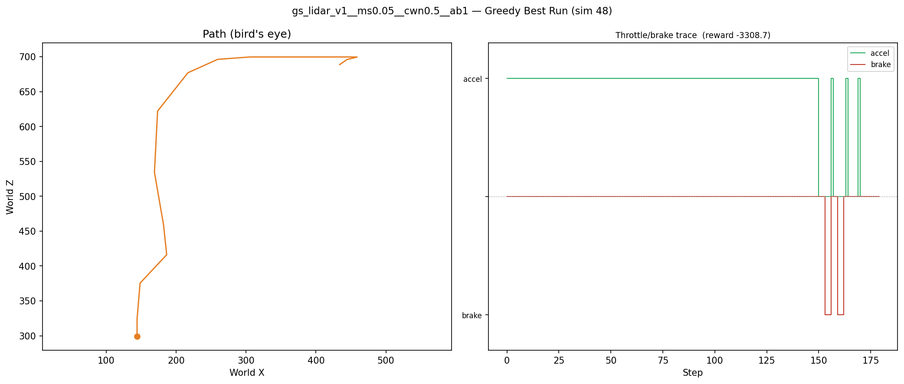

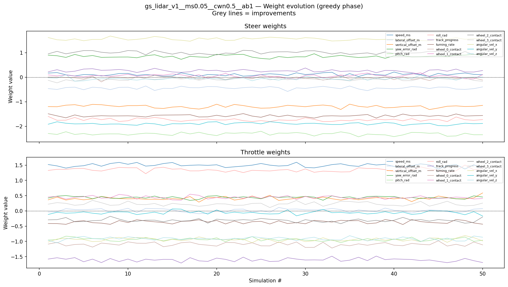

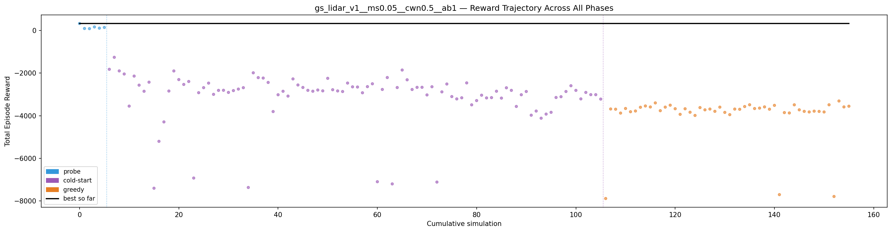

