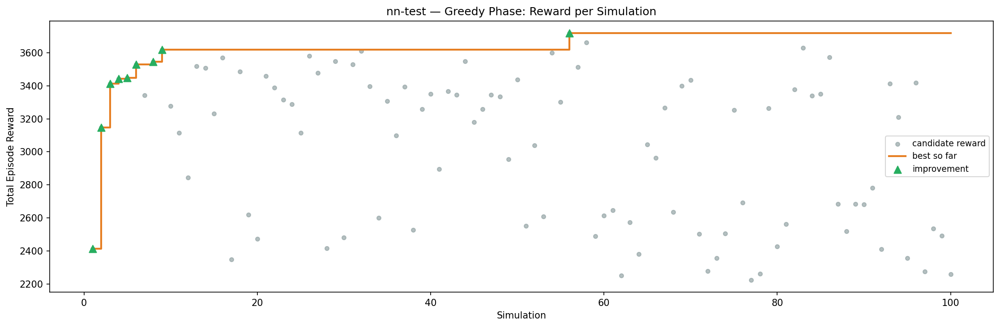
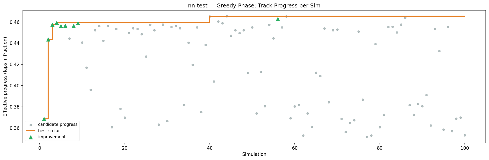
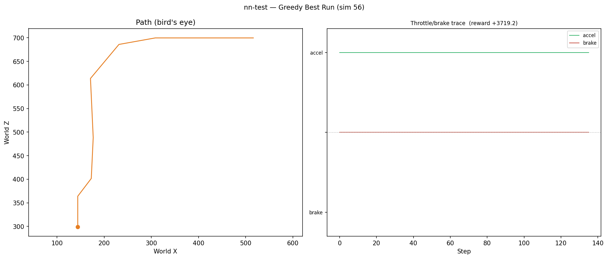
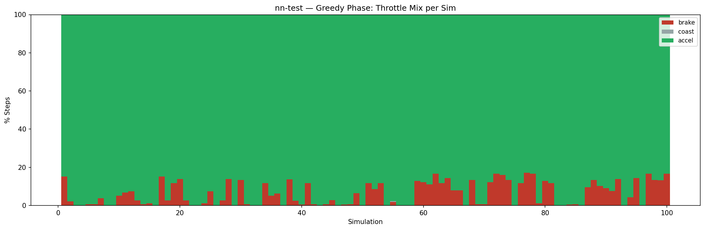
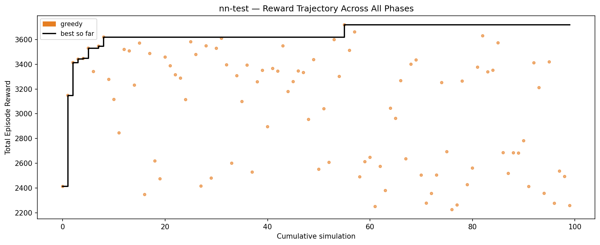

# Experiment: nn-test

## Timings

- **Start:** 2026-04-03 14:40:04
- **End:** 2026-04-03 14:45:15
- **Total runtime:** 5m 11.0s

| Phase | Duration |
|-------|----------|
| Greedy | 5m 05.9s |

## Run Parameters

### Training

| Parameter | Value |
|-----------|-------|
| speed | 10.0 |
| in_game_episode_s | 30.0 |
| n_sims | 100 |
| mutation_scale | 0.05 |
| probe_s | 8.0 |
| cold_restarts | 20 |
| cold_sims | 5 |
| n_lidar_rays | 8 |
| policy_type | neural_net |
| policy_params | {'hidden_sizes': [16, 16]} |

### Reward Config

| Parameter | Value |
|-----------|-------|
| progress_weight | 10000.0 |
| centerline_weight | -0.1 |
| centerline_exp | 2.0 |
| speed_weight | 0.05 |
| step_penalty | -0.05 |
| finish_bonus | 5000.0 |
| finish_time_weight | -5.0 |
| par_time_s | 60.0 |
| accel_bonus | 1.0 |
| airborne_penalty | -1.0 |
| crash_threshold_m | 25.0 |

## Greedy Phase

Best reward: **+3719.2**

| Sim  | Reward   | Result       |
|------|----------|--------------|
|    1 |  +2412.2 | **NEW BEST** |
|    2 |  +3148.7 | **NEW BEST** |
|    3 |  +3414.1 | **NEW BEST** |
|    4 |  +3441.9 | **NEW BEST** |
|    5 |  +3447.3 | **NEW BEST** |
|    6 |  +3530.6 | **NEW BEST** |
|    7 |  +3341.5 |  |
|    8 |  +3547.0 | **NEW BEST** |
|    9 |  +3620.4 | **NEW BEST** |
|   10 |  +3278.0 |  |
|   11 |  +3115.8 |  |
|   12 |  +2845.4 |  |
|   13 |  +3520.2 |  |
|   14 |  +3508.2 |  |
|   15 |  +3231.5 |  |
|   16 |  +3571.6 |  |
|   17 |  +2346.9 |  |
|   18 |  +3487.4 |  |
|   19 |  +2618.3 |  |
|   20 |  +2473.9 |  |
|   21 |  +3458.3 |  |
|   22 |  +3387.9 |  |
|   23 |  +3315.3 |  |
|   24 |  +3288.1 |  |
|   25 |  +3114.4 |  |
|   26 |  +3582.0 |  |
|   27 |  +3479.3 |  |
|   28 |  +2415.1 |  |
|   29 |  +3549.1 |  |
|   30 |  +2479.9 |  |
|   31 |  +3529.4 |  |
|   32 |  +3610.6 |  |
|   33 |  +3395.6 |  |
|   34 |  +2600.2 |  |
|   35 |  +3307.7 |  |
|   36 |  +3099.0 |  |
|   37 |  +3393.3 |  |
|   38 |  +2528.2 |  |
|   39 |  +3258.4 |  |
|   40 |  +3351.0 |  |
|   41 |  +2895.3 |  |
|   42 |  +3366.2 |  |
|   43 |  +3344.5 |  |
|   44 |  +3548.9 |  |
|   45 |  +3179.6 |  |
|   46 |  +3260.0 |  |
|   47 |  +3345.8 |  |
|   48 |  +3333.3 |  |
|   49 |  +2954.2 |  |
|   50 |  +3437.6 |  |
|   51 |  +2551.1 |  |
|   52 |  +3040.5 |  |
|   53 |  +2606.9 |  |
|   54 |  +3599.3 |  |
|   55 |  +3301.8 |  |
|   56 |  +3719.2 | **NEW BEST** |
|   57 |  +3512.6 |  |
|   58 |  +3661.7 |  |
|   59 |  +2489.9 |  |
|   60 |  +2612.4 |  |
|   61 |  +2647.5 |  |
|   62 |  +2249.8 |  |
|   63 |  +2574.3 |  |
|   64 |  +2379.2 |  |
|   65 |  +3044.6 |  |
|   66 |  +2962.6 |  |
|   67 |  +3267.5 |  |
|   68 |  +2635.5 |  |
|   69 |  +3400.6 |  |
|   70 |  +3435.1 |  |
|   71 |  +2503.8 |  |
|   72 |  +2277.1 |  |
|   73 |  +2355.4 |  |
|   74 |  +2504.2 |  |
|   75 |  +3252.0 |  |
|   76 |  +2693.2 |  |
|   77 |  +2224.7 |  |
|   78 |  +2262.3 |  |
|   79 |  +3264.2 |  |
|   80 |  +2426.4 |  |
|   81 |  +2560.8 |  |
|   82 |  +3376.7 |  |
|   83 |  +3630.4 |  |
|   84 |  +3338.7 |  |
|   85 |  +3351.9 |  |
|   86 |  +3573.5 |  |
|   87 |  +2685.3 |  |
|   88 |  +2517.6 |  |
|   89 |  +2684.2 |  |
|   90 |  +2682.0 |  |
|   91 |  +2781.8 |  |
|   92 |  +2411.7 |  |
|   93 |  +3411.9 |  |
|   94 |  +3211.3 |  |
|   95 |  +2356.5 |  |
|   96 |  +3419.5 |  |
|   97 |  +2275.9 |  |
|   98 |  +2536.2 |  |
|   99 |  +2492.7 |  |
|  100 |  +2257.7 |  |

## Additional Plots

